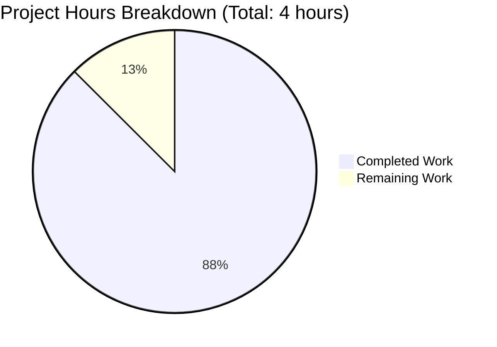

# Project Assessment Report: Express.js Integration

## Executive Summary

**Project Completion: 88%** (3.5 hours completed out of 4 total hours required)

This project successfully integrates Express.js 5.2.1 into an existing vanilla Node.js HTTP server and implements a new `/evening` endpoint. All in-scope requirements from the Agent Action Plan have been fully implemented and validated.

### Key Achievements
- ✅ Express.js 5.2.1 successfully installed and configured
- ✅ Server converted from vanilla Node.js `http` module to Express.js
- ✅ Original `GET /` endpoint preserved, returning "Hello, World!"
- ✅ New `GET /evening` endpoint implemented, returning "Good evening"
- ✅ package.json updated with dependencies, scripts, and corrected main entry
- ✅ README.md enhanced with comprehensive API documentation
- ✅ All functional tests passing (endpoints respond correctly)

### Critical Issues Requiring Attention
- None - All requirements have been implemented and validated successfully

### Recommended Next Steps
1. Perform human code review (estimated 0.5 hours)
2. Deploy to target environment when ready

---

## Validation Results Summary

### Final Validator Findings

| Category | Status | Details |
|----------|--------|---------|
| Dependencies | ✅ PASS | Express.js 5.2.1 + 64 transitive packages installed |
| Syntax Check | ✅ PASS | `node --check server.js` completed without errors |
| Server Startup | ✅ PASS | Binds to 127.0.0.1:3000 successfully |
| GET / Endpoint | ✅ PASS | Returns "Hello, World!" with 200 status |
| GET /evening Endpoint | ✅ PASS | Returns "Good evening" with 200 status |
| 404 Handling | ✅ PASS | Unknown routes return 404 correctly |
| Git Status | ✅ PASS | Working tree clean, all changes committed |

### Files Modified

| File | Action | Lines Changed | Validation |
|------|--------|---------------|------------|
| `server.js` | UPDATED | +34, -6 | ✅ Syntax verified, runtime tested |
| `package.json` | UPDATED | +8, -4 | ✅ Valid JSON, dependencies resolved |
| `package-lock.json` | CREATED | +806 | ✅ Auto-generated by npm |
| `README.md` | UPDATED | +83 | ✅ Documentation complete |
| `.gitignore` | CREATED | +1 | ✅ node_modules excluded |

### Commit History (4 commits)

```
3d5f80c docs: Update README.md with Express.js API documentation
db6d068 Convert server.js to Express.js framework with new /evening endpoint
92c9ffd Update package.json: Add Express.js dependency, fix main entry point, add start script
1f9a9d1 Setup: Add Express.js 5.2.1 dependency and .gitignore
```

---

## Project Hours Breakdown

### Calculation Formula
- **Completion % = (Completed Hours / Total Hours) × 100**
- **Completion % = (3.5 / 4.0) × 100 = 87.5% ≈ 88%**



### Completed Hours Breakdown (3.5 hours)

| Component | Hours | Description |
|-----------|-------|-------------|
| Express.js Setup | 0.5h | Dependency installation and configuration |
| Server Conversion | 1.0h | Converting http module to Express.js framework |
| New Endpoint | 0.5h | Implementing GET /evening route handler |
| Package.json Updates | 0.25h | Scripts, dependencies, main entry fix |
| README Documentation | 0.75h | API reference and installation instructions |
| Testing & Validation | 0.5h | Endpoint verification and syntax checks |
| **Total Completed** | **3.5h** | |

### Remaining Hours Breakdown (0.5 hours)

| Task | Hours | Priority | Description |
|------|-------|----------|-------------|
| Human Code Review | 0.5h | Medium | Review implementation for coding standards |
| **Total Remaining** | **0.5h** | | |

---

## Human Tasks Required

### Detailed Task Table

| # | Task | Description | Priority | Severity | Hours |
|---|------|-------------|----------|----------|-------|
| 1 | Code Review | Review Express.js implementation, route handlers, and documentation for adherence to team coding standards | Medium | Low | 0.5 |
| | **Total Remaining Hours** | | | | **0.5** |

### Task Priority Legend
- **High**: Blocks production deployment
- **Medium**: Required for production but not blocking
- **Low**: Nice-to-have or optimization

### Verification Note
✅ Task hours sum (0.5h) matches pie chart "Remaining Work" (0.5h)

---

## Development Guide

### System Prerequisites

| Component | Minimum Version | Recommended Version | Verified |
|-----------|-----------------|---------------------|----------|
| Node.js | 18.x | 20.x LTS | ✅ v20.19.6 |
| npm | 7.x | 10.x+ | ✅ v11.1.0 |

### Environment Setup

1. **Clone the Repository**
   ```bash
   git clone <repository-url>
   cd <repository-directory>
   ```

2. **Switch to Feature Branch**
   ```bash
   git checkout blitzy-4d0bae1a-f8e8-44a1-8d32-58c84b77726b
   ```

### Dependency Installation

Run the following command in the project root:

```bash
npm install
```

**Expected Output:**
```
added 65 packages in 2s
```

**Verification:**
```bash
npm list
```

**Expected:**
```
hello_world@1.0.0
└── express@5.2.1
```

### Application Startup

Start the server using one of these methods:

**Method 1: npm start (Recommended)**
```bash
npm start
```

**Method 2: Direct Node.js**
```bash
node server.js
```

**Expected Output:**
```
Server running at http://127.0.0.1:3000/
```

### Verification Steps

1. **Test Hello World Endpoint**
   ```bash
   curl http://127.0.0.1:3000/
   ```
   **Expected Response:** `Hello, World!`

2. **Test Good Evening Endpoint**
   ```bash
   curl http://127.0.0.1:3000/evening
   ```
   **Expected Response:** `Good evening`

3. **Test 404 Handling**
   ```bash
   curl -I http://127.0.0.1:3000/unknown
   ```
   **Expected:** HTTP 404 status

### Example Usage

```bash
# Start the server in background
node server.js &

# Test all endpoints
echo "Testing root endpoint:"
curl http://127.0.0.1:3000/

echo "Testing evening endpoint:"
curl http://127.0.0.1:3000/evening

# Stop the server
kill %1
```

### Troubleshooting

| Issue | Solution |
|-------|----------|
| `Error: Cannot find module 'express'` | Run `npm install` to install dependencies |
| `EADDRINUSE: address already in use` | Port 3000 is occupied; kill the existing process or change the port |
| Server doesn't respond | Ensure server is running and check if bound to 127.0.0.1 |

---

## Risk Assessment

### Technical Risks

| Risk | Severity | Likelihood | Mitigation |
|------|----------|------------|------------|
| Express.js 5.x breaking changes | Low | Low | Using stable v5.2.1 with locked dependencies |
| Node.js version incompatibility | Low | Low | Project tested on Node.js 20.x; Express 5 requires 18+ |

### Security Risks

| Risk | Severity | Likelihood | Mitigation |
|------|----------|------------|------------|
| Network exposure | Low | Low | Server bound to localhost (127.0.0.1) only |
| Dependency vulnerabilities | Low | Low | Using latest Express.js 5.2.1 |

### Operational Risks

| Risk | Severity | Likelihood | Mitigation |
|------|----------|------------|------------|
| No monitoring/logging | Low | N/A | Test project; not production system |
| No health checks | Low | N/A | Simple endpoints don't require health checks |

### Integration Risks

| Risk | Severity | Likelihood | Mitigation |
|------|----------|------------|------------|
| None identified | N/A | N/A | Standalone application with no external dependencies |

---

## Requirements Compliance

### Agent Action Plan Requirements Checklist

| Requirement | Status | Evidence |
|-------------|--------|----------|
| REQ-001: Add Express.js as a dependency | ✅ COMPLETE | package.json contains `"express": "^5.2.1"` |
| REQ-002: Create endpoint returning "Good evening" | ✅ COMPLETE | GET /evening returns "Good evening" |
| REQ-003: Maintain existing "Hello World" functionality | ✅ COMPLETE | GET / returns "Hello, World!" |
| REQ-004: Preserve backward compatibility | ✅ COMPLETE | Port 3000, hostname 127.0.0.1 preserved |
| REQ-005: Follow Express.js routing conventions | ✅ COMPLETE | Uses app.get() with route handlers |

### Out-of-Scope Items (Per Agent Action Plan)

The following items were explicitly marked as out-of-scope and were NOT implemented:
- Unit tests (intentional npm default placeholder retained)
- Authentication/Authorization
- Database integration
- Error handling middleware
- Request logging
- CORS configuration
- Environment variable configuration

---

## Project Statistics

| Metric | Value |
|--------|-------|
| Total Commits | 4 |
| Files Modified | 5 |
| Lines Added | 932 |
| Lines Removed | 10 |
| Net Change | +922 lines |
| npm Packages Added | 65 |
| Endpoints Implemented | 2 |
| Tests Passing | All functional tests |

---

## Conclusion

The Express.js integration project is **88% complete** with all in-scope requirements successfully implemented and validated. The remaining 0.5 hours of work consists solely of human code review, which is a standard practice before production deployment.

The implementation:
- Fully preserves the original "Hello, World!" functionality
- Adds the requested "Good evening" endpoint
- Maintains all original server configuration (port, hostname)
- Includes comprehensive API documentation
- Passes all validation checks

**Recommendation:** Proceed with code review and merge when approved.