# Technical Specification

# 1. Introduction

This Technical Specification documents the `hao-backprop-test` repository, a minimal Node.js HTTP server implementation designed explicitly as a test harness for Backprop integration validation. This document provides stakeholders with a complete understanding of the system's purpose, technical composition, and defined boundaries.

## 1.1 Executive Summary

### 1.1.1 Project Overview

The `hao-backprop-test` project is a deliberately minimal "Hello World" HTTP server implemented in Node.js. As explicitly stated in the repository documentation, this is a **test project for Backprop integration** and is not intended for production deployment. The project serves as a controlled, simple codebase against which Backprop—a tool or service likely used for code analysis, refactoring, or AI-assisted development—can be validated and tested.

| Attribute | Value |
|-----------|-------|
| Repository Name | `hao-backprop-test` |
| npm Package Name | `hello_world` |
| Version | 1.0.0 |
| License | MIT |

### 1.1.2 Core Problem Being Solved

The project addresses the need for a **minimal, predictable test environment** for validating Backprop integration capabilities. By providing an extremely simple codebase with:

- Zero external dependencies
- Single-file server implementation
- Deterministic behavior (always returns "Hello, World!")
- Mixed test artifacts (source files, data files, binary files)

The repository enables integration testers to verify Backprop's functionality against a controlled baseline without the complexity of production systems.

### 1.1.3 Key Stakeholders and Users

| Stakeholder | Role | Interest |
|-------------|------|----------|
| hxu | Original Author | Created the initial Hello World implementation |
| Sandeep01Kumar | Repository Owner | Maintains the GitHub repository |
| Backprop Integration Testers | Primary Users | Validate Backprop tool capabilities against this test harness |
| Backprop Development Team | Secondary Users | Use feedback from integration testing to improve Backprop |

### 1.1.4 Value Proposition

The project delivers value through its **intentional simplicity**:

- **Predictability**: Single, unchanging HTTP response enables reliable baseline testing
- **Isolation**: Zero dependencies eliminate external factors from test results
- **Diversity**: Mixed file types (Node.js, Java placeholder, CSV, PDF, JPEG, DOC) enable testing across multiple scenarios
- **Transparency**: Minimal codebase allows complete understanding of system behavior

---

## 1.2 System Overview

### 1.2.1 Project Context

#### Business Context and Positioning

This repository occupies a specific niche in the Backprop integration testing ecosystem. It is positioned as:

- A **validation target** for Backprop's code analysis capabilities
- A **baseline reference** for comparing Backprop behavior against known, simple inputs
- A **smoke test environment** for rapid verification of Backprop integration

The explicit warning in the README—"Do not touch!"—indicates this repository's state should remain stable to ensure consistent test results across Backprop integration cycles.

#### Current System Context

The project does not replace or upgrade an existing system. It exists solely as a purpose-built test artifact with no predecessor system and no planned evolution beyond its testing role.

#### Enterprise Landscape Integration

As a standalone test project, the system has minimal integration points:

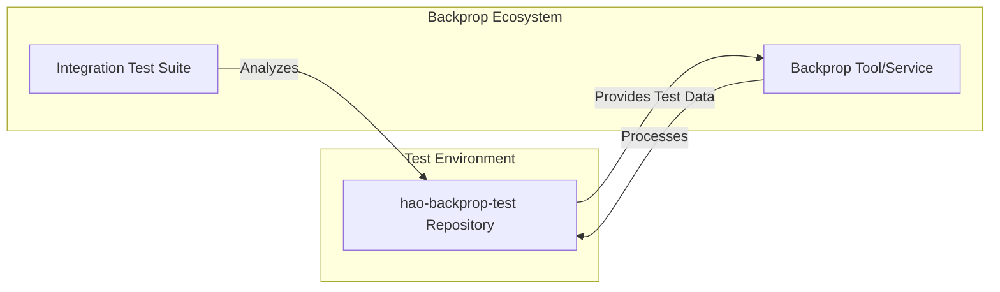

### 1.2.2 High-Level System Description

#### Primary System Capabilities

The system provides a single core capability:

| Capability | Description | Implementation |
|------------|-------------|----------------|
| HTTP Response | Responds to any HTTP request with "Hello, World!" | `server.js` using Node.js native `http` module |

#### Major System Components

The repository contains the following components organized in a flat directory structure:

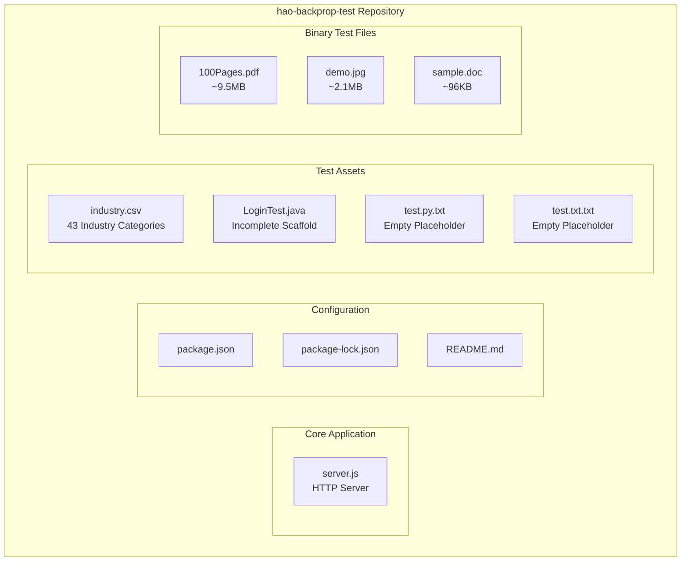

#### Core Technical Approach

The server implementation follows a **minimalist architectural philosophy**:

1. **Native Module Usage**: Uses only Node.js built-in `http` module with no external packages
2. **Single Response Pattern**: All HTTP requests receive identical "Hello, World!" response
3. **Localhost Binding**: Server binds exclusively to `127.0.0.1:3000` for local-only access
4. **Stateless Operation**: No session management, no data persistence, no state tracking

**Technical Specifications:**

| Parameter | Value |
|-----------|-------|
| Host | 127.0.0.1 |
| Port | 3000 |
| Response Code | 200 OK |
| Content-Type | text/plain |
| Response Body | "Hello, World!\n" |

### 1.2.3 Success Criteria

#### Measurable Objectives

Given the project's role as a test harness, success is measured by:

| Objective | Metric | Target |
|-----------|--------|--------|
| Server Availability | HTTP response on localhost:3000 | 100% when running |
| Response Consistency | Identical response to all requests | "Hello, World!\n" always |
| Dependency Isolation | External npm packages | 0 dependencies |
| Repository Stability | Codebase changes | Minimal (test artifact) |

#### Critical Success Factors

1. **Simplicity Preservation**: The codebase must remain minimal to serve as a valid baseline
2. **Deterministic Behavior**: Server response must be completely predictable
3. **File Diversity**: Repository must maintain diverse file types for comprehensive Backprop testing

#### Key Performance Indicators (KPIs)

| KPI | Description | Current Status |
|-----|-------------|----------------|
| Lines of Code | Total server implementation | ~10 lines (server.js) |
| Dependency Count | npm packages required | 0 |
| File Type Coverage | Distinct file extensions | 9 types (.md, .json, .js, .csv, .java, .txt, .pdf, .jpg, .doc) |
| Response Latency | Time to respond to HTTP request | Native Node.js performance |

---

## 1.3 Scope

### 1.3.1 In-Scope Elements

#### Core Features and Functionalities

**Must-Have Capabilities:**

| Feature | Description | Implementation Status |
|---------|-------------|----------------------|
| HTTP Server | Basic HTTP listener on port 3000 | ✅ Implemented in `server.js` |
| Static Response | Return "Hello, World!" to all requests | ✅ Implemented |
| Console Logging | Startup confirmation message | ✅ Implemented |

**Primary User Workflow:**

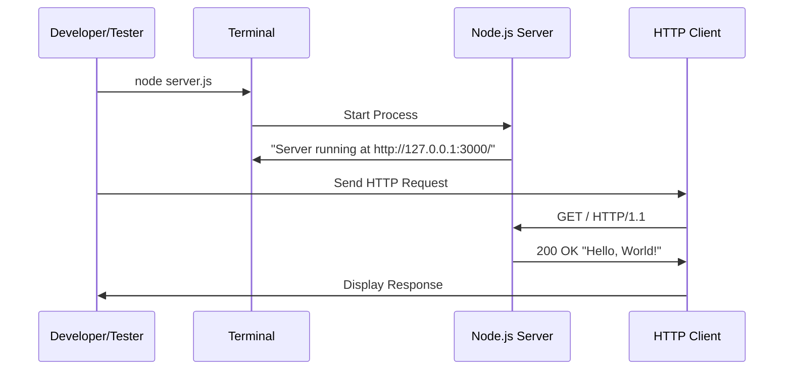

**Essential Test Assets:**

| Asset | Purpose | Content |
|-------|---------|---------|
| `industry.csv` | Taxonomy test data | 43 standard industry categories |
| `LoginTest.java` | Multi-language testing | Java test scaffold (incomplete) |
| `100Pages.pdf` | Binary file processing | Large PDF test document |
| `demo.jpg` | Image file processing | JPEG test image |
| `sample.doc` | Document processing | Word document test file |

#### Implementation Boundaries

**System Boundaries:**
- Single Node.js process
- Localhost network interface only (127.0.0.1)
- Port 3000 exclusively
- No external network communication

**User Groups Covered:**
- Backprop integration testers
- Developers validating Backprop functionality
- Quality assurance engineers testing code analysis tools

**Data Domains Included:**
- HTTP request/response handling
- Industry classification taxonomy (via `industry.csv`)
- Sample binary documents (PDF, JPEG, DOC)

### 1.3.2 Out-of-Scope Elements

#### Explicitly Excluded Features

| Feature | Reason for Exclusion |
|---------|---------------------|
| Production Deployment | Explicitly marked as test project in README |
| Authentication/Authorization | Not required for test harness purpose |
| Database Integration | No data persistence needed |
| HTTPS/TLS Security | Local testing only, no security requirements |
| Multiple Routes/Endpoints | Single response design is intentional |
| Request Parsing | All requests treated identically |
| Error Handling | Beyond Node.js defaults not implemented |
| Logging Framework | Only basic console.log present |
| Configuration Management | No environment variables or config files |
| Graceful Shutdown | Not implemented |
| Health Checks | Not implemented |
| Metrics/Monitoring | Not implemented |

#### Future Phase Considerations

As a test project with the explicit directive "Do not touch!", future phases are intentionally undefined. The repository is designed to remain static to ensure consistent Backprop integration testing baselines.

| Consideration | Status |
|---------------|--------|
| Feature Expansion | Not planned |
| Performance Optimization | Not applicable |
| Security Hardening | Not applicable |
| Scalability Enhancements | Not applicable |

#### Integration Points Not Covered

| Integration Type | Status |
|------------------|--------|
| External APIs | Not implemented |
| Message Queues | Not implemented |
| Cache Systems | Not implemented |
| Cloud Services | Not implemented |
| CI/CD Pipelines | Not configured |
| Container Orchestration | Not configured |

#### Unsupported Use Cases

| Use Case | Reason |
|----------|--------|
| Production web serving | Test project only |
| User-facing applications | No UI or user management |
| Data processing pipelines | No data transformation logic |
| API gateway functionality | Single static response only |
| Microservices architecture | Standalone test artifact |
| Multi-tenant applications | No tenant isolation |

---

## 1.4 Document Conventions

### 1.4.1 Terminology

| Term | Definition |
|------|------------|
| Backprop | External tool/service for code analysis, refactoring, or AI-assisted development |
| Test Harness | A controlled environment for validating software tool behavior |
| Baseline | A known, stable reference point for comparison |

### 1.4.2 Configuration Anomalies

The following configuration issues exist in the repository and should be noted:

| Issue | Location | Description |
|-------|----------|-------------|
| Incorrect Entry Point | `package.json` | `main` field points to `index.js` which does not exist; actual entry point is `server.js` |
| Placeholder Test Script | `package.json` | Test script outputs error message and exits with code 1 |
| Incomplete Java Code | `LoginTest.java` | Contains undefined identifier `Web`; will not compile |

---

#### References

- `README.md` - Project name, description, and purpose declaration ("test project for backprop integration")
- `package.json` - npm package metadata including name (`hello_world`), version (1.0.0), author (hxu), and license (MIT)
- `package-lock.json` - Dependency lock file confirming zero external dependencies
- `server.js` - Complete HTTP server implementation using Node.js native `http` module
- `industry.csv` - 43-item industry category taxonomy used as test data
- `LoginTest.java` - Incomplete Java test scaffold demonstrating multi-language file presence
- `test.py.txt` - Empty placeholder file (0 bytes)
- `test.txt.txt` - Empty placeholder file (0 bytes)
- `100Pages.pdf` - Binary PDF test file (~9.5MB)
- `demo.jpg` - Binary JPEG test file (~2.1MB)
- `sample.doc` - Binary Word document test file (~96KB)

# 2. Product Requirements

## 2.1 Feature Catalog

This section documents the discrete, testable features of the `hao-backprop-test` project. Given the project's intentional simplicity as a Backprop integration test harness, the feature set is deliberately minimal and stable.

### 2.1.1 Feature F-001: HTTP Server

#### Feature Metadata

| Attribute | Value |
|-----------|-------|
| **Feature ID** | F-001 |
| **Feature Name** | HTTP Hello World Server |
| **Feature Category** | Core Functionality |
| **Priority Level** | Critical |
| **Status** | Completed |

#### Description

| Aspect | Details |
|--------|---------|
| **Overview** | A minimal HTTP server that listens on localhost port 3000 and responds to all incoming requests with a static "Hello, World!" message. |
| **Business Value** | Provides a predictable, deterministic baseline for Backprop integration testing by eliminating variables in server response behavior. |
| **User Benefits** | Enables testers to validate Backprop functionality against a known, unchanging target without external dependencies or complex setup. |
| **Technical Context** | Implemented in `server.js` using Node.js native `http` module with CommonJS `require` syntax. Zero external npm packages required. |

#### Dependencies

| Dependency Type | Details |
|-----------------|---------|
| **Prerequisite Features** | None |
| **System Dependencies** | Node.js runtime (version unspecified) |
| **External Dependencies** | None (uses only Node.js built-in `http` module) |
| **Integration Requirements** | None |

---

### 2.1.2 Feature F-002: Test Asset Collection

#### Feature Metadata

| Attribute | Value |
|-----------|-------|
| **Feature ID** | F-002 |
| **Feature Name** | Multi-Format Test Asset Collection |
| **Feature Category** | Test Support |
| **Priority Level** | High |
| **Status** | Completed |

#### Description

| Aspect | Details |
|--------|---------|
| **Overview** | A curated collection of diverse file types enabling comprehensive Backprop testing across multiple file formats, languages, and content types. |
| **Business Value** | Enables validation of Backprop's ability to analyze and process various file types including source code, data files, and binary documents. |
| **User Benefits** | Provides ready-to-use test data without requiring testers to create or source diverse file samples. |
| **Technical Context** | Files are organized in a flat directory structure with intentional variety in size (0 bytes to ~9.5MB) and format (text, binary, structured data). |

#### Dependencies

| Dependency Type | Details |
|-----------------|---------|
| **Prerequisite Features** | None |
| **System Dependencies** | None |
| **External Dependencies** | None |
| **Integration Requirements** | None |

#### Test Asset Inventory

| Asset File | Type | Size | Purpose |
|------------|------|------|---------|
| `industry.csv` | CSV Data | ~2KB | Taxonomy test data with 43 industry categories |
| `LoginTest.java` | Java Source | ~500B | Multi-language code analysis testing |
| `test.py.txt` | Empty Placeholder | 0 bytes | Edge case testing for empty files |
| `test.txt.txt` | Empty Placeholder | 0 bytes | Edge case testing for empty files |
| `100Pages.pdf` | PDF Binary | ~9.5MB | Large binary file processing testing |
| `demo.jpg` | JPEG Binary | ~2.1MB | Image file processing testing |
| `sample.doc` | DOC Binary | ~96KB | Document file processing testing |

---

## 2.2 Functional Requirements

### 2.2.1 Feature F-001: HTTP Server Requirements

#### Requirement F-001-RQ-001: Server Initialization

| Attribute | Value |
|-----------|-------|
| **Requirement ID** | F-001-RQ-001 |
| **Description** | The server must initialize and bind to the specified host and port on startup. |
| **Priority** | Must-Have |
| **Complexity** | Low |

| Acceptance Criteria | Status |
|---------------------|--------|
| Server binds to host `127.0.0.1` | ✅ Implemented |
| Server listens on port `3000` | ✅ Implemented |
| Console outputs startup confirmation message | ✅ Implemented |
| Message format: `Server running at http://127.0.0.1:3000/` | ✅ Implemented |

**Technical Specifications:**

| Parameter | Specification |
|-----------|---------------|
| **Input Parameters** | None (hardcoded configuration) |
| **Output/Response** | Console log message confirming server startup |
| **Performance Criteria** | Server ready to accept connections immediately after startup |
| **Data Requirements** | None |

**Validation Rules:**

| Rule Type | Requirement |
|-----------|-------------|
| **Business Rules** | Server must bind to localhost only (127.0.0.1) |
| **Data Validation** | N/A - no configurable inputs |
| **Security Requirements** | Localhost binding prevents external network access |
| **Compliance Requirements** | None |

---

#### Requirement F-001-RQ-002: HTTP Request Handling

| Attribute | Value |
|-----------|-------|
| **Requirement ID** | F-001-RQ-002 |
| **Description** | The server must respond to any HTTP request with a static "Hello, World!" response. |
| **Priority** | Must-Have |
| **Complexity** | Low |

| Acceptance Criteria | Status |
|---------------------|--------|
| All HTTP methods receive identical response | ✅ Implemented |
| All URL paths receive identical response | ✅ Implemented |
| Response includes proper HTTP status code | ✅ Implemented |
| Response body is exactly "Hello, World!\n" | ✅ Implemented |

**Technical Specifications:**

| Parameter | Specification |
|-----------|---------------|
| **Input Parameters** | HTTP request (any method, any path, any headers) |
| **Output/Response** | HTTP 200 OK with "Hello, World!\n" body |
| **Performance Criteria** | Native Node.js `http` module performance |
| **Data Requirements** | None |

**Response Format:**

| Header/Property | Value |
|-----------------|-------|
| **Status Code** | 200 |
| **Content-Type** | text/plain |
| **Body** | "Hello, World!\n" |

**Validation Rules:**

| Rule Type | Requirement |
|-----------|-------------|
| **Business Rules** | Response must be identical for all requests (no routing logic) |
| **Data Validation** | N/A - no request parsing performed |
| **Security Requirements** | None (no authentication, no input processing) |
| **Compliance Requirements** | None |

---

#### Requirement F-001-RQ-003: Stateless Operation

| Attribute | Value |
|-----------|-------|
| **Requirement ID** | F-001-RQ-003 |
| **Description** | The server must operate without maintaining any state between requests. |
| **Priority** | Must-Have |
| **Complexity** | Low |

| Acceptance Criteria | Status |
|---------------------|--------|
| No session management implemented | ✅ Confirmed |
| No data persistence between requests | ✅ Confirmed |
| No in-memory caching or storage | ✅ Confirmed |
| Each request is independent | ✅ Confirmed |

**Technical Specifications:**

| Parameter | Specification |
|-----------|---------------|
| **Input Parameters** | N/A |
| **Output/Response** | N/A |
| **Performance Criteria** | Constant memory footprint |
| **Data Requirements** | No data storage |

---

### 2.2.2 Feature F-002: Test Asset Requirements

#### Requirement F-002-RQ-001: File Type Diversity

| Attribute | Value |
|-----------|-------|
| **Requirement ID** | F-002-RQ-001 |
| **Description** | The repository must contain diverse file types for comprehensive Backprop testing. |
| **Priority** | Must-Have |
| **Complexity** | Low |

| Acceptance Criteria | Status |
|---------------------|--------|
| Repository contains JavaScript source files | ✅ `server.js` |
| Repository contains JSON configuration files | ✅ `package.json`, `package-lock.json` |
| Repository contains Markdown documentation | ✅ `README.md` |
| Repository contains CSV data files | ✅ `industry.csv` |
| Repository contains alternative language source | ✅ `LoginTest.java` |
| Repository contains empty/placeholder files | ✅ `test.py.txt`, `test.txt.txt` |
| Repository contains binary files | ✅ PDF, JPEG, DOC |

**File Type Coverage:**

| Category | Extensions | Count |
|----------|------------|-------|
| Source Code | .js, .java | 2 |
| Configuration | .json | 2 |
| Documentation | .md | 1 |
| Data | .csv | 1 |
| Placeholder | .txt | 2 |
| Binary | .pdf, .jpg, .doc | 3 |
| **Total** | 9 unique types | 11 files |

---

#### Requirement F-002-RQ-002: Industry Taxonomy Data

| Attribute | Value |
|-----------|-------|
| **Requirement ID** | F-002-RQ-002 |
| **Description** | The `industry.csv` file must contain a structured taxonomy of industry categories. |
| **Priority** | Should-Have |
| **Complexity** | Low |

| Acceptance Criteria | Status |
|---------------------|--------|
| File contains a header row | ✅ "Industry" header |
| File contains industry category entries | ✅ 43 categories |
| Entries include special characters for edge case testing | ✅ Contains "/" and "-" characters |
| File is valid CSV format | ✅ Single-column structure |

**Data Sample (Representative Entries):**

| Industry Category Examples |
|---------------------------|
| Accounting |
| Airlines/Aviation |
| Computer Hardware |
| Banking/Mortgage |
| Information Technology/IT |

---

#### Requirement F-002-RQ-003: Known Incomplete Assets

| Attribute | Value |
|-----------|-------|
| **Requirement ID** | F-002-RQ-003 |
| **Description** | Certain test assets are intentionally incomplete to test Backprop's handling of edge cases. |
| **Priority** | Could-Have |
| **Complexity** | Low |

| Known Anomaly | File | Description |
|---------------|------|-------------|
| Non-compilable Java code | `LoginTest.java` | Contains undefined `Web` identifier |
| Empty files | `test.py.txt`, `test.txt.txt` | 0-byte placeholder files |
| Incorrect entry point | `package.json` | `main` points to non-existent `index.js` |
| Failing test script | `package.json` | Test script exits with error code 1 |

---

## 2.3 Feature Relationships

### 2.3.1 Feature Dependency Map

Given the minimal nature of this test project, feature relationships are intentionally limited:

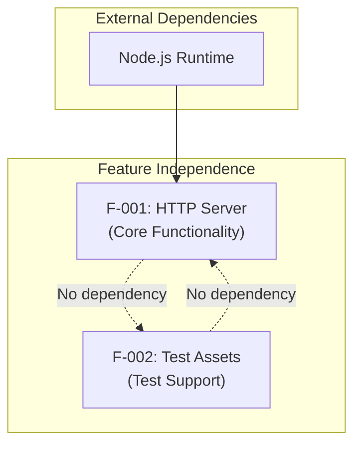

### 2.3.2 Integration Points

| Integration Aspect | Status |
|--------------------|--------|
| **Inter-Feature Dependencies** | None - features are independent |
| **Shared Components** | None |
| **Common Services** | None |
| **External Integrations** | None |

### 2.3.3 Dependency Matrix

| Feature | Depends On | Required By |
|---------|------------|-------------|
| F-001: HTTP Server | Node.js runtime | None |
| F-002: Test Assets | None | None |

---

## 2.4 Implementation Considerations

### 2.4.1 Feature F-001: HTTP Server Considerations

#### Technical Constraints

| Constraint | Description |
|------------|-------------|
| **Runtime Dependency** | Requires Node.js runtime (version unspecified) |
| **Network Binding** | Hardcoded to `127.0.0.1:3000` - cannot be configured |
| **Single Instance** | No support for clustering or multiple workers |
| **No Configuration** | No environment variables or config file support |

#### Performance Requirements

| Metric | Requirement |
|--------|-------------|
| **Response Time** | Native Node.js HTTP performance (typically <10ms for localhost) |
| **Throughput** | Limited by single-threaded Node.js event loop |
| **Memory Usage** | Minimal - no state storage |
| **Startup Time** | Immediate - no initialization overhead |

#### Scalability Considerations

| Aspect | Assessment |
|--------|------------|
| **Horizontal Scaling** | Not applicable - test project only |
| **Vertical Scaling** | Not applicable - minimal resource usage |
| **Load Balancing** | Not supported |
| **Caching** | Not implemented |

#### Security Implications

| Security Aspect | Status |
|-----------------|--------|
| **Network Exposure** | Localhost only - no external access |
| **Authentication** | Not implemented (intentional) |
| **Input Validation** | Not implemented - all inputs ignored |
| **TLS/HTTPS** | Not implemented (intentional) |
| **Rate Limiting** | Not implemented |

#### Maintenance Requirements

| Requirement | Description |
|-------------|-------------|
| **Code Stability** | Must remain unchanged ("Do not touch!" directive) |
| **Dependency Updates** | No external dependencies to update |
| **Bug Fixes** | Configuration anomalies are intentional |
| **Documentation** | This specification serves as primary reference |

---

### 2.4.2 Feature F-002: Test Assets Considerations

#### Technical Constraints

| Constraint | Description |
|------------|-------------|
| **File System** | Files must remain in flat directory structure |
| **File Integrity** | Binary files must remain uncorrupted |
| **Size Limits** | Repository includes large files (~9.5MB PDF) |

#### Maintenance Requirements

| Requirement | Description |
|-------------|-------------|
| **Asset Stability** | Files must not be modified to maintain test baseline |
| **Format Consistency** | File formats must remain as-is |
| **Known Anomalies** | Intentionally incomplete files must remain incomplete |

---

## 2.5 Requirements Traceability Matrix

### 2.5.1 Feature-to-Requirement Tracing

| Feature ID | Requirement ID | Description | Priority | Status |
|------------|----------------|-------------|----------|--------|
| F-001 | F-001-RQ-001 | Server Initialization | Must-Have | Completed |
| F-001 | F-001-RQ-002 | HTTP Request Handling | Must-Have | Completed |
| F-001 | F-001-RQ-003 | Stateless Operation | Must-Have | Completed |
| F-002 | F-002-RQ-001 | File Type Diversity | Must-Have | Completed |
| F-002 | F-002-RQ-002 | Industry Taxonomy Data | Should-Have | Completed |
| F-002 | F-002-RQ-003 | Known Incomplete Assets | Could-Have | Completed |

### 2.5.2 Requirement-to-Implementation Tracing

| Requirement ID | Implementation File | Lines/Location |
|----------------|---------------------|----------------|
| F-001-RQ-001 | `server.js` | Lines 2-4, 11-13 |
| F-001-RQ-002 | `server.js` | Lines 6-10 |
| F-001-RQ-003 | `server.js` | Full file (no state management code) |
| F-002-RQ-001 | Repository root | Multiple files |
| F-002-RQ-002 | `industry.csv` | Full file |
| F-002-RQ-003 | `LoginTest.java`, `package.json`, empty files | Various |

---

## 2.6 Assumptions and Constraints

### 2.6.1 Assumptions

| ID | Assumption | Impact if Invalid |
|----|------------|-------------------|
| A-001 | Node.js is installed on the target system | Server cannot start |
| A-002 | Port 3000 is available on localhost | Server fails to bind |
| A-003 | Repository stability is maintained | Backprop test baseline becomes unreliable |
| A-004 | Known anomalies remain unfixed | Edge case testing scenarios are lost |

### 2.6.2 Constraints

| ID | Constraint | Rationale |
|----|------------|-----------|
| C-001 | No new features shall be added | "Do not touch!" directive; test baseline stability |
| C-002 | No configuration externalization | Intentional simplicity for predictable testing |
| C-003 | No external npm dependencies | Isolation requirement for clean testing |
| C-004 | Localhost binding only | Test project security posture |

---

## 2.7 Process Flowcharts

### 2.7.1 Server Startup Flow

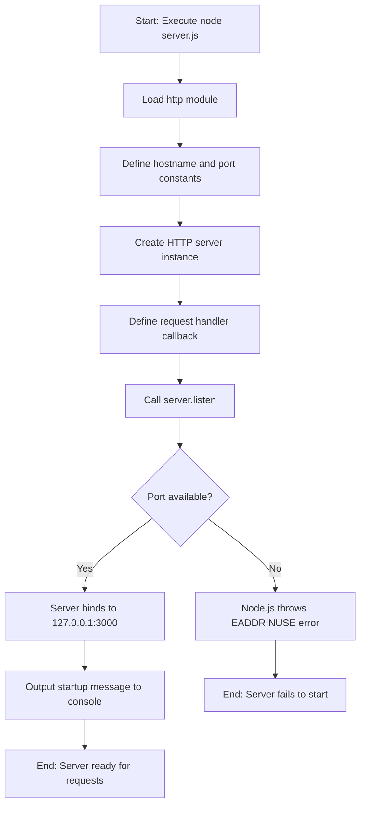

### 2.7.2 Request Handling Flow

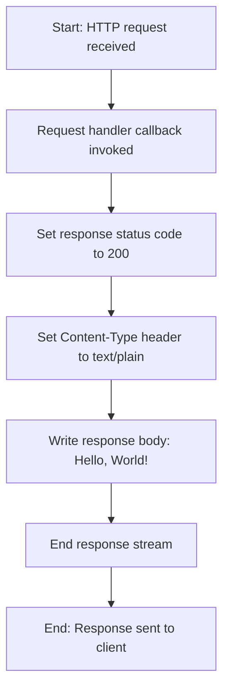

---

## 2.8 References

### 2.8.1 Implementation Files

| File | Relevance |
|------|-----------|
| `server.js` | Core HTTP server implementation; source for F-001 requirements |
| `package.json` | Project metadata, entry point configuration (with known anomaly) |
| `package-lock.json` | Confirms zero external dependencies |
| `README.md` | Project purpose declaration and "Do not touch!" directive |

### 2.8.2 Test Asset Files

| File | Relevance |
|------|-----------|
| `industry.csv` | Structured data test asset; 43 industry taxonomy entries |
| `LoginTest.java` | Multi-language test asset; intentionally incomplete |
| `test.py.txt` | Empty file edge case testing |
| `test.txt.txt` | Empty file edge case testing |
| `100Pages.pdf` | Large binary file test asset (~9.5MB) |
| `demo.jpg` | Image binary file test asset (~2.1MB) |
| `sample.doc` | Document binary file test asset (~96KB) |

### 2.8.3 Related Technical Specification Sections

| Section | Relationship |
|---------|--------------|
| 1.1 Executive Summary | Project overview and stakeholder context |
| 1.2 System Overview | System capabilities and success criteria |
| 1.3 Scope | In-scope and out-of-scope boundaries |
| 1.4 Document Conventions | Terminology definitions and known configuration anomalies |

# 3. Technology Stack

## 3.1 Overview

The `hao-backprop-test` project employs a deliberately minimal technology stack, optimized for its role as a Backprop integration test harness rather than a production system. This section documents all technology choices, their rationale, and explicitly identifies areas where the default enterprise technology stack is intentionally not applicable.

### 3.1.1 Technology Selection Philosophy

The technology choices for this project are governed by a fundamental design constraint: **intentional simplicity**. As documented in Section 2.6.2, constraint C-003 mandates "No external npm dependencies - Isolation requirement for clean testing." This constraint, combined with the project's purpose as a stable test baseline, drives all technology decisions.

| Selection Criteria | Application to This Project |
|-------------------|----------------------------|
| Simplicity | Single-file implementation with no build complexity |
| Predictability | Deterministic behavior for reliable test baselines |
| Isolation | Zero external dependencies eliminate variable factors |
| Stability | Minimal surface area reduces maintenance requirements |

### 3.1.2 Technology Stack Summary Diagram

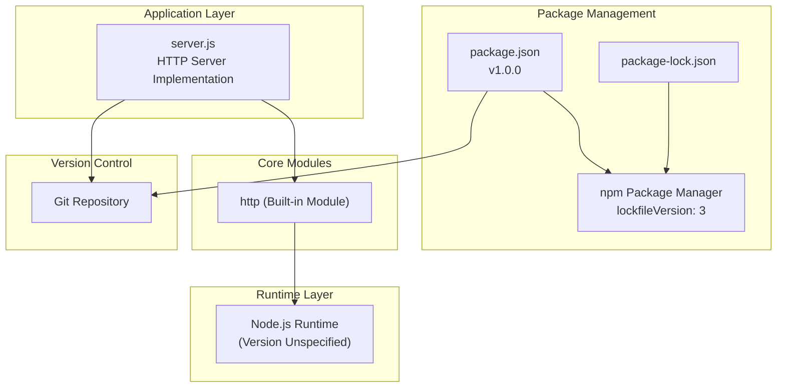

### 3.1.3 Deviation from Default Technology Stack

This project intentionally deviates from the enterprise default technology stack. The following table documents all default technologies and their applicability status:

| Default Technology | Category | Status | Rationale |
|-------------------|----------|--------|-----------|
| AWS | Cloud Platform | ❌ Not Used | Test project requires no cloud deployment |
| Docker | Containerization | ❌ Not Used | No containerization configured for test harness |
| Terraform | Infrastructure as Code | ❌ Not Used | No infrastructure provisioning needed |
| GitHub Actions | CI/CD | ❌ Not Used | No automated pipelines configured |
| Python/Flask | Backend Language/Framework | ❌ Not Used | Node.js is the selected runtime |
| Auth0 | Authentication | ❌ Not Used | No authentication per Section 1.3.2 |
| MongoDB | Database | ❌ Not Used | Stateless operation per F-001-RQ-003 |
| Langchain | AI Framework | ❌ Not Used | No AI components required |
| React/TypeScript | Frontend Web | ❌ Not Used | No frontend user interface |
| TailwindCSS | CSS Framework | ❌ Not Used | No frontend styling needed |
| React-Native | Mobile Framework | ❌ Not Used | No mobile application |
| Swift/Kotlin | Native Mobile | ❌ Not Used | No native app components |
| Objective-C | macOS Development | ❌ Not Used | No desktop application |
| ElectronJS | Desktop Framework | ❌ Not Used | No desktop application |

---

## 3.2 Programming Languages

### 3.2.1 Primary Language: JavaScript (Node.js)

The project utilizes JavaScript as its sole programming language, executed on the Node.js runtime environment.

| Attribute | Specification |
|-----------|--------------|
| **Language** | JavaScript (ECMAScript) |
| **Runtime** | Node.js |
| **Version Specified** | No explicit version constraint |
| **Module System** | CommonJS (`require()`) |
| **Source File** | `server.js` |

#### Language Selection Justification

| Criterion | Justification |
|-----------|---------------|
| **Simplicity** | JavaScript enables single-file implementation without compilation |
| **Native HTTP Support** | Node.js provides built-in HTTP server capabilities |
| **No Build Step** | Direct execution without transpilation or bundling |
| **Backprop Compatibility** | Node.js projects are standard targets for code analysis tools |

#### Runtime Version Considerations

The project does not specify a Node.js version requirement in `package.json`. According to Section 2.6.1, Assumption A-001 states: "Node.js is installed on the target system" with the impact "Server cannot start" if invalid.

**Recommended Node.js Versions for Execution:**

| Version | Status | Support End |
|---------|--------|-------------|
| Node.js 22.x (Jod) | Active LTS | April 2027 |
| Node.js 20.x (Iron) | Maintenance LTS | April 2026 |
| Node.js 24.x (Krypton) | Active LTS | April 2028 |

The minimalist implementation using only the built-in `http` module ensures broad compatibility across all modern Node.js versions. No version-specific features are utilized.

### 3.2.2 Secondary Languages (Test Assets Only)

The repository contains files in other languages for Backprop file-type diversity testing. These are **not functional components** of the technology stack.

| Language | File | Status | Purpose |
|----------|------|--------|---------|
| Java | `LoginTest.java` | Non-Compilable | Contains undefined `Web` identifier; intentionally broken for edge-case testing |
| Python | `test.py.txt` | Empty Placeholder | 0-byte file for file extension diversity |

> **Important**: These files exist solely to test Backprop's handling of multi-language repositories and incomplete code. They do not represent functional technology stack components.

---

## 3.3 Frameworks & Libraries

### 3.3.1 Core Framework: None

The project deliberately uses **no web frameworks**. This is an intentional architectural decision to maintain maximum simplicity and isolation.

| Common Frameworks | Status | Rationale for Exclusion |
|-------------------|--------|------------------------|
| Express.js | Not Used | Adds external dependency; violates constraint C-003 |
| Koa | Not Used | Adds external dependency; violates constraint C-003 |
| Fastify | Not Used | Adds external dependency; violates constraint C-003 |
| Hapi | Not Used | Adds external dependency; violates constraint C-003 |
| NestJS | Not Used | Adds external dependency; violates constraint C-003 |

### 3.3.2 Node.js Built-in Module: http

The only module utilized is Node.js's native `http` module, which is part of the Node.js core distribution.

| Attribute | Value |
|-----------|-------|
| **Module Name** | `http` |
| **Import Statement** | `const http = require('http');` |
| **Type** | Node.js Built-in (Core Module) |
| **External Installation** | Not Required |
| **Version** | Tied to Node.js runtime version |

#### Module Capabilities Used

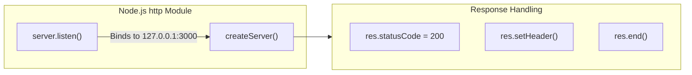

| Method | Usage in server.js | Purpose |
|--------|-------------------|---------|
| `http.createServer()` | Request handler setup | Creates HTTP server instance with callback |
| `res.statusCode` | Set to `200` | Defines HTTP response status |
| `res.setHeader()` | Sets `Content-Type: text/plain` | Defines response header |
| `res.end()` | Sends `Hello, World!\n` | Completes response with body content |
| `server.listen()` | Binds to `127.0.0.1:3000` | Activates server on specified host/port |

### 3.3.3 Supporting Libraries: None

No supporting libraries are used. The project maintains a zero-dependency architecture as documented in Section 1.2.3 (KPI: "Dependency Count - npm packages required: 0").

---

## 3.4 Open Source Dependencies

### 3.4.1 Production Dependencies

| Dependency | Version | Status |
|------------|---------|--------|
| *None* | — | Zero external dependencies by design |

The `package.json` file contains no `dependencies` field, confirming the zero-dependency architecture.

### 3.4.2 Development Dependencies

| Dependency | Version | Status |
|------------|---------|--------|
| *None* | — | Zero devDependencies by design |

The `package.json` file contains no `devDependencies` field.

### 3.4.3 Package Registry Configuration

| Attribute | Value |
|-----------|-------|
| **Registry** | npm (default public registry) |
| **Package Name** | `hello_world` |
| **Version** | `1.0.0` |
| **License** | MIT |
| **Author** | hxu |

## package.json Manifest

| Field | Value | Notes |
|-------|-------|-------|
| `name` | `hello_world` | npm package identifier |
| `version` | `1.0.0` | Semantic version |
| `description` | `Hello world in Node.js` | Package description |
| `main` | `index.js` | **Known Anomaly**: Points to non-existent file |
| `license` | `MIT` | Open source license |
| `author` | `hxu` | Original author |

### 3.4.4 Lock File Analysis

| Attribute | Value |
|-----------|-------|
| **File** | `package-lock.json` |
| **lockfileVersion** | 3 |
| **npm Version Indicated** | npm v7+ compatible |
| **Locked Dependencies** | None (only root package metadata) |

The `lockfileVersion: 3` format indicates the lock file was generated with npm version 7.0.0 or later, which introduced this lock file format.

### 3.4.5 Dependency Security Posture

| Security Aspect | Assessment |
|-----------------|------------|
| **Supply Chain Risk** | Eliminated - no external packages |
| **Transitive Dependencies** | None - no dependency tree |
| **Vulnerability Surface** | Minimal - only Node.js core |
| **Audit Requirements** | None - `npm audit` returns empty results |

---

## 3.5 Third-Party Services

### 3.5.1 External Service Integration Status

As documented in Section 1.3.2 (Out-of-Scope Elements), third-party services are explicitly excluded from this project.

| Service Category | Status | Rationale |
|-----------------|--------|-----------|
| External APIs | ❌ Not Implemented | Test harness requires no external data |
| Authentication Services | ❌ Not Implemented | No user authentication needed |
| Monitoring Tools | ❌ Not Implemented | Not required for test project |
| Cloud Services | ❌ Not Implemented | Local execution only |
| Message Queues | ❌ Not Implemented | No asynchronous messaging needed |
| Cache Systems | ❌ Not Implemented | Stateless operation by design |

### 3.5.2 Network Connectivity

| Aspect | Configuration |
|--------|--------------|
| **Inbound Connections** | Localhost only (127.0.0.1) |
| **Outbound Connections** | None |
| **External API Calls** | None |
| **Network Dependencies** | None |

The localhost-only binding (constraint C-004) ensures complete network isolation, eliminating any dependency on external services or internet connectivity.

---

## 3.6 Databases & Storage

### 3.6.1 Database Status: Not Applicable

The project operates under a stateless architecture as mandated by Requirement F-001-RQ-003:

| Stateless Requirement | Implementation Status |
|----------------------|----------------------|
| No session management | ✅ Confirmed |
| No data persistence between requests | ✅ Confirmed |
| No in-memory caching or storage | ✅ Confirmed |
| Each request is independent | ✅ Confirmed |

### 3.6.2 Storage Technologies Not Implemented

| Technology Category | Default Option | Status | Rationale |
|--------------------|---------------|--------|-----------|
| Primary Database | MongoDB | ❌ Not Used | Stateless design; no data persistence |
| Secondary Database | — | ❌ Not Used | Not applicable |
| Caching Layer | Redis/Memcached | ❌ Not Used | No caching requirements |
| Object Storage | S3/Blob Storage | ❌ Not Used | No file storage requirements |
| Session Storage | — | ❌ Not Used | No session management |

### 3.6.3 Static Data Assets

While no database exists, the repository contains one structured data file used for test purposes:

| File | Format | Purpose | Content |
|------|--------|---------|---------|
| `industry.csv` | CSV | Taxonomy test data | 43 industry categories with header row |

This file is a **static test asset** for Backprop analysis, not a data storage solution. Sample categories include: Accounting, Airlines/Aviation, Banking/Mortgage, Computer Hardware, and Information Technology/IT.

---

## 3.7 Development & Deployment

### 3.7.1 Development Tools

#### Package Manager

| Tool | Version | Evidence |
|------|---------|----------|
| **npm** | v7.0.0+ (inferred from lockfileVersion: 3) | `package-lock.json` |

#### Version Control

| Tool | Configuration | Evidence |
|------|--------------|----------|
| **Git** | Repository initialized | `.git` folder present |
| **Platform** | GitHub | Repository context from README |

#### Code Editor Support

No specific IDE configurations are included (no `.vscode/`, `.idea/`, or editor config files), allowing developers to use any preferred development environment.

### 3.7.2 Build System: None Required

| Build Aspect | Status |
|--------------|--------|
| Transpilation | Not Required (native JavaScript) |
| Bundling | Not Required (single file) |
| Minification | Not Required (development/test only) |
| Source Maps | Not Required (no transpilation) |
| Asset Pipeline | Not Required (no static assets to process) |

The project executes directly with `node server.js` without any build step, compilation, or preprocessing.

### 3.7.3 npm Scripts Configuration

| Script | Command | Status |
|--------|---------|--------|
| `test` | `echo "Error: no test specified" && exit 1` | Placeholder (intentionally fails) |
| `start` | *Not defined* | Server started with `node server.js` |
| `build` | *Not defined* | No build process required |

> **Known Anomaly**: The `test` script exits with error code 1, which is intentional for edge case testing as documented in Requirement F-002-RQ-003.

### 3.7.4 Containerization: Not Implemented

| Container Technology | Status | Rationale |
|---------------------|--------|-----------|
| Docker | ❌ Not Configured | Test project; no production deployment |
| Docker Compose | ❌ Not Configured | No multi-container orchestration needed |
| Container Registry | ❌ Not Configured | No image publishing required |

No `Dockerfile`, `docker-compose.yml`, or `.dockerignore` files are present in the repository.

### 3.7.5 CI/CD Pipeline: Not Implemented

| CI/CD Technology | Status | Rationale |
|-----------------|--------|-----------|
| GitHub Actions | ❌ Not Configured | No automated workflows defined |
| GitLab CI | ❌ Not Configured | Not applicable |
| Jenkins | ❌ Not Configured | Not applicable |
| CircleCI | ❌ Not Configured | Not applicable |

As documented in Section 1.3.2, CI/CD Pipelines are explicitly out of scope. The repository contains no `.github/workflows/`, `.gitlab-ci.yml`, `Jenkinsfile`, or similar CI/CD configuration files.

### 3.7.6 Execution Environment

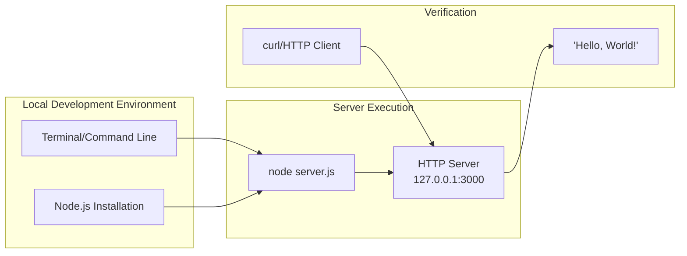

| Execution Step | Command/Action |
|---------------|----------------|
| Start Server | `node server.js` |
| Verify Output | Console displays: `Server running at http://127.0.0.1:3000/` |
| Test Response | `curl http://127.0.0.1:3000` returns `Hello, World!` |

---

## 3.8 Security Considerations

### 3.8.1 Security Posture Summary

The project's minimal technology stack provides inherent security benefits through reduced attack surface:

| Security Aspect | Status | Implementation |
|-----------------|--------|----------------|
| **Network Exposure** | Localhost Only | Hardcoded to 127.0.0.1 (C-004) |
| **Dependency Vulnerabilities** | Eliminated | Zero external dependencies |
| **Input Validation** | Not Implemented | All inputs ignored by design |
| **Authentication** | Not Implemented | Intentional for test project |
| **TLS/HTTPS** | Not Implemented | Local testing only |
| **Rate Limiting** | Not Implemented | Not required for local testing |

### 3.8.2 Security Implications of Technology Choices

| Decision | Security Impact |
|----------|-----------------|
| Zero dependencies | Eliminates supply chain attack vectors |
| Localhost binding | Prevents external network access |
| No authentication | Acceptable for isolated test environment |
| No input processing | No injection vulnerabilities possible |
| Native Node.js only | Security depends solely on Node.js runtime updates |

### 3.8.3 Node.js Runtime Security

Since the project relies exclusively on Node.js core modules, security maintenance is limited to keeping the Node.js runtime updated:

| Maintenance Task | Frequency | Responsibility |
|-----------------|-----------|----------------|
| Node.js security patches | As released | Runtime administrator |
| Dependency audits | Not applicable | No dependencies |
| Container security | Not applicable | No containerization |

---

## 3.9 Technology Stack Compatibility Matrix

### 3.9.1 Component Integration Requirements

| Component | Integrates With | Integration Mechanism |
|-----------|-----------------|----------------------|
| `server.js` | Node.js `http` module | CommonJS `require()` import |
| `package.json` | npm | Package manifest parsing |
| `package-lock.json` | npm | Dependency resolution (empty) |
| `README.md` | Documentation tools | Markdown rendering |

### 3.9.2 Version Compatibility

| Component | Minimum Version | Maximum Version | Notes |
|-----------|-----------------|-----------------|-------|
| Node.js | Any modern version | Latest | Uses only stable `http` module APIs |
| npm | 7.0.0+ | Latest | lockfileVersion 3 compatibility |
| Git | Any | Latest | Standard repository operations |

### 3.9.3 File Type Coverage for Backprop Testing

The technology stack intentionally includes diverse file types to enable comprehensive Backprop code analysis testing:

| Category | File Types | Count | Purpose |
|----------|-----------|-------|---------|
| Source Code | `.js`, `.java` | 2 | Multi-language analysis testing |
| Configuration | `.json` | 2 | Configuration parsing testing |
| Documentation | `.md` | 1 | Markdown processing testing |
| Data | `.csv` | 1 | Structured data analysis testing |
| Placeholder | `.txt` | 2 | Edge case handling (empty files) |
| Binary | `.pdf`, `.jpg`, `.doc` | 3 | Binary file handling testing |
| **Total** | 9 unique extensions | 11 files | Comprehensive file type coverage |

---

## 3.10 References

### 3.10.1 Repository Files Examined

| File Path | Relevance to Technology Stack |
|-----------|------------------------------|
| `server.js` | Core application implementing HTTP server with Node.js `http` module |
| `package.json` | npm package manifest defining project metadata and (empty) dependencies |
| `package-lock.json` | Dependency lock file confirming zero external dependencies |
| `README.md` | Project documentation establishing test project context |
| `LoginTest.java` | Test asset demonstrating multi-language file presence (non-functional) |
| `industry.csv` | Static data asset for taxonomy testing |
| `test.py.txt` | Empty placeholder file for file type diversity |
| `test.txt.txt` | Empty placeholder file for file type diversity |
| `100Pages.pdf` | Binary test file (~9.5MB) |
| `demo.jpg` | Binary test file (~2.1MB) |
| `sample.doc` | Binary test file (~96KB) |

### 3.10.2 Technical Specification Sections Referenced

- **Section 1.1 Executive Summary**: Project overview and stakeholder context
- **Section 1.2 System Overview**: Architecture and core technical approach
- **Section 1.3 Scope**: In-scope and out-of-scope technology elements
- **Section 2.2 Functional Requirements**: Stateless operation requirements (F-001-RQ-003)
- **Section 2.4 Implementation Considerations**: Technical constraints and performance requirements
- **Section 2.6 Assumptions and Constraints**: Technology-related constraints (C-001 through C-004)

### 3.10.3 External Sources

| Source | Information Retrieved |
|--------|----------------------|
| Node.js Official Release Schedule (nodejs.org) | Current LTS version information and support timelines |
| GitHub nodejs/Release Repository | Node.js 22.x (Jod) Active LTS and Node.js 24.x (Krypton) Active LTS status |
| npm Package Registry Documentation | lockfileVersion 3 indicates npm v7+ compatibility |

# 4. Process Flowchart

This section provides comprehensive process flowcharts documenting all system workflows, integration patterns, and operational flows for the `hao-backprop-test` repository. Given the project's role as a minimal test harness for Backprop integration testing, the process flows are intentionally simple and deterministic.

## 4.1 System Workflow Overview

### 4.1.1 High-Level System Workflow

The system operates through two primary workflows: server initialization and request handling. These workflows form the complete operational scope of the application.

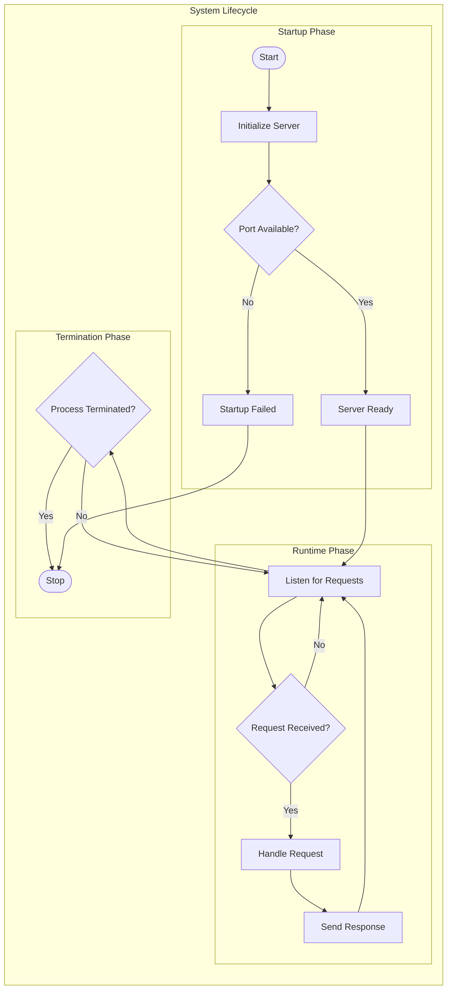

### 4.1.2 System States Overview

The server maintains minimal state throughout its lifecycle. The following state diagram illustrates all possible system states:

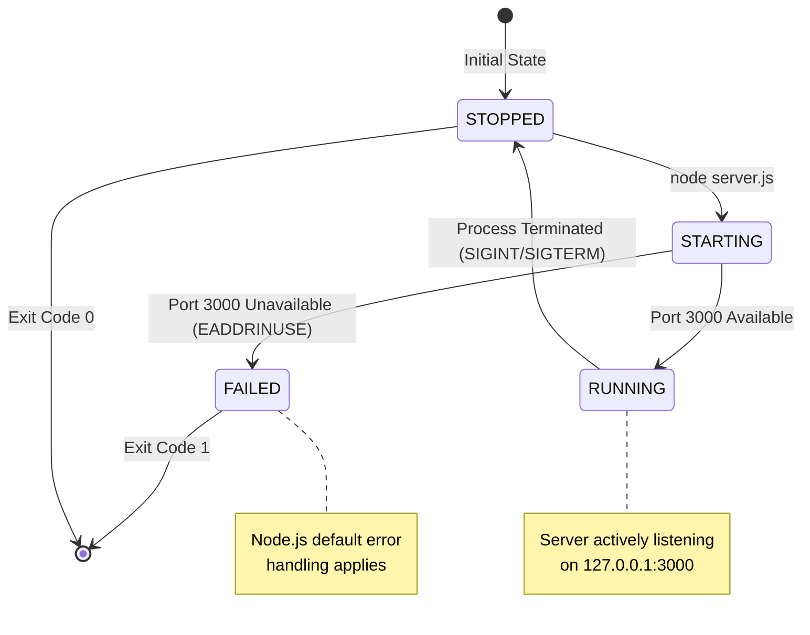

## 4.2 Core Business Processes

### 4.2.1 Server Startup Flow

The server startup process follows a deterministic sequence of operations using only Node.js built-in modules. This flow is implemented in `server.js`.

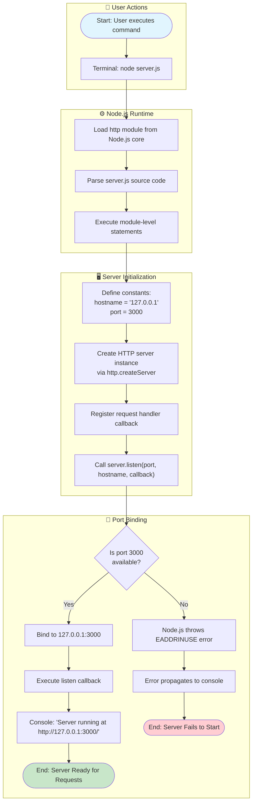

#### Startup Validation Rules

| Step | Validation Rule | Business Rule | Error Handling |
|------|-----------------|---------------|----------------|
| Load Module | `http` module must exist | Use only built-in Node.js modules (C-003) | Node.js throws MODULE_NOT_FOUND |
| Define Constants | Values are hardcoded | No configuration externalization (C-002) | N/A - compile-time constants |
| Create Server | Handler must be valid function | Single response pattern required | Node.js throws TypeError |
| Port Binding | Port 3000 must be available | Localhost binding only (C-004) | Node.js throws EADDRINUSE |

### 4.2.2 Request Handling Flow

All incoming HTTP requests follow an identical processing path, regardless of method, path, headers, or body content. This implements the stateless operation requirement (F-001-RQ-003).

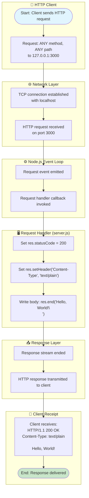

#### Request Processing Validation Rules

| Step | Validation Rule | Implementation Note |
|------|-----------------|---------------------|
| Request Receipt | All HTTP methods accepted | No method filtering implemented |
| Path Handling | All paths receive identical response | No routing logic exists |
| Header Processing | Headers are ignored | No header inspection performed |
| Body Processing | Request body is ignored | No body parsing implemented |
| Response Generation | Fixed response always returned | Stateless by design (F-001-RQ-003) |

### 4.2.3 End-to-End User Journey

The complete user workflow encompasses server startup, request testing, and response verification:

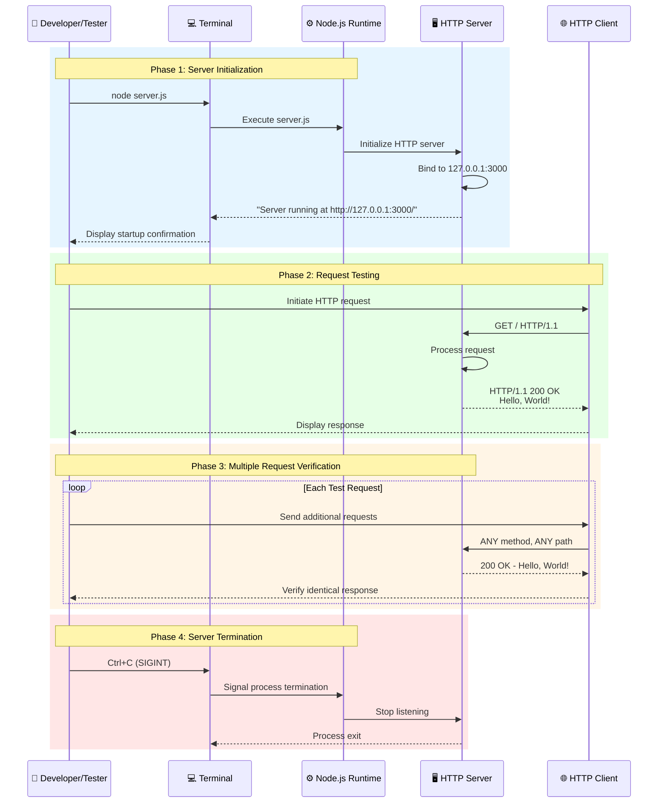

## 4.3 Integration Workflows

### 4.3.1 Backprop Integration Testing Flow

The primary purpose of this repository is to serve as a test harness for Backprop integration. The following diagram illustrates the integration workflow:

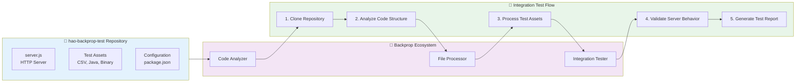

### 4.3.2 HTTP Client Integration Sequence

This sequence diagram details the data flow between external HTTP clients and the server:

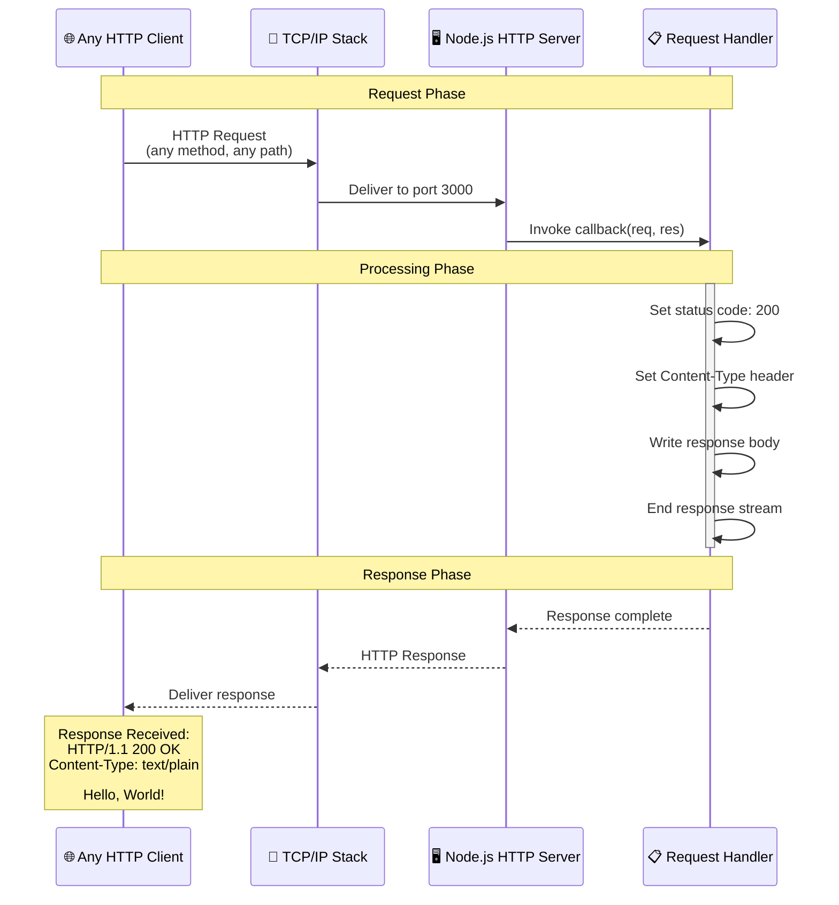

### 4.3.3 Data Flow Between Systems

The system maintains unidirectional data flow with no persistent state:

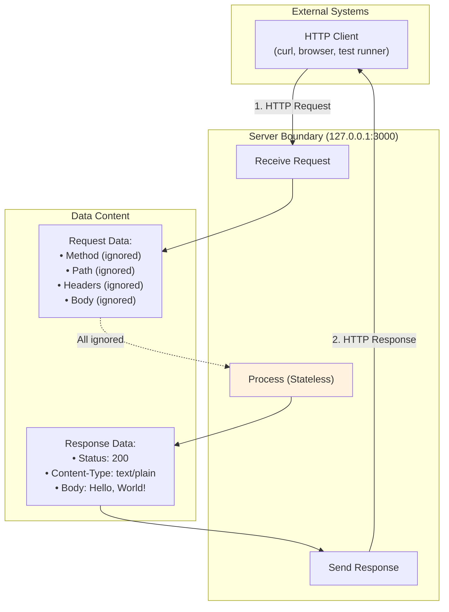

## 4.4 Error Handling Flowcharts

### 4.4.1 Error Handling Overview

The system relies on default Node.js error handling mechanisms. Custom error handling is explicitly out of scope per Section 1.3.2.

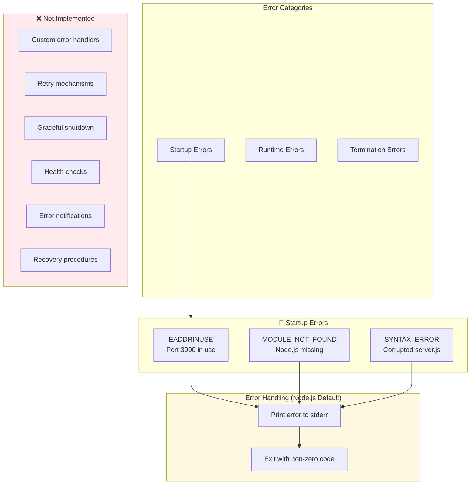

### 4.4.2 Startup Error Flow

The following flowchart details error handling during server initialization:

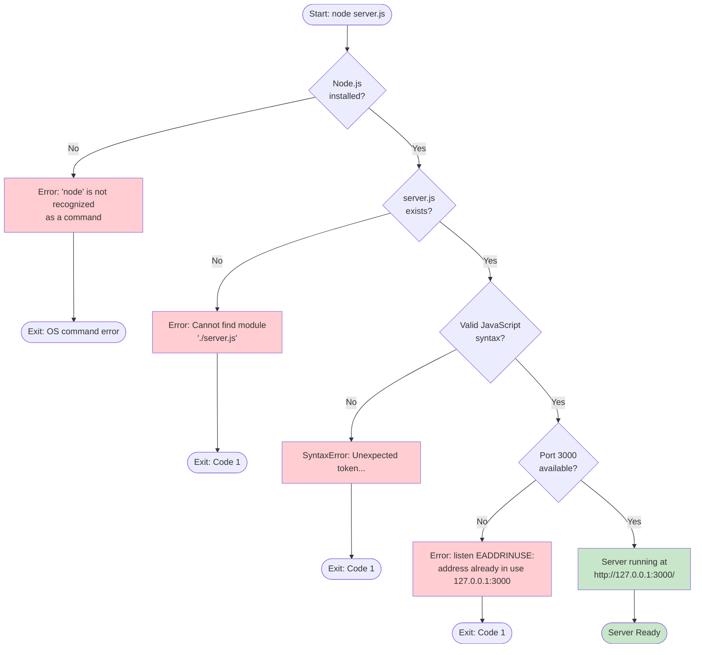

### 4.4.3 Runtime Error Scenarios

Runtime errors are minimal due to the stateless design. The server handles all valid HTTP requests without error:

```mermaid
flowchart TD
    subgraph Request_Processing["Request Processing"]
        REQ([HTTP Request Received]) --> HANDLER[Request Handler Invoked]
        HANDLER --> SET_STATUS[Set Status Code]
        SET_STATUS --> SET_HEADER[Set Content-Type Header]
        SET_HEADER --> WRITE_BODY[Write Response Body]
        WRITE_BODY --> END_STREAM[End Response Stream]
        END_STREAM --> RESP([Response Sent Successfully])
    end
    
    subgraph Error_Resistance["Error Resistance by Design"]
        direction TB
        R1["✓ No request parsing = No parse errors"]
        R2["✓ No database = No DB connection errors"]
        R3["✓ No external APIs = No network errors"]
        R4["✓ No authentication = No auth errors"]
        R5["✓ No file I/O = No file system errors"]
        R6["✓ No state = No state corruption"]
    end
    
    style Request_Processing fill:#e8f5e9
    style Error_Resistance fill:#e3f2fd
```

### 4.4.4 Recovery Procedures (Not Applicable)

The following diagram explicitly documents what recovery mechanisms are NOT implemented:

```mermaid
flowchart TD
    subgraph Excluded_Features["❌ Excluded Recovery Features"]
        direction TB
        
        subgraph Retry["Retry Mechanisms"]
            R1["Automatic restart"]
            R2["Connection retry"]
            R3["Exponential backoff"]
        end
        
        subgraph Fallback["Fallback Processes"]
            F1["Alternate ports"]
            F2["Backup servers"]
            F3["Degraded mode"]
        end
        
        subgraph Notification["Error Notifications"]
            N1["Email alerts"]
            N2["Log aggregation"]
            N3["Monitoring webhooks"]
        end
        
        subgraph Recovery["Recovery Procedures"]
            RC1["Auto-healing"]
            RC2["State restoration"]
            RC3["Graceful degradation"]
        end
    end
    
    subgraph Actual_Recovery["✓ Actual Recovery Process"]
        direction TB
        A1["1. Identify failure cause"]
        A2["2. Resolve manually<br/>(e.g., free port 3000)"]
        A3["3. Re-run: node server.js"]
    end
    
    style Excluded_Features fill:#ffebee
    style Actual_Recovery fill:#e8f5e9
```

## 4.5 State Transition Diagrams

### 4.5.1 Server Lifecycle States

The server follows a simple lifecycle with minimal state transitions:

```mermaid
stateDiagram-v2
    [*] --> Stopped
    
    Stopped --> Starting: Execute "node server.js"
    
    Starting --> Running: Port binding successful
    Starting --> Failed: Port binding failed (EADDRINUSE)
    
    Running --> Processing: HTTP request received
    Processing --> Running: Response sent
    
    Running --> Stopped: SIGINT (Ctrl+C)
    Running --> Stopped: SIGTERM
    Running --> Stopped: Process killed
    
    Failed --> [*]: Process exits with error
    Stopped --> [*]: Clean exit
    
    note right of Stopped
        Initial state
        No resources held
    end note
    
    note right of Running
        Listening on 127.0.0.1:3000
        Ready for requests
    end note
    
    note right of Processing
        Synchronous request handling
        Stateless operation
    end note
    
    note right of Failed
        Node.js default error output
        Non-zero exit code
    end note
```

### 4.5.2 Request-Response State Machine

Each HTTP request follows a deterministic state machine:

```mermaid
stateDiagram-v2
    direction LR
    
    [*] --> Idle: Server Running
    
    Idle --> Receiving: TCP Connection
    Receiving --> Parsing: HTTP Data Received
    Parsing --> Handling: Request Complete
    Handling --> Responding: Handler Executed
    Responding --> Idle: Response Sent
    
    note right of Idle
        Awaiting connection
        Event loop polling
    end note
    
    note right of Handling
        Synchronous execution
        No async operations
    end note
    
    note right of Responding
        Status: 200
        Body: "Hello, World!\n"
    end note
```

### 4.5.3 Data Persistence States

The system intentionally maintains no persistent state:

```mermaid
flowchart LR
    subgraph No_Persistence["No Persistence Layer"]
        direction TB
        
        REQ1["Request 1"] --> PROCESS1["Process"]
        PROCESS1 --> RESP1["Response"]
        
        REQ2["Request 2"] --> PROCESS2["Process"]
        PROCESS2 --> RESP2["Response"]
        
        REQ3["Request N"] --> PROCESS3["Process"]
        PROCESS3 --> RESP3["Response"]
    end
    
    subgraph State_Storage["State Storage: None"]
        direction TB
        DB["❌ No Database"]
        CACHE["❌ No Cache"]
        SESSION["❌ No Sessions"]
        MEMORY["❌ No In-Memory State"]
    end
    
    PROCESS1 -.->|"No connection"| State_Storage
    PROCESS2 -.->|"No connection"| State_Storage
    PROCESS3 -.->|"No connection"| State_Storage
    
    style State_Storage fill:#ffebee
    style No_Persistence fill:#e8f5e9
```

## 4.6 Validation Rules Summary

### 4.6.1 Business Rules by Process Step

```mermaid
flowchart TD
    subgraph Startup_Rules["Startup Business Rules"]
        SR1["SR-001: Use only built-in Node.js modules"]
        SR2["SR-002: Bind exclusively to localhost (127.0.0.1)"]
        SR3["SR-003: Use port 3000 only"]
        SR4["SR-004: No configuration files"]
    end
    
    subgraph Request_Rules["Request Handling Business Rules"]
        RR1["RR-001: Accept all HTTP methods"]
        RR2["RR-002: Accept all URL paths"]
        RR3["RR-003: Ignore all request headers"]
        RR4["RR-004: Ignore all request bodies"]
        RR5["RR-005: Return identical response always"]
    end
    
    subgraph Response_Rules["Response Business Rules"]
        RSR1["RSR-001: Status code must be 200"]
        RSR2["RSR-002: Content-Type must be text/plain"]
        RSR3["RSR-003: Body must be 'Hello, World!\\n'"]
    end
    
    subgraph Security_Rules["Security Rules"]
        SEC1["SEC-001: No external network access"]
        SEC2["SEC-002: No authentication required"]
        SEC3["SEC-003: No input validation (by design)"]
    end
    
    style Startup_Rules fill:#e3f2fd
    style Request_Rules fill:#f3e5f5
    style Response_Rules fill:#e8f5e9
    style Security_Rules fill:#fff8e1
```

### 4.6.2 Validation Checkpoint Matrix

| Process Phase | Checkpoint | Validation Type | Implemented |
|---------------|------------|-----------------|-------------|
| Startup | Node.js availability | Runtime prerequisite | System-level |
| Startup | Port 3000 availability | Resource validation | Node.js default |
| Startup | Module loading | Syntax validation | Node.js default |
| Request | HTTP protocol compliance | Protocol validation | Node.js http module |
| Request | Method validation | Business rule | ❌ Not applicable |
| Request | Path validation | Business rule | ❌ Not applicable |
| Request | Input sanitization | Security rule | ❌ Not applicable |
| Request | Authentication | Security rule | ❌ Not implemented |
| Request | Authorization | Security rule | ❌ Not implemented |
| Response | Status code | Response integrity | Hardcoded (200) |
| Response | Content-Type | Response integrity | Hardcoded (text/plain) |
| Response | Body content | Response integrity | Hardcoded (Hello, World!) |

## 4.7 Timing and Performance Considerations

### 4.7.1 Process Timing Diagram

```mermaid
gantt
    dateFormat ss.SSS
    title Request Processing Timeline (Typical)
    
    section TCP Layer
    Connection Establishment    :tcp, 00.000, 00.001
    
    section HTTP Layer
    Request Parsing             :http, after tcp, 00.001
    
    section Application Layer
    Handler Invocation          :handler, after http, 00.001
    Set Status Code             :status, after handler, 00.000
    Set Headers                 :headers, after status, 00.000
    Write Body                  :body, after headers, 00.000
    End Stream                  :endstream, after body, 00.000
    
    section Response
    Transmit Response           :resp, after endstream, 00.001
```

### 4.7.2 Performance Characteristics

| Metric | Expected Value | Notes |
|--------|----------------|-------|
| Startup Time | < 100ms | No initialization overhead |
| Request Latency | < 10ms | Native Node.js HTTP performance (localhost) |
| Memory Usage | ~ 20-30 MB | Baseline Node.js process |
| Throughput | > 10,000 req/sec | Limited by single-threaded event loop |
| Connection Overhead | Minimal | No connection pooling or state |

### 4.7.3 SLA Considerations

As documented in the system context, this test project has:

- **No explicit SLAs defined** - Test project only
- **No availability requirements** - Manual start/stop
- **No performance guarantees** - Native Node.js only
- **No monitoring infrastructure** - Excluded by design

## 4.8 Swim Lane Process Diagrams

### 4.8.1 Multi-Actor Server Operation Flow

```mermaid
flowchart TB
    subgraph User["👤 User/Developer"]
        U1([Execute Command])
        U2([View Startup Message])
        U3([Initiate Test Request])
        U4([View Response])
        U5([Terminate Server])
    end
    
    subgraph Terminal["💻 Terminal/Shell"]
        T1[Parse command]
        T2[Display output]
        T3[Forward SIGINT]
    end
    
    subgraph NodeJS["⚙️ Node.js Runtime"]
        N1[Load server.js]
        N2[Execute code]
        N3[Event loop]
        N4[Handle signal]
    end
    
    subgraph HTTP_Server["🖥️ HTTP Server"]
        H1[Create server]
        H2[Bind to port]
        H3[Listen for requests]
        H4[Process request]
        H5[Send response]
    end
    
    subgraph HTTP_Client["🌐 HTTP Client"]
        C1[Send request]
        C2[Receive response]
    end
    
    U1 --> T1
    T1 --> N1
    N1 --> N2
    N2 --> H1
    H1 --> H2
    H2 --> T2
    T2 --> U2
    
    U3 --> C1
    C1 --> H3
    H3 --> H4
    H4 --> H5
    H5 --> C2
    C2 --> U4
    
    U5 --> T3
    T3 --> N4
    N4 --> H3
```

### 4.8.2 Component Interaction Matrix

```mermaid
flowchart LR
    subgraph Actors["System Actors"]
        DEV["👤 Developer"]
        BACKPROP["🔧 Backprop"]
        CLIENT["🌐 HTTP Client"]
    end
    
    subgraph System["hao-backprop-test"]
        SERVER["server.js"]
        ASSETS["Test Assets"]
        CONFIG["Configuration"]
    end
    
    subgraph Interactions["Interaction Types"]
        I1["Execute & Test"]
        I2["Analyze & Process"]
        I3["Request & Response"]
    end
    
    DEV -->|"Start/Stop"| SERVER
    DEV -->|"Modify (prohibited)"| ASSETS
    
    BACKPROP -->|"Code Analysis"| SERVER
    BACKPROP -->|"File Processing"| ASSETS
    BACKPROP -->|"Metadata Reading"| CONFIG
    
    CLIENT -->|"HTTP Requests"| SERVER
    SERVER -->|"Hello, World!"| CLIENT
```

## 4.9 Process Flow Summary

### 4.9.1 Complete System Flow Diagram

```mermaid
flowchart TB
    subgraph Legend["Legend"]
        direction LR
        L1["🟢 Start/End Points"]
        L2["🔵 Process Steps"]
        L3["🟡 Decision Points"]
        L4["🔴 Error States"]
    end
    
    subgraph Complete_Flow["Complete System Flow"]
        START([🟢 Start])
        
        START --> EXEC["🔵 Execute node server.js"]
        EXEC --> LOAD["🔵 Load http module"]
        LOAD --> INIT["🔵 Initialize server"]
        INIT --> BIND{"🟡 Port available?"}
        
        BIND -->|Yes| READY["🔵 Server ready"]
        BIND -->|No| ERROR["🔴 EADDRINUSE"]
        ERROR --> FAIL([🔴 Exit: Failed])
        
        READY --> LISTEN["🔵 Listen for requests"]
        
        LISTEN --> REQ_CHECK{"🟡 Request received?"}
        REQ_CHECK -->|No| TERM_CHECK
        REQ_CHECK -->|Yes| HANDLE["🔵 Process request"]
        
        HANDLE --> RESPOND["🔵 Send 'Hello, World!'"]
        RESPOND --> LISTEN
        
        TERM_CHECK{"🟡 Termination signal?"}
        TERM_CHECK -->|No| LISTEN
        TERM_CHECK -->|Yes| STOP["🔵 Stop server"]
        STOP --> EXIT([🟢 Exit: Success])
    end
```

### 4.9.2 Process Flow Statistics

| Category | Count | Details |
|----------|-------|---------|
| **Total Process Steps** | 8 | Load, Init, Bind, Ready, Listen, Handle, Respond, Stop |
| **Decision Points** | 3 | Port availability, Request check, Termination check |
| **Error States** | 1 | Port unavailable (EADDRINUSE) |
| **Success Endpoints** | 2 | Server ready, Clean exit |
| **Failure Endpoints** | 1 | Startup failed |
| **State Transitions** | 5 | Stopped→Starting→Running→Processing→Stopped |
| **Integration Points** | 1 | HTTP client interface |

#### References

The following sources were examined to create this Process Flowchart section:

- `server.js` - Core HTTP server implementation containing the complete request handling logic
- `package.json` - Project metadata and configuration
- `package-lock.json` - Dependency verification (confirms zero external dependencies)
- `README.md` - Project context and "Do not touch!" directive
- Technical Specification Section 1.2 System Overview - Enterprise landscape integration
- Technical Specification Section 1.3 Scope - In-scope/out-of-scope boundaries and user workflow
- Technical Specification Section 2.2 Functional Requirements - F-001-RQ-001 through F-001-RQ-003
- Technical Specification Section 2.3 Feature Relationships - Feature dependency map
- Technical Specification Section 2.4 Implementation Considerations - Technical constraints and performance
- Technical Specification Section 2.6 Assumptions and Constraints - A-001 through A-004, C-001 through C-004
- Technical Specification Section 2.7 Process Flowcharts - Existing startup and request handling flows
- Technical Specification Section 3.1 Overview - Technology stack summary diagram
- Technical Specification Section 3.8 Security Considerations - Security posture and localhost-only access

# 5. System Architecture

## 5.1 High-Level Architecture

### 5.1.1 System Overview

#### Architectural Style and Rationale

The `hao-backprop-test` system implements a **Minimal Monolithic Single-File Architecture**, deliberately designed to serve as a predictable, deterministic baseline for Backprop integration testing. This architectural choice prioritizes simplicity, isolation, and stability over scalability, flexibility, or feature richness.

| Architectural Attribute | Value | Rationale |
|------------------------|-------|-----------|
| **Style** | Minimal Monolithic | Single-file implementation eliminates complexity for reliable baseline testing |
| **Coupling** | None | Zero external dependencies ensure complete isolation |
| **Distribution** | Single Process | Local-only execution for controlled test environments |
| **State Management** | Stateless | No persistence ensures identical behavior across all requests |

#### Key Architectural Principles

The system adheres to the following architectural principles derived from its test harness purpose:

1. **Native Module Exclusivity**: Uses only Node.js built-in `http` module—no external packages are permitted per constraint C-003
2. **Single Response Pattern**: All HTTP requests receive identical "Hello, World!" responses regardless of method, path, headers, or body
3. **Localhost Binding**: Server binds exclusively to `127.0.0.1:3000`, preventing any external network access per constraint C-004
4. **Stateless Operation**: No session management, data persistence, or state tracking—each request is completely independent per requirement F-001-RQ-003
5. **Zero Configuration**: All values are hardcoded to ensure predictable behavior per constraint C-002

#### System Boundaries and Major Interfaces

```mermaid
flowchart TB
    subgraph External_Context["External Context"]
        direction LR
        BACKPROP["Backprop Tool/Service<br/>(Code Analysis)"]
        HTTP_CLIENT["HTTP Clients<br/>(curl, browsers, test runners)"]
    end
    
    subgraph System_Boundary["System Boundary: hao-backprop-test"]
        direction TB
        
        subgraph Runtime_Boundary["Runtime Boundary"]
            SERVER["HTTP Server<br/>server.js"]
        end
        
        subgraph Config_Boundary["Configuration Boundary"]
            PKG["package.json"]
            LOCK["package-lock.json"]
        end
        
        subgraph Asset_Boundary["Test Asset Boundary"]
            ASSETS["Test Files<br/>(CSV, Java, PDF, JPG, DOC)"]
        end
    end
    
    BACKPROP -->|"Analyzes Repository"| System_Boundary
    HTTP_CLIENT -->|"HTTP Request<br/>127.0.0.1:3000"| SERVER
    SERVER -->|"HTTP 200 OK<br/>Hello, World!"| HTTP_CLIENT
    
    style System_Boundary fill:#e3f2fd
    style Runtime_Boundary fill:#c8e6c9
    style Config_Boundary fill:#fff8e1
    style Asset_Boundary fill:#f3e5f5
```

| Boundary Type | Scope | Interface |
|--------------|-------|-----------|
| **Network** | Localhost only (127.0.0.1) | Port 3000 |
| **Protocol** | HTTP/1.1 | Request-Response |
| **Data Format** | text/plain | Static string output |
| **Process** | Single Node.js process | No IPC or distributed components |

### 5.1.2 Core Components

The system comprises three logical component groups, each serving a distinct architectural purpose:

| Component | Primary Responsibility | Key Dependencies | Integration Points |
|-----------|----------------------|------------------|-------------------|
| **HTTP Server (server.js)** | Handles all HTTP requests and returns static response | Node.js `http` module | TCP/IP on port 3000 |
| **Package Configuration (package.json)** | Defines project metadata and npm configuration | npm package manager | npm CLI commands |
| **Test Asset Collection** | Provides diverse file types for Backprop testing | None (static files) | File system access |

#### Component Interaction Overview

```mermaid
flowchart LR
    subgraph Core_Application["Core Application"]
        SERVER["server.js<br/>HTTP Server"]
    end
    
    subgraph Configuration["Configuration Layer"]
        PKG_JSON["package.json<br/>Project Metadata"]
        PKG_LOCK["package-lock.json<br/>Lock File"]
    end
    
    subgraph Test_Assets["Test Asset Layer"]
        CSV["industry.csv<br/>43 Categories"]
        JAVA["LoginTest.java<br/>Java Scaffold"]
        BINARY["Binary Files<br/>PDF, JPG, DOC"]
        EMPTY["Empty Files<br/>test.py.txt, test.txt.txt"]
    end
    
    PKG_JSON -.->|"Defines project"| SERVER
    PKG_LOCK -.->|"Locks dependencies<br/>(none)"| PKG_JSON
    
    style Core_Application fill:#c8e6c9
    style Configuration fill:#fff8e1
    style Test_Assets fill:#f3e5f5
```

### 5.1.3 Data Flow Architecture

#### Primary Data Flow Description

The system implements a minimal, unidirectional data flow pattern with no data transformation or persistence:

1. **Request Ingestion**: HTTP clients establish TCP connections to `127.0.0.1:3000`
2. **Request Processing**: The Node.js event loop receives the connection and invokes the request handler callback
3. **Response Generation**: The handler sets a fixed status code (200), content-type header (text/plain), and response body ("Hello, World!\n")
4. **Response Transmission**: The response stream is ended and transmitted back to the client

```mermaid
sequenceDiagram
    participant Client as HTTP Client
    participant TCP as TCP/IP Stack
    participant EventLoop as Node.js Event Loop
    participant Handler as Request Handler
    
    Client->>TCP: Connect to 127.0.0.1:3000
    TCP->>EventLoop: Connection established
    Client->>TCP: Send HTTP Request
    TCP->>EventLoop: Data received
    EventLoop->>Handler: Invoke callback(req, res)
    
    activate Handler
    Note over Handler: res.statusCode = 200
    Note over Handler: res.setHeader('Content-Type', 'text/plain')
    Note over Handler: res.end('Hello, World!\n')
    deactivate Handler
    
    Handler-->>EventLoop: Response complete
    EventLoop-->>TCP: Send HTTP Response
    TCP-->>Client: HTTP/1.1 200 OK
```

#### Data Flow Characteristics

| Characteristic | Implementation | Notes |
|---------------|----------------|-------|
| **Request Parsing** | Not performed | All request data (method, path, headers, body) is ignored |
| **Data Transformation** | None | No processing logic applied to any data |
| **State Storage** | None | No database, cache, session, or memory storage |
| **Response Generation** | Static | Identical response for every request |
| **Error Propagation** | Node.js defaults | No custom error handling or transformation |

### 5.1.4 External Integration Points

The system has minimal external integration, consistent with its test harness purpose:

| System Name | Integration Type | Data Exchange Pattern | Protocol/Format |
|-------------|-----------------|----------------------|-----------------|
| **Backprop Tool** | Repository Analysis | One-way (read-only) | File system/Git |
| **HTTP Clients** | Request-Response | Synchronous | HTTP/1.1, text/plain |
| **Node.js Runtime** | Execution Platform | Process lifecycle | OS process management |
| **npm** | Package Management | Metadata reading | JSON configuration |

---

## 5.2 Component Details

### 5.2.1 HTTP Server Component (server.js)

#### Purpose and Responsibilities

The HTTP Server is the sole runtime component, responsible for:

- Listening for incoming HTTP connections on localhost port 3000
- Responding to all requests with HTTP 200 status and "Hello, World!\n" body
- Logging server startup confirmation to the console

#### Technologies and Frameworks

| Technology | Specification | Purpose |
|------------|--------------|---------|
| **Runtime** | Node.js (any modern LTS version) | JavaScript execution environment |
| **Language** | JavaScript (ECMAScript) | CommonJS module syntax |
| **HTTP Module** | Node.js built-in `http` | TCP server and HTTP parsing |
| **Frameworks** | None | Intentionally excluded per constraint C-003 |

#### Key Interfaces and APIs

The component utilizes the following Node.js `http` module interfaces:

| Interface | Usage | Purpose |
|-----------|-------|---------|
| `http.createServer(callback)` | Creates server with request handler | Establishes HTTP server instance |
| `res.statusCode` | Set to `200` | Defines HTTP response status |
| `res.setHeader(name, value)` | Sets `Content-Type: text/plain` | Declares response content type |
| `res.end(body)` | Sends `Hello, World!\n` | Completes response with body |
| `server.listen(port, host, callback)` | Binds to `127.0.0.1:3000` | Activates server |

#### Server Lifecycle State Diagram

```mermaid
stateDiagram-v2
    [*] --> Stopped: Initial State
    
    Stopped --> Starting: Execute "node server.js"
    
    Starting --> Running: Port binding successful
    Starting --> Failed: EADDRINUSE (port 3000 in use)
    
    Running --> Processing: HTTP request received
    Processing --> Running: Response sent
    
    Running --> Stopped: SIGINT (Ctrl+C) or SIGTERM
    
    Failed --> [*]: Exit with error code 1
    Stopped --> [*]: Clean exit code 0
    
    note right of Running
        Listening on 127.0.0.1:3000
        Ready for requests
    end note
    
    note right of Processing
        Synchronous handler execution
        No async operations
    end note
```

#### Data Persistence Requirements

**Status**: None required

The server operates in a completely stateless manner per requirement F-001-RQ-003:

| Storage Type | Status | Rationale |
|--------------|--------|-----------|
| Database | Not implemented | No data persistence needed |
| Cache | Not implemented | No caching requirements |
| Session storage | Not implemented | No session management |
| In-memory state | Not implemented | Each request independent |

#### Scaling Considerations

**Status**: Not applicable

As a single-process test harness bound to localhost, scaling is explicitly out of scope. The server is designed for local testing only, not production deployment.

### 5.2.2 Package Configuration Component (package.json)

#### Purpose and Responsibilities

The package configuration defines project metadata for npm and provides minimal project identification:

| Attribute | Value | Purpose |
|-----------|-------|---------|
| `name` | `hello_world` | npm package identifier |
| `version` | `1.0.0` | Semantic version |
| `description` | "Hello world in Node.js" | Project description |
| `main` | `index.js` | Entry point (Note: file does not exist) |
| `author` | `hxu` | Original creator |
| `license` | `MIT` | Open source license |

#### Known Configuration Anomalies

| Anomaly | Description | Impact |
|---------|-------------|--------|
| **Missing main entry** | `main` points to `index.js` which doesn't exist | Server must be started with explicit `node server.js` |
| **Failing test script** | `test` script returns exit code 1 | Intentional for edge case testing |
| **Zero dependencies** | No `dependencies` or `devDependencies` | By design per constraint C-003 |

### 5.2.3 Test Asset Collection Component

#### Purpose and Responsibilities

Provides diverse file types enabling comprehensive Backprop testing across multiple formats:

| Asset File | Type | Size | Test Purpose |
|------------|------|------|--------------|
| `industry.csv` | CSV Data | ~2KB | Structured data parsing with 43 industry categories |
| `LoginTest.java` | Java Source | ~500B | Multi-language code analysis (intentionally incomplete) |
| `test.py.txt` | Empty file | 0 bytes | Edge case: empty Python-related file |
| `test.txt.txt` | Empty file | 0 bytes | Edge case: empty text file |
| `100Pages.pdf` | PDF Binary | ~9.5MB | Large binary file processing |
| `demo.jpg` | JPEG Binary | ~2.1MB | Image file processing |
| `sample.doc` | DOC Binary | ~96KB | Document file processing |

---

## 5.3 Technical Decisions

### 5.3.1 Architecture Style Decision

#### Decision Record: Minimal Monolithic Architecture

| Aspect | Decision | Rationale |
|--------|----------|-----------|
| **Architecture Style** | Minimal single-file monolith | Intentional simplicity creates predictable test baseline; aligns with constraint C-001 (no new features) |
| **Alternative Considered** | Microservices, Layered Architecture | Rejected due to unnecessary complexity for test harness |
| **Trade-off Accepted** | No scalability, no flexibility | Acceptable for controlled test environment |

```mermaid
flowchart TD
    subgraph Decision_Context["Architecture Style Decision"]
        NEED["Need: Test Harness for Backprop"]
        
        subgraph Options["Options Evaluated"]
            OPT1["Option 1: Minimal Monolith"]
            OPT2["Option 2: Layered Architecture"]
            OPT3["Option 3: Microservices"]
        end
        
        subgraph Criteria["Decision Criteria"]
            C1["Simplicity: Critical"]
            C2["Predictability: Critical"]
            C3["Scalability: Not Required"]
            C4["Flexibility: Not Required"]
        end
        
        DECISION["Decision: Minimal Monolith"]
        
        NEED --> Options
        Options --> Criteria
        Criteria --> DECISION
        
        OPT1 -->|"Selected"| DECISION
        OPT2 -->|"Rejected: Too complex"| DECISION
        OPT3 -->|"Rejected: Overkill"| DECISION
    end
    
    style DECISION fill:#c8e6c9
    style OPT1 fill:#c8e6c9
    style OPT2 fill:#ffcdd2
    style OPT3 fill:#ffcdd2
```

### 5.3.2 Framework Selection Decision

#### Decision Record: No External Frameworks

| Framework | Exclusion Rationale | Constraint Reference |
|-----------|--------------------|--------------------|
| Express.js | Adds external dependency | C-003: No external npm dependencies |
| Koa | Adds external dependency | C-003: No external npm dependencies |
| Fastify | Adds external dependency | C-003: No external npm dependencies |
| Hapi | Adds external dependency | C-003: No external npm dependencies |
| NestJS | Adds external dependency | C-003: No external npm dependencies |

**Decision Outcome**: Use only Node.js built-in `http` module

**Benefits**:
- Zero supply chain attack vectors
- No version compatibility issues
- Complete behavioral predictability
- Maximum isolation for testing

### 5.3.3 Data Storage Decision

#### Decision Record: No Data Persistence

| Storage Option | Decision | Rationale |
|---------------|----------|-----------|
| Relational Database | Not implemented | Stateless design per F-001-RQ-003 |
| Document Database | Not implemented | No data persistence requirements |
| Cache Layer | Not implemented | No caching needed for static response |
| Session Storage | Not implemented | No session management required |
| File-based Storage | Not implemented | No runtime data storage needed |

### 5.3.4 Communication Pattern Decision

#### Decision Record: Synchronous Request-Response Only

| Pattern | Implementation | Rationale |
|---------|---------------|-----------|
| **Synchronous HTTP** | Implemented | Simple, predictable request-response cycle |
| WebSockets | Not implemented | Real-time communication not required |
| Server-Sent Events | Not implemented | Push notifications not required |
| Message Queues | Not implemented | Asynchronous processing not required |
| gRPC | Not implemented | Binary protocol unnecessary |

### 5.3.5 Security Mechanism Decision

#### Decision Record: Minimal Security Through Isolation

| Security Mechanism | Status | Rationale |
|-------------------|--------|-----------|
| **Localhost Binding** | Implemented | Constraint C-004: Prevents external network access |
| **Zero Dependencies** | Implemented | Eliminates supply chain vulnerabilities |
| TLS/HTTPS | Not implemented | Local testing only, encryption unnecessary |
| Authentication | Not implemented | Test project, no access control needed |
| Rate Limiting | Not implemented | Local testing, no abuse prevention needed |
| Input Validation | Not implemented | All input ignored by design |

---

## 5.4 Cross-Cutting Concerns

### 5.4.1 Monitoring and Observability

#### Current Implementation Status

**Status**: Not implemented

The system provides no monitoring, metrics collection, or observability infrastructure:

| Capability | Status | Rationale |
|------------|--------|-----------|
| Application Metrics | Not implemented | Test project, monitoring unnecessary |
| Health Check Endpoints | Not implemented | Explicitly out of scope per Section 1.3.2 |
| Distributed Tracing | Not implemented | Single-process architecture |
| Performance Monitoring | Not implemented | No SLAs defined |

### 5.4.2 Logging and Tracing Strategy

#### Current Implementation

**Status**: Minimal—single console.log statement

| Log Event | Implementation | Output |
|-----------|---------------|--------|
| Server Startup | `console.log()` | "Server running at http://127.0.0.1:3000/" |
| Request Received | Not logged | — |
| Response Sent | Not logged | — |
| Errors | Node.js stderr | Default error output |
| Shutdown | Not logged | — |

#### Capabilities Not Implemented

| Logging Capability | Status |
|-------------------|--------|
| Structured logging (JSON) | Not implemented |
| Log levels (debug, info, warn, error) | Not implemented |
| Request/response logging | Not implemented |
| Log aggregation | Not implemented |
| Log rotation | Not implemented |

### 5.4.3 Error Handling Patterns

#### Error Handling Strategy

The system relies exclusively on default Node.js error handling with no custom error processing:

```mermaid
flowchart TD
    subgraph Error_Sources["Potential Error Sources"]
        E1["EADDRINUSE<br/>Port 3000 in use"]
        E2["MODULE_NOT_FOUND<br/>Node.js missing"]
        E3["SYNTAX_ERROR<br/>Corrupted server.js"]
    end
    
    subgraph Error_Handling["Error Handling (Node.js Default)"]
        H1["Print error to stderr"]
        H2["Exit with non-zero code"]
    end
    
    subgraph Not_Implemented["Not Implemented"]
        N1["Custom error handlers"]
        N2["Retry mechanisms"]
        N3["Graceful shutdown"]
        N4["Error notifications"]
        N5["Recovery procedures"]
    end
    
    E1 --> H1
    E2 --> H1
    E3 --> H1
    H1 --> H2
    
    style Error_Sources fill:#ffcdd2
    style Error_Handling fill:#fff8e1
    style Not_Implemented fill:#ffebee
```

#### Error Resistance by Design

The stateless architecture provides inherent error resistance:

| Error Category | Protection Mechanism |
|---------------|---------------------|
| Parse errors | No request parsing performed |
| Database errors | No database connections |
| Network errors | No external API calls |
| Authentication errors | No authentication implemented |
| File system errors | No file I/O during runtime |
| State corruption | No state maintained |

#### Recovery Procedures

| Scenario | Recovery Process |
|----------|-----------------|
| Port in use | 1. Identify process using port 3000; 2. Terminate conflicting process; 3. Re-run `node server.js` |
| Server crash | 1. Review error output; 2. Resolve issue; 3. Re-run `node server.js` |
| Node.js not found | 1. Install Node.js; 2. Re-run `node server.js` |

### 5.4.4 Authentication and Authorization

#### Current Implementation Status

**Status**: Not implemented—explicitly out of scope

| Security Feature | Status | Rationale |
|-----------------|--------|-----------|
| User Authentication | Not implemented | Test project, no user management |
| API Key Validation | Not implemented | No protected endpoints |
| Role-Based Access Control | Not implemented | No authorization requirements |
| Session Management | Not implemented | Stateless design |
| Token Validation (JWT) | Not implemented | No authentication flow |

### 5.4.5 Performance Requirements and SLAs

#### Current Status

**Status**: No formal SLAs defined

The project serves as a test harness with no production performance requirements:

| Metric | Specification |
|--------|--------------|
| Response Time | Native Node.js performance (typically < 1ms for local requests) |
| Throughput | Not specified |
| Availability | 100% while process is running |
| Concurrent Connections | Node.js default limits |

#### Key Performance Indicators

| KPI | Current Value |
|-----|---------------|
| Lines of Code | ~10 lines (server.js) |
| Dependency Count | 0 |
| Response Consistency | 100% (identical response always) |
| Startup Time | < 1 second typically |

### 5.4.6 Disaster Recovery

#### Current Implementation Status

**Status**: Not implemented—explicitly out of scope

| DR Capability | Status |
|--------------|--------|
| Automated Restart | Not implemented |
| State Backup | Not applicable (stateless) |
| Failover | Not implemented |
| Data Recovery | Not applicable (no data) |

#### Manual Recovery Process

```mermaid
flowchart LR
    subgraph Recovery_Steps["Manual Recovery Process"]
        R1["1. Identify<br/>failure cause"]
        R2["2. Resolve<br/>manually"]
        R3["3. Re-run<br/>node server.js"]
    end
    
    R1 --> R2
    R2 --> R3
    
    style Recovery_Steps fill:#e8f5e9
```

---

## 5.5 Architectural Assumptions and Constraints

### 5.5.1 Assumptions

| ID | Assumption | Impact if Invalid |
|----|------------|-------------------|
| A-001 | Node.js is installed on the target system | Server cannot start |
| A-002 | Port 3000 is available on localhost | Server fails to bind with EADDRINUSE |
| A-003 | Repository stability is maintained | Backprop test baseline becomes unreliable |
| A-004 | Known anomalies remain unfixed | Edge case testing scenarios are lost |

### 5.5.2 Constraints

| ID | Constraint | Rationale |
|----|------------|-----------|
| C-001 | No new features shall be added | "Do not touch!" directive; test baseline stability |
| C-002 | No configuration externalization | Intentional simplicity for predictable testing |
| C-003 | No external npm dependencies | Isolation requirement for clean testing |
| C-004 | Localhost binding only | Test project security posture |

---

## 5.6 References

#### Files Examined

| File Path | Relevance to Architecture Documentation |
|-----------|----------------------------------------|
| `server.js` | Core HTTP server implementation—primary runtime component |
| `package.json` | Project configuration and metadata |
| `package-lock.json` | Confirms zero external dependencies (lockfileVersion: 3) |
| `README.md` | Project context and "Do not touch!" directive |
| `industry.csv` | Test asset—43 industry categories |
| `LoginTest.java` | Test asset—incomplete Java scaffold |
| `test.py.txt` | Test asset—empty placeholder file |
| `test.txt.txt` | Test asset—empty placeholder file |

#### Technical Specification Sections Referenced

| Section | Information Utilized |
|---------|---------------------|
| 1.1 Executive Summary | Project overview, stakeholders, value proposition |
| 1.2 System Overview | Enterprise landscape, system capabilities, KPIs |
| 1.3 Scope | In-scope/out-of-scope elements, system boundaries |
| 2.1 Feature Catalog | Feature definitions F-001 and F-002 |
| 2.6 Assumptions and Constraints | Architectural constraints C-001 through C-004 |
| 3.2 Programming Languages | JavaScript/Node.js specifications |
| 3.3 Frameworks & Libraries | Framework exclusion rationale |
| 3.6 Databases & Storage | Stateless architecture confirmation |
| 3.7 Development & Deployment | Build system, execution environment |
| 3.8 Security Considerations | Security posture and localhost binding |
| 4.1 System Workflow Overview | High-level workflow and system states |
| 4.2 Core Business Processes | Startup and request handling flows |
| 4.3 Integration Workflows | Backprop integration and HTTP client flows |
| 4.4 Error Handling Flowcharts | Error categories and handling |
| 4.5 State Transition Diagrams | Server lifecycle and request states |
| 4.9 Process Flow Summary | Complete system flow statistics |

# 6. SYSTEM COMPONENTS DESIGN

## 6.1 Core Services Architecture

#### ARCHITECTURE DETAILS

## 6.1 Core Services Architecture

### 6.1.1 Applicability Assessment

#### Executive Determination

**Core Services Architecture is not applicable for this system.**

The `hao-backprop-test` repository implements a **Minimal Monolithic Single-File Architecture** that fundamentally precludes the need for core services architecture documentation. This determination is based on explicit architectural decisions, documented constraints, and the project's defined purpose as a Backprop integration test harness.

#### Architectural Classification Evidence

| Architectural Attribute | Actual Value | Core Services Requirement |
|------------------------|--------------|--------------------------|
| **Style** | Minimal Monolithic | Microservices or SOA |
| **Components** | Single 15-line file | Multiple discrete services |
| **Coupling** | None (zero dependencies) | Loose inter-service coupling |
| **Distribution** | Single Process | Distributed processes |
| **Communication** | None required | Inter-service protocols |
| **State Management** | Stateless | Coordinated state |

#### Decision Record Summary

The microservices architectural pattern was explicitly evaluated and rejected during the architecture style decision process:

| Option Evaluated | Decision | Rationale |
|-----------------|----------|-----------|
| Minimal Monolith | **Selected** | Intentional simplicity creates predictable test baseline |
| Layered Architecture | Rejected | Too complex for test harness |
| Microservices | Rejected | Overkill for controlled test environment |

```mermaid
flowchart TD
    subgraph Assessment_Process["6.1 Core Services Architecture Assessment"]
        START[("Begin Assessment")]
        
        subgraph Evaluation_Criteria["Evaluation Criteria"]
            Q1{"Multiple discrete<br/>services?"}
            Q2{"Inter-service<br/>communication?"}
            Q3{"Service discovery<br/>required?"}
            Q4{"Scalability<br/>requirements?"}
            Q5{"Resilience<br/>patterns needed?"}
        end
        
        subgraph Evidence["Evidence from Technical Specification"]
            E1["Single server.js file<br/>(15 lines of code)"]
            E2["Zero external dependencies<br/>(Constraint C-003)"]
            E3["Localhost binding only<br/>(Constraint C-004)"]
            E4["Scalability: Not Required<br/>(Section 5.3.1)"]
            E5["DR: Not Implemented<br/>(Section 5.4.6)"]
        end
        
        RESULT[["Core Services Architecture<br/>NOT APPLICABLE"]]
        
        START --> Q1
        Q1 -->|"No"| E1
        E1 --> Q2
        Q2 -->|"No"| E2
        E2 --> Q3
        Q3 -->|"No"| E3
        E3 --> Q4
        Q4 -->|"No"| E4
        E4 --> Q5
        Q5 -->|"No"| E5
        E5 --> RESULT
    end
    
    style RESULT fill:#ffcdd2,stroke:#b71c1c,stroke-width:2px
    style Assessment_Process fill:#f5f5f5
```

### 6.1.2 Non-Applicability Justification

#### 6.1.2.1 Service Components Analysis

The fundamental prerequisites for a core services architecture are absent from this system:

| Required Element | Status | Technical Evidence |
|-----------------|--------|-------------------|
| **Service Boundaries** | Not Applicable | Single-file monolith with one component (`server.js`) |
| **Inter-service Communication** | Not Applicable | No services exist to communicate between |
| **Service Discovery** | Not Applicable | Single process on localhost—no discovery needed |
| **Load Balancing** | Not Applicable | Single server instance bound to 127.0.0.1:3000 |
| **Circuit Breaker Patterns** | Not Applicable | No external service calls performed |
| **Retry/Fallback Mechanisms** | Not Applicable | Zero external dependencies; nothing to retry |

#### Actual System Component Architecture

The system comprises only three logical component groups, none of which constitute independent services:

```mermaid
flowchart TB
    subgraph System_Architecture["Actual System Architecture (Non-Services Based)"]
        subgraph Single_Process["Single Node.js Process"]
            HTTP_SERVER["HTTP Server<br/>server.js<br/>(15 lines)"]
        end
        
        subgraph Static_Config["Static Configuration"]
            PKG_JSON["package.json"]
            PKG_LOCK["package-lock.json"]
        end
        
        subgraph Test_Assets["Test Asset Collection"]
            CSV["industry.csv"]
            JAVA["LoginTest.java"]
            BINARY["Binary Files"]
        end
        
        CLIENT["HTTP Client<br/>(localhost only)"]
    end
    
    CLIENT -->|"HTTP Request<br/>127.0.0.1:3000"| HTTP_SERVER
    HTTP_SERVER -->|"'Hello, World!'"| CLIENT
    PKG_JSON -.->|"Metadata"| Single_Process
    
    style Single_Process fill:#c8e6c9,stroke:#2e7d32
    style Static_Config fill:#fff8e1,stroke:#f57f17
    style Test_Assets fill:#f3e5f5,stroke:#7b1fa2
```

#### 6.1.2.2 Scalability Design Analysis

Scalability design is explicitly documented as out of scope for this system:

| Required Element | Status | Technical Evidence |
|-----------------|--------|-------------------|
| **Horizontal Scaling** | Not Applicable | "Scalability: Not Required" (Technical Decision 5.3.1) |
| **Vertical Scaling** | Not Applicable | Single-process test harness with no growth path |
| **Auto-scaling Triggers** | Not Applicable | No deployment infrastructure exists |
| **Resource Allocation** | Not Applicable | No capacity requirements defined |
| **Performance Optimization** | Not Applicable | Explicitly listed as out of scope (Section 1.3.2) |
| **Capacity Planning** | Not Applicable | Test harness with no production use case |

#### Constraint-Based Scaling Prohibition

The architectural constraints actively prevent any evolution toward scalable architecture:

| Constraint ID | Definition | Impact on Scalability |
|--------------|------------|----------------------|
| **C-001** | No new features shall be added | Cannot implement scaling features |
| **C-002** | No configuration externalization | Cannot support environment-based scaling |
| **C-003** | No external npm dependencies | Cannot add load balancers, orchestration tools |
| **C-004** | Localhost binding only | Cannot distribute across network nodes |

#### 6.1.2.3 Resilience Patterns Analysis

Resilience patterns are explicitly documented as not implemented and out of scope:

| Required Element | Status | Technical Evidence |
|-----------------|--------|-------------------|
| **Fault Tolerance** | Not Implemented | "Status: Not implemented" (Section 5.4.6) |
| **Disaster Recovery** | Not Implemented | "Not implemented—explicitly out of scope" |
| **Data Redundancy** | Not Applicable | No data persistence exists |
| **Failover Configurations** | Not Implemented | Single process, no redundancy |
| **Service Degradation** | Not Applicable | Stateless—no degradation states possible |

#### Inherent Error Resistance

The stateless, zero-dependency architecture provides inherent error resistance without requiring explicit resilience patterns:

| Error Category | Protection Mechanism |
|---------------|---------------------|
| Parse errors | No request parsing performed—all input ignored |
| Database errors | No database connections exist |
| Network errors | No external API calls made |
| Authentication errors | No authentication implemented |
| State corruption | No state maintained between requests |

### 6.1.3 Alternative Architecture Documentation

#### 6.1.3.1 Minimal Monolithic Architecture Overview

Instead of a core services architecture, this system implements a **Minimal Monolithic Single-File Architecture** designed specifically for Backprop integration testing:

```mermaid
flowchart TB
    subgraph Minimal_Monolith["Minimal Monolithic Single-File Architecture"]
        direction TB
        
        subgraph Design_Principles["Design Principles"]
            P1["Native Module<br/>Exclusivity"]
            P2["Single Response<br/>Pattern"]
            P3["Localhost<br/>Binding"]
            P4["Stateless<br/>Operation"]
            P5["Zero<br/>Configuration"]
        end
        
        subgraph Implementation["Single-File Implementation"]
            SERVER["server.js<br/>─────────────────<br/>• http.createServer()<br/>• res.statusCode = 200<br/>• res.end('Hello, World!')<br/>• server.listen(3000)"]
        end
        
        subgraph Benefits["Achieved Benefits"]
            B1["Predictable<br/>Baseline"]
            B2["Complete<br/>Isolation"]
            B3["Behavioral<br/>Consistency"]
            B4["Maximum<br/>Simplicity"]
        end
        
        P1 & P2 & P3 & P4 & P5 --> SERVER
        SERVER --> B1 & B2 & B3 & B4
    end
    
    style Implementation fill:#c8e6c9,stroke:#2e7d32,stroke-width:2px
```

#### 6.1.3.2 Data Flow Architecture

The system implements a minimal, unidirectional data flow pattern that requires no service coordination:

```mermaid
sequenceDiagram
    participant Client as HTTP Client<br/>(localhost only)
    participant TCP as TCP/IP Stack
    participant EventLoop as Node.js Event Loop
    participant Handler as Request Handler
    
    Client->>TCP: Connect to 127.0.0.1:3000
    TCP->>EventLoop: Connection established
    Client->>TCP: Send HTTP Request
    TCP->>EventLoop: Data received
    EventLoop->>Handler: Invoke callback(req, res)
    
    activate Handler
    Note over Handler: res.statusCode = 200
    Note over Handler: res.setHeader('Content-Type', 'text/plain')
    Note over Handler: res.end('Hello, World!\n')
    deactivate Handler
    
    Handler-->>EventLoop: Response complete
    EventLoop-->>TCP: Send HTTP Response
    TCP-->>Client: HTTP/1.1 200 OK
```

| Data Flow Characteristic | Implementation | Service Architecture Implication |
|--------------------------|----------------|----------------------------------|
| Request Parsing | Not performed | No request routing to services |
| Data Transformation | None | No service-to-service data mapping |
| State Storage | None | No distributed state coordination |
| Response Generation | Static | No service composition required |
| Error Propagation | Node.js defaults | No circuit breakers or fallbacks needed |

### 6.1.4 Explicit Out-of-Scope Elements

The following core services architecture elements have been explicitly documented as out of scope or not applicable throughout the technical specification:

#### 6.1.4.1 Service Infrastructure

| Infrastructure Element | Status | Reference |
|-----------------------|--------|-----------|
| Container Orchestration | Not configured | Section 1.3.2 |
| Message Queues | Not implemented | Section 1.3.2 |
| API Gateway | Not implemented | Section 1.3.2 |
| Service Mesh | Not implemented | Constraint C-003 |
| Service Registry | Not applicable | Single-process architecture |

#### 6.1.4.2 Communication Patterns

| Communication Pattern | Status | Reference |
|----------------------|--------|-----------|
| Synchronous HTTP | Limited to request-response | Section 5.3.4 |
| WebSockets | Not implemented | Section 5.3.4 |
| Server-Sent Events | Not implemented | Section 5.3.4 |
| Message Queues | Not implemented | Section 5.3.4 |
| gRPC | Not implemented | Section 5.3.4 |

#### 6.1.4.3 Operational Capabilities

| Operational Capability | Status | Reference |
|-----------------------|--------|-----------|
| Health Check Endpoints | Not implemented | Section 5.4.1 |
| Application Metrics | Not implemented | Section 5.4.1 |
| Distributed Tracing | Not implemented | Section 5.4.1 |
| Graceful Shutdown | Not implemented | Section 1.3.2 |
| Automated Restart | Not implemented | Section 5.4.6 |

### 6.1.5 Project Context Summary

#### 6.1.5.1 Purpose-Driven Architecture

The architectural decisions that preclude core services architecture are intentional and aligned with the project's purpose:

| Project Attribute | Value | Architecture Impact |
|------------------|-------|---------------------|
| **Purpose** | Backprop integration test harness | Requires predictable baseline, not scalability |
| **Directive** | "Do not touch!" (README.md) | Prevents architectural evolution |
| **Design Philosophy** | Intentional simplicity | Microservices adds unwanted complexity |
| **Production Status** | Test project only | Production architecture patterns not required |

#### 6.1.5.2 Value Delivered Through Simplicity

The absence of core services architecture is itself a design feature that delivers value:

| Value Proposition | How Achieved |
|------------------|--------------|
| **Predictability** | Single, unchanging HTTP response enables reliable baseline testing |
| **Isolation** | Zero dependencies eliminate external factors from test results |
| **Transparency** | Minimal codebase allows complete understanding of system behavior |
| **Consistency** | No distributed state means identical behavior on every request |

```mermaid
flowchart LR
    subgraph Value_Through_Simplicity["Value Delivered Through Architectural Simplicity"]
        direction TB
        
        subgraph Absent_Features["Features Intentionally Absent"]
            F1["Microservices"]
            F2["Distributed State"]
            F3["Service Discovery"]
            F4["Load Balancing"]
            F5["Circuit Breakers"]
        end
        
        subgraph Resulting_Benefits["Resulting Test Harness Benefits"]
            B1["Deterministic<br/>Behavior"]
            B2["Zero External<br/>Dependencies"]
            B3["Complete<br/>Isolation"]
            B4["Predictable<br/>Baseline"]
        end
        
        F1 & F2 & F3 & F4 & F5 -->|"Intentional<br/>Omission"| B1 & B2 & B3 & B4
    end
    
    style Absent_Features fill:#ffcdd2
    style Resulting_Benefits fill:#c8e6c9
```

### 6.1.6 References

The following sources were examined to determine the non-applicability of Core Services Architecture:

#### Technical Specification Sections Referenced

| Section | Information Utilized |
|---------|---------------------|
| `1.1 Executive Summary` | Project purpose as Backprop integration test harness |
| `1.3 Scope` | Explicit out-of-scope elements including microservices architecture |
| `5.1 High-Level Architecture` | "Minimal Monolithic Single-File Architecture" classification |
| `5.2 Component Details` | Scaling considerations documented as "Not applicable" |
| `5.3 Technical Decisions` | Microservices explicitly rejected as "overkill" |
| `5.4 Cross-Cutting Concerns` | Disaster recovery "Not implemented—explicitly out of scope" |
| `5.5 Architectural Assumptions and Constraints` | Constraints C-001 through C-004 preventing microservices evolution |

#### Repository Files Referenced

| File Path | Relevance |
|-----------|-----------|
| `server.js` | Single 15-line HTTP server implementation confirming monolithic architecture |
| `package.json` | Zero dependencies verification (`dependencies` and `devDependencies` absent) |
| `README.md` | Project directive: "test project for backprop integration. Do not touch!" |

## 6.2 Database Design

### 6.2.1 Applicability Assessment

#### 6.2.1.1 Executive Determination

**Database Design is not applicable to this system.**

The `hao-backprop-test` repository implements a **stateless, zero-dependency architecture** that fundamentally precludes the need for any database or persistent storage design. This determination is based on explicit architectural decisions, documented constraints, and the project's defined purpose as a Backprop integration test harness.

#### 6.2.1.2 Architectural Classification Evidence

The following evidence demonstrates the complete absence of database requirements in this system:

| Assessment Criteria | Status | Evidence Source |
|---------------------|--------|-----------------|
| **Database Drivers** | ❌ Not Present | `package.json` contains no dependencies |
| **Connection Logic** | ❌ Not Present | `server.js` has no database code |
| **Data Persistence** | ❌ Not Required | Requirement F-001-RQ-003 mandates stateless operation |
| **Storage Infrastructure** | ❌ Not Implemented | Section 3.6 confirms no storage technologies |
| **Data Models** | ❌ Not Defined | No schemas, entities, or data structures exist |

#### 6.2.1.3 Stateless Architecture Mandate

Per **Requirement F-001-RQ-003** (Stateless Operation), the system is explicitly designed to operate without maintaining any state between requests:

| Stateless Requirement | Implementation Status | Database Implication |
|----------------------|----------------------|---------------------|
| No session management | ✅ Confirmed | No session storage needed |
| No data persistence between requests | ✅ Confirmed | No database writes required |
| No in-memory caching or storage | ✅ Confirmed | No caching layer required |
| Each request is independent | ✅ Confirmed | No transaction support needed |

```mermaid
flowchart TD
    subgraph Assessment_Process["6.2 Database Design Assessment"]
        START[("Begin Assessment")]
        
        subgraph Evaluation_Criteria["Evaluation Criteria"]
            Q1{"Data persistence<br/>required?"}
            Q2{"Database connections<br/>in code?"}
            Q3{"Storage dependencies<br/>declared?"}
            Q4{"State management<br/>implemented?"}
            Q5{"Data models<br/>defined?"}
        end
        
        subgraph Evidence["Evidence from Technical Specification"]
            E1["F-001-RQ-003<br/>Stateless Operation"]
            E2["server.js<br/>15 lines, no DB code"]
            E3["package.json<br/>Zero dependencies"]
            E4["Section 3.6<br/>No storage technologies"]
            E5["Constraint C-003<br/>No external npm packages"]
        end
        
        RESULT[["Database Design<br/>NOT APPLICABLE"]]
        
        START --> Q1
        Q1 -->|"No"| E1
        E1 --> Q2
        Q2 -->|"No"| E2
        E2 --> Q3
        Q3 -->|"No"| E3
        E3 --> Q4
        Q4 -->|"No"| E4
        E4 --> Q5
        Q5 -->|"No"| E5
        E5 --> RESULT
    end
    
    style RESULT fill:#ffcdd2,stroke:#b71c1c,stroke-width:2px
    style Assessment_Process fill:#f5f5f5
```

### 6.2.2 Non-Applicability Justification

#### 6.2.2.1 Storage Technologies Explicitly Excluded

As documented in **Section 3.6 (Databases & Storage)**, all storage technologies have been explicitly evaluated and confirmed as not used:

| Technology Category | Default Option | Status | Rationale |
|--------------------|---------------|--------|-----------|
| Primary Database | MongoDB | ❌ Not Used | Stateless design; no data persistence |
| Secondary Database | — | ❌ Not Used | Not applicable |
| Caching Layer | Redis/Memcached | ❌ Not Used | No caching requirements |
| Object Storage | S3/Blob Storage | ❌ Not Used | No file storage requirements |
| Session Storage | — | ❌ Not Used | No session management |

#### 6.2.2.2 Constraint-Based Database Prohibition

The architectural constraints actively prevent any database implementation:

| Constraint ID | Definition | Impact on Database Design |
|--------------|------------|--------------------------|
| **C-001** | No new features shall be added | Cannot add database functionality |
| **C-002** | No configuration externalization | Cannot add connection strings or DB config |
| **C-003** | No external npm dependencies | Cannot add database drivers (mongodb, mysql, pg, sequelize, etc.) |
| **C-004** | Localhost binding only | Prevents external database service connections |

#### 6.2.2.3 Source Code Verification

The sole runtime file (`server.js`) contains no database-related code:

| Code Element | Expected for DB | Actual in server.js |
|--------------|-----------------|---------------------|
| Database imports | `require('mongodb')`, `require('sequelize')`, etc. | ❌ Not present |
| Connection setup | `db.connect()`, connection strings | ❌ Not present |
| Query execution | CRUD operations, prepared statements | ❌ Not present |
| Connection pooling | Pool configuration | ❌ Not present |
| Transaction handling | Commit, rollback logic | ❌ Not present |

**Actual server.js implementation** (15 lines total):
- Uses ONLY Node.js built-in `http` module
- No data persistence logic
- Returns identical static "Hello, World!" response to all requests

#### 6.2.2.4 Package Dependency Verification

The `package.json` file confirms zero database dependencies:

| Dependency Type | Expected for DB Systems | Actual Status |
|-----------------|------------------------|---------------|
| Production dependencies | Database drivers, ORMs | ❌ No `dependencies` section |
| Development dependencies | Migration tools, seeders | ❌ No `devDependencies` section |
| Peer dependencies | Framework database plugins | ❌ Not present |
| Optional dependencies | Alternative database adapters | ❌ Not present |

### 6.2.3 Schema Design: Not Applicable

#### 6.2.3.1 Entity Relationships

No entity relationships exist in this system. The architecture has no data models, tables, or document collections.

| Schema Element | Status | Reason |
|----------------|--------|--------|
| Entity definitions | ❌ Not Applicable | No data persistence |
| Relationship mappings | ❌ Not Applicable | No entities to relate |
| Foreign key constraints | ❌ Not Applicable | No relational schema |
| Index definitions | ❌ Not Applicable | No query requirements |
| Partitioning strategy | ❌ Not Applicable | No data to partition |
| Replication config | ❌ Not Applicable | No database to replicate |

#### 6.2.3.2 Data Model Absence Visualization

The following diagram illustrates the complete absence of a data persistence layer in the system architecture:

```mermaid
flowchart TB
    subgraph System_Architecture["System Architecture: No Database Layer"]
        direction TB
        
        subgraph Client_Layer["Client Layer"]
            CLIENT["HTTP Client<br/>(localhost only)"]
        end
        
        subgraph Application_Layer["Application Layer"]
            SERVER["HTTP Server<br/>server.js"]
        end
        
        subgraph Data_Layer["Data Layer"]
            NO_DB["<span style='color:red'>❌ NO DATABASE</span><br/>Stateless by Design"]
        end
        
        CLIENT -->|"HTTP Request<br/>127.0.0.1:3000"| SERVER
        SERVER -->|"HTTP 200 OK<br/>'Hello, World!'"| CLIENT
        SERVER -.->|"No Connection"| NO_DB
    end
    
    style NO_DB fill:#ffcdd2,stroke:#b71c1c,stroke-width:2px,color:#b71c1c
    style Application_Layer fill:#c8e6c9
    style Client_Layer fill:#e3f2fd
    style Data_Layer fill:#ffebee
```

### 6.2.4 Data Management: Not Applicable

#### 6.2.4.1 Data Management Elements Assessment

All standard data management elements are not applicable to this stateless system:

| Management Element | Status | Justification |
|-------------------|--------|---------------|
| Migration procedures | ❌ Not Applicable | No schema to migrate |
| Versioning strategy | ❌ Not Applicable | No data schema versions |
| Archival policies | ❌ Not Applicable | No data to archive |
| Data storage mechanisms | ❌ Not Applicable | No storage implemented |
| Data retrieval mechanisms | ❌ Not Applicable | No data to retrieve |
| Caching policies | ❌ Not Applicable | No caching layer exists |

#### 6.2.4.2 Static Test Asset Clarification

While the repository contains one structured data file (`industry.csv`), this file is explicitly a **static test asset** for Backprop analysis and NOT a database:

| Attribute | Value | Database Comparison |
|-----------|-------|---------------------|
| **File type** | Flat CSV file | Not a database format |
| **Structure** | Single column with header | No relational schema |
| **Content** | 43 industry category names | Static taxonomy data |
| **Access method** | File system read (if any) | No connection protocol |
| **Write operations** | None | No CRUD operations |
| **Query capability** | None | No query language support |
| **Application integration** | None | Not referenced by server.js |

**Purpose**: The `industry.csv` file exists solely to provide diverse file types for testing Backprop's code analysis capabilities across different data formats.

### 6.2.5 Compliance Considerations: Not Applicable

#### 6.2.5.1 Data Compliance Assessment

Without a database or persistent storage, data compliance requirements do not apply:

| Compliance Area | Status | Rationale |
|-----------------|--------|-----------|
| Data retention rules | ❌ Not Applicable | No data retained beyond request lifecycle |
| Backup policies | ❌ Not Applicable | No database to backup |
| Fault tolerance | ❌ Not Applicable | Stateless—no data loss possible |
| Privacy controls | ❌ Not Applicable | No user data collected or stored |
| Audit mechanisms | ❌ Not Applicable | No data operations to audit |
| Access controls | ❌ Not Applicable | No data access to control |

#### 6.2.5.2 Inherent Data Protection

The stateless architecture provides inherent data protection through absence:

| Protection Mechanism | How Achieved |
|---------------------|--------------|
| Data breach prevention | No data stored to breach |
| PII protection | No personal data collected |
| Audit compliance | No data operations requiring audit |
| GDPR/CCPA compliance | No user data subject to regulations |
| Data recovery | Not needed—no data to recover |

### 6.2.6 Performance Optimization: Not Applicable

#### 6.2.6.1 Database Performance Elements Assessment

Standard database performance optimization patterns do not apply:

| Optimization Pattern | Status | Reason |
|---------------------|--------|--------|
| Query optimization | ❌ Not Applicable | No database queries |
| Caching strategy | ❌ Not Applicable | No caching layer |
| Connection pooling | ❌ Not Applicable | No database connections |
| Read/write splitting | ❌ Not Applicable | No read/write operations |
| Batch processing | ❌ Not Applicable | No batch data operations |
| Index optimization | ❌ Not Applicable | No indexes exist |

#### 6.2.6.2 Request-Response Data Flow

The system's data flow is entirely stateless, requiring no database interaction:

```mermaid
sequenceDiagram
    participant Client as HTTP Client<br/>(localhost only)
    participant Server as HTTP Server<br/>(server.js)
    participant NoData as Data Layer
    
    Client->>Server: HTTP Request (any method/path)
    
    activate Server
    Note over Server: res.statusCode = 200
    Note over Server: res.setHeader('Content-Type', 'text/plain')
    Note over Server: res.end('Hello, World!\n')
    Note over Server,NoData: No database access<br/>No data read/write<br/>No state changes
    deactivate Server
    
    Server-->>Client: HTTP/1.1 200 OK<br/>"Hello, World!"
    
    Note over NoData: ❌ Database Layer<br/>Does Not Exist
```

### 6.2.7 Alternative Architecture Documentation

#### 6.2.7.1 Stateless Request-Response Architecture

Instead of a database-backed architecture, this system implements a **stateless request-response pattern** that intentionally excludes data persistence:

```mermaid
flowchart LR
    subgraph Stateless_Architecture["Stateless Request-Response Architecture"]
        direction TB
        
        subgraph Absent_Elements["Elements Intentionally Absent"]
            DB1["Primary Database"]
            DB2["Cache Layer"]
            DB3["Session Store"]
            DB4["Object Storage"]
        end
        
        subgraph Design_Benefits["Resulting Benefits"]
            B1["Deterministic<br/>Responses"]
            B2["Zero State<br/>Corruption Risk"]
            B3["Maximum<br/>Isolation"]
            B4["Predictable<br/>Baseline"]
        end
        
        DB1 & DB2 & DB3 & DB4 -->|"Intentional<br/>Exclusion"| B1 & B2 & B3 & B4
    end
    
    style Absent_Elements fill:#ffcdd2
    style Design_Benefits fill:#c8e6c9
```

#### 6.2.7.2 Value Delivered Through Database Absence

The intentional absence of database design is itself a design feature that delivers value for the test harness purpose:

| Value Proposition | How Database Absence Achieves It |
|------------------|----------------------------------|
| **Predictability** | No database state means identical response every time |
| **Isolation** | No database dependencies eliminate external test factors |
| **Simplicity** | No schema management, migrations, or connection handling |
| **Reliability** | No database failures can affect system behavior |
| **Transparency** | Complete system behavior visible in 15 lines of code |

### 6.2.8 Explicit Out-of-Scope Elements

#### 6.2.8.1 Database Infrastructure

The following database infrastructure elements have been explicitly documented as out of scope:

| Infrastructure Element | Status | Reference |
|-----------------------|--------|-----------|
| Database servers | Not implemented | Section 3.6 |
| Connection pooling | Not implemented | Constraint C-003 |
| Replication clusters | Not applicable | Section 1.3.2 |
| Backup systems | Not implemented | Section 5.4.6 |
| Monitoring/metrics | Not implemented | Section 1.3.2 |

#### 6.2.8.2 Data Processing Capabilities

| Processing Capability | Status | Reference |
|----------------------|--------|-----------|
| CRUD operations | Not implemented | Stateless design |
| Transaction management | Not applicable | No database |
| Data validation | Not applicable | No data input |
| Data transformation | Not implemented | Section 5.1.3 |
| ETL pipelines | Not implemented | Section 1.3.2 |

### 6.2.9 Project Context Summary

#### 6.2.9.1 Purpose-Driven Non-Database Architecture

The architectural decisions that preclude database design are intentional and aligned with the project's purpose:

| Project Attribute | Value | Database Design Impact |
|------------------|-------|------------------------|
| **Purpose** | Backprop integration test harness | Requires simplicity, not data persistence |
| **Directive** | "Do not touch!" (README.md) | Prevents addition of database functionality |
| **Design Philosophy** | Intentional simplicity | Database adds unwanted complexity |
| **Production Status** | Test project only | Production database patterns not required |
| **Stateless Mandate** | Requirement F-001-RQ-003 | Explicitly prohibits data persistence |

#### 6.2.9.2 Summary Determination

```mermaid
flowchart TD
    subgraph Summary["Database Design Non-Applicability Summary"]
        direction TB
        
        subgraph Reasons["Primary Reasons"]
            R1["Stateless Architecture<br/>(F-001-RQ-003)"]
            R2["Zero Dependencies<br/>(Constraint C-003)"]
            R3["Test Harness Purpose<br/>(README.md)"]
            R4["Explicit Scope Exclusion<br/>(Section 1.3.2)"]
        end
        
        subgraph Verification["Verification Evidence"]
            V1["server.js: No DB code"]
            V2["package.json: No DB drivers"]
            V3["Section 3.6: No storage"]
        end
        
        CONCLUSION[["DATABASE DESIGN<br/>NOT APPLICABLE"]]
        
        R1 & R2 & R3 & R4 --> V1 & V2 & V3
        V1 & V2 & V3 --> CONCLUSION
    end
    
    style CONCLUSION fill:#ffcdd2,stroke:#b71c1c,stroke-width:2px
    style Reasons fill:#fff8e1
    style Verification fill:#e3f2fd
```

| Determination | Database design is NOT APPLICABLE to the `hao-backprop-test` system |
|---------------|---------------------------------------------------------------------|
| **Reason** | Stateless architecture with explicit prohibition on data persistence |
| **Evidence** | Zero database code, zero dependencies, explicit scope exclusion |
| **Constraint** | C-003 prohibits external npm packages including database drivers |
| **Requirement** | F-001-RQ-003 mandates stateless operation |

### 6.2.10 References

#### Technical Specification Sections Referenced

| Section | Information Utilized |
|---------|---------------------|
| `1.1 Executive Summary` | Project purpose as Backprop integration test harness with zero dependencies |
| `1.3 Scope` | Database Integration explicitly listed as out of scope (Section 1.3.2) |
| `2.2 Functional Requirements` | Requirement F-001-RQ-003 mandating stateless operation |
| `2.6 Assumptions and Constraints` | Constraint C-003 prohibiting external npm dependencies |
| `3.6 Databases & Storage` | Comprehensive confirmation of no database usage |
| `5.1 High-Level Architecture` | Stateless architecture classification and data flow |
| `6.1 Core Services Architecture` | Adjacent section structure and non-applicability documentation pattern |

#### Repository Files Referenced

| File Path | Relevance |
|-----------|-----------|
| `server.js` | Verified no database code—15 lines of HTTP server logic only |
| `package.json` | Verified zero dependencies—no database packages declared |
| `industry.csv` | Clarified as static test asset, not a database |
| `README.md` | Project directive: "test project for backprop integration. Do not touch!" |

## 6.3 Integration Architecture

### 6.3.1 Applicability Assessment

#### 6.3.1.1 Executive Determination

**Integration Architecture is not applicable for this system.**

The `hao-backprop-test` repository implements a **Minimal Monolithic Single-File Architecture** that fundamentally precludes the need for integration architecture documentation. This determination is based on explicit architectural decisions, documented constraints, and the project's defined purpose as a Backprop integration test harness.

#### 6.3.1.2 Integration Capability Assessment

The following evaluation demonstrates the complete absence of integration requirements in this system:

| Integration Element | Status | Technical Evidence |
|---------------------|--------|-------------------|
| **API Design** | ❌ Not Implemented | No authentication, authorization, versioning, or rate limiting |
| **Message Processing** | ❌ Not Applicable | No event processing, queues, or streams |
| **External Systems** | ❌ Not Connected | Localhost binding only (Constraint C-004) |
| **Service Contracts** | ❌ Not Defined | Single static response to all requests |
| **Integration Protocols** | ❌ Minimal | Basic HTTP/1.1 on localhost only |

#### 6.3.1.3 Assessment Decision Flowchart

The following diagram illustrates the systematic evaluation process that leads to the non-applicability determination:

```mermaid
flowchart TD
    subgraph Assessment_Process["6.3 Integration Architecture Assessment"]
        START[("Begin Assessment")]
        
        subgraph Evaluation_Criteria["Evaluation Criteria"]
            Q1{"External API<br/>integrations?"}
            Q2{"Message queue<br/>systems?"}
            Q3{"Third-party<br/>service calls?"}
            Q4{"Authentication<br/>mechanisms?"}
            Q5{"API versioning<br/>required?"}
        end
        
        subgraph Evidence["Evidence from Technical Specification"]
            E1["Constraint C-004<br/>Localhost binding only"]
            E2["Constraint C-003<br/>No external npm dependencies"]
            E3["Section 3.5<br/>No third-party services"]
            E4["Section 5.3.5<br/>No authentication implemented"]
            E5["Section 1.3.2<br/>API gateway not implemented"]
        end
        
        RESULT[["Integration Architecture<br/>NOT APPLICABLE"]]
        
        START --> Q1
        Q1 -->|"No"| E1
        E1 --> Q2
        Q2 -->|"No"| E2
        E2 --> Q3
        Q3 -->|"No"| E3
        E3 --> Q4
        Q4 -->|"No"| E4
        E4 --> Q5
        Q5 -->|"No"| E5
        E5 --> RESULT
    end
    
    style RESULT fill:#ffcdd2,stroke:#b71c1c,stroke-width:2px
    style Assessment_Process fill:#f5f5f5
```

### 6.3.2 Non-Applicability Justification

#### 6.3.2.1 API Design Analysis

The fundamental prerequisites for API design documentation are absent from this system. The server accepts HTTP requests but implements no API design patterns:

| API Design Element | Status | Technical Evidence |
|--------------------|--------|-------------------|
| **Protocol Specifications** | Minimal | HTTP/1.1 only, no REST/GraphQL/gRPC |
| **Authentication Methods** | ❌ Not Implemented | Section 5.3.5: "No authentication implemented" |
| **Authorization Framework** | ❌ Not Implemented | Section 1.3.2: "Authentication/Authorization not required" |
| **Rate Limiting Strategy** | ❌ Not Implemented | Section 5.3.5: "Rate Limiting not implemented" |
| **Versioning Approach** | ❌ Not Applicable | Single static endpoint with no versioning |
| **Documentation Standards** | ❌ Not Applicable | No API to document |

#### Request Handling Evidence

The `server.js` implementation demonstrates that no API design exists:

| Request Attribute | Handling | API Design Implication |
|------------------|----------|------------------------|
| HTTP Method | Ignored | No RESTful verb semantics |
| Request Path | Ignored | No routing or endpoints |
| Headers | Ignored | No authentication tokens processed |
| Request Body | Ignored | No payload parsing |
| Query Parameters | Ignored | No parameter handling |

#### 6.3.2.2 Message Processing Analysis

All message processing patterns are not applicable to this stateless, synchronous system:

| Processing Pattern | Status | Technical Evidence |
|-------------------|--------|-------------------|
| **Event Processing** | ❌ Not Implemented | No event handlers or event bus |
| **Message Queue Architecture** | ❌ Not Implemented | Section 5.3.4: "Message Queues not implemented" |
| **Stream Processing Design** | ❌ Not Implemented | No streaming data flows |
| **Batch Processing Flows** | ❌ Not Implemented | Section 1.3.2: "Data processing pipelines not implemented" |
| **Error Handling Strategy** | ❌ Minimal | Node.js defaults only, no custom error handling |

#### Communication Pattern Decisions

Per Section 5.3.4, the following communication patterns were explicitly evaluated:

| Pattern | Implementation | Rationale |
|---------|---------------|-----------|
| **Synchronous HTTP** | Implemented | Simple, predictable request-response cycle |
| WebSockets | Not implemented | Real-time communication not required |
| Server-Sent Events | Not implemented | Push notifications not required |
| Message Queues | Not implemented | Asynchronous processing not required |
| gRPC | Not implemented | Binary protocol unnecessary |

#### 6.3.2.3 External Systems Analysis

No external system integrations exist in this architecture:

| External System Category | Status | Constraint Reference |
|-------------------------|--------|---------------------|
| **Third-Party APIs** | ❌ Not Connected | C-003: No external npm dependencies |
| **Legacy System Interfaces** | ❌ Not Applicable | No legacy systems to interface |
| **API Gateway** | ❌ Not Implemented | Section 1.3.2: Explicitly excluded |
| **External Service Contracts** | ❌ Not Defined | No external services |

#### Network Connectivity Evidence

Per Section 3.5.2, the system has strict network isolation:

| Aspect | Configuration |
|--------|--------------|
| **Inbound Connections** | Localhost only (127.0.0.1) |
| **Outbound Connections** | None |
| **External API Calls** | None |
| **Network Dependencies** | None |

#### 6.3.2.4 Constraint-Based Integration Prohibition

The architectural constraints actively prevent any integration architecture implementation:

| Constraint ID | Definition | Impact on Integration |
|--------------|------------|----------------------|
| **C-001** | No new features shall be added | Cannot add integration features |
| **C-002** | No configuration externalization | Cannot add API keys, connection strings, or service endpoints |
| **C-003** | No external npm dependencies | Cannot add HTTP clients, queue drivers, SDK libraries |
| **C-004** | Localhost binding only | Cannot connect to external services |

```mermaid
flowchart LR
    subgraph Constraint_Impact["Architectural Constraints Impact on Integration"]
        direction TB
        
        subgraph Constraints["Active Constraints"]
            C1["C-001<br/>No New Features"]
            C2["C-002<br/>No External Config"]
            C3["C-003<br/>No npm Dependencies"]
            C4["C-004<br/>Localhost Only"]
        end
        
        subgraph Blocked_Capabilities["Blocked Integration Capabilities"]
            B1["API Client Libraries"]
            B2["OAuth/JWT Handlers"]
            B3["Message Queue Drivers"]
            B4["Database Connectors"]
            B5["External Service SDKs"]
            B6["API Gateway Plugins"]
        end
        
        C1 & C2 & C3 & C4 --> B1 & B2 & B3 & B4 & B5 & B6
    end
    
    style Constraints fill:#fff8e1
    style Blocked_Capabilities fill:#ffcdd2
```

### 6.3.3 Minimal HTTP Integration Point

#### 6.3.3.1 Single Integration Endpoint

While comprehensive integration architecture is not applicable, the system does expose a single, minimal HTTP integration point for testing purposes:

| Aspect | Value |
|--------|-------|
| **Protocol** | HTTP/1.1 |
| **Host** | 127.0.0.1 (localhost only) |
| **Port** | 3000 |
| **Response Status** | 200 OK (always) |
| **Response Body** | `Hello, World!\n` (static) |
| **Content-Type** | text/plain |

#### 6.3.3.2 HTTP Client Integration Sequence

The following sequence diagram documents the sole integration flow available:

```mermaid
sequenceDiagram
    participant Client as HTTP Client<br/>(localhost only)
    participant TCP as TCP/IP Stack
    participant Server as Node.js HTTP Server
    participant Handler as Request Handler
    
    Note over Client,Handler: Request Phase
    Client->>TCP: HTTP Request<br/>(any method, any path)
    TCP->>Server: Deliver to port 3000
    Server->>Handler: Invoke callback(req, res)
    
    Note over Client,Handler: Processing Phase (Stateless)
    activate Handler
    Handler->>Handler: Set status code: 200
    Handler->>Handler: Set Content-Type header
    Handler->>Handler: Write response body
    Handler->>Handler: End response stream
    deactivate Handler
    
    Note over Client,Handler: Response Phase
    Handler-->>Server: Response complete
    Server-->>TCP: HTTP Response
    TCP-->>Client: Deliver response
    
    Note over Client: Response Received:<br/>HTTP/1.1 200 OK<br/>Content-Type: text/plain<br/>Hello, World!
```

#### 6.3.3.3 Data Flow Characteristics

The minimal HTTP integration implements unidirectional data flow with no data transformation:

```mermaid
flowchart TD
    subgraph Integration_Flow["Minimal HTTP Integration Flow"]
        subgraph External["External Systems"]
            HTTP_CLIENT["HTTP Client<br/>(curl, browser, test runner)"]
        end
        
        subgraph Server_Boundary["Server Boundary (127.0.0.1:3000)"]
            direction TB
            RECEIVE["Receive Request"]
            PROCESS["Process (Stateless)"]
            RESPOND["Send Response"]
        end
        
        subgraph Data_Content["Data Content"]
            REQ_DATA["Request Data:<br/>• Method (ignored)<br/>• Path (ignored)<br/>• Headers (ignored)<br/>• Body (ignored)"]
            RESP_DATA["Response Data:<br/>• Status: 200<br/>• Content-Type: text/plain<br/>• Body: Hello, World!"]
        end
        
        HTTP_CLIENT -->|"1. HTTP Request"| RECEIVE
        RECEIVE --> REQ_DATA
        REQ_DATA -.->|"All ignored"| PROCESS
        PROCESS --> RESP_DATA
        RESP_DATA --> RESPOND
        RESPOND -->|"2. HTTP Response"| HTTP_CLIENT
    end
    
    style PROCESS fill:#fff3e0
    style External fill:#e3f2fd
    style Server_Boundary fill:#c8e6c9
```

| Data Flow Characteristic | Implementation | Integration Implication |
|--------------------------|----------------|------------------------|
| **Request Parsing** | Not performed | No integration data extraction |
| **Data Transformation** | None | No service data mapping |
| **State Storage** | None | No integration state |
| **Response Generation** | Static | No dynamic integration responses |
| **Error Propagation** | Node.js defaults | No custom integration error handling |

### 6.3.4 Integration Patterns Not Applicable

#### 6.3.4.1 API Design Patterns

The following standard API design patterns are not implemented:

| Pattern | Status | Would Require |
|---------|--------|--------------|
| RESTful Architecture | ❌ Not Implemented | Routing, HTTP verbs, resource modeling |
| GraphQL | ❌ Not Implemented | Schema definition, resolvers, external package |
| gRPC | ❌ Not Implemented | Protocol buffers, external package |
| OpenAPI/Swagger | ❌ Not Implemented | API documentation tools |
| HATEOAS | ❌ Not Implemented | Dynamic link generation |

#### 6.3.4.2 Message Processing Patterns

The following message processing patterns are not implemented:

| Pattern | Status | Would Require |
|---------|--------|--------------|
| Event Sourcing | ❌ Not Implemented | Event store, replay capability |
| CQRS | ❌ Not Implemented | Separate read/write models |
| Pub/Sub | ❌ Not Implemented | Message broker (RabbitMQ, Kafka) |
| Point-to-Point | ❌ Not Implemented | Message queue infrastructure |
| Request/Reply | Minimal | Only basic HTTP request-response |

#### 6.3.4.3 Integration Strategy Patterns

The following integration strategy patterns are not applicable:

| Pattern | Status | Would Require |
|---------|--------|--------------|
| API Gateway | ❌ Not Implemented | Gateway infrastructure, routing rules |
| Service Mesh | ❌ Not Implemented | Sidecar proxies, control plane |
| Circuit Breaker | ❌ Not Implemented | External service calls to protect |
| Retry/Backoff | ❌ Not Implemented | Transient failure handling logic |
| Bulkhead | ❌ Not Implemented | Resource isolation boundaries |

```mermaid
flowchart TB
    subgraph Pattern_Assessment["Integration Patterns Assessment"]
        direction TB
        
        subgraph API_Patterns["API Design Patterns"]
            AP1["REST"]
            AP2["GraphQL"]
            AP3["gRPC"]
            AP4["OpenAPI"]
        end
        
        subgraph Message_Patterns["Message Patterns"]
            MP1["Event Sourcing"]
            MP2["CQRS"]
            MP3["Pub/Sub"]
            MP4["Point-to-Point"]
        end
        
        subgraph Integration_Strategies["Integration Strategies"]
            IS1["API Gateway"]
            IS2["Service Mesh"]
            IS3["Circuit Breaker"]
            IS4["Retry/Backoff"]
        end
        
        NOT_APPLICABLE[["ALL PATTERNS<br/>NOT APPLICABLE"]]
        
        AP1 & AP2 & AP3 & AP4 --> NOT_APPLICABLE
        MP1 & MP2 & MP3 & MP4 --> NOT_APPLICABLE
        IS1 & IS2 & IS3 & IS4 --> NOT_APPLICABLE
    end
    
    style NOT_APPLICABLE fill:#ffcdd2,stroke:#b71c1c,stroke-width:2px
    style API_Patterns fill:#e3f2fd
    style Message_Patterns fill:#f3e5f5
    style Integration_Strategies fill:#fff8e1
```

### 6.3.5 External Service Integration Status

#### 6.3.5.1 Third-Party Services

As documented in Section 3.5.1, all third-party service categories have been explicitly excluded:

| Service Category | Status | Rationale |
|-----------------|--------|-----------|
| External APIs | ❌ Not Implemented | Test harness requires no external data |
| Authentication Services | ❌ Not Implemented | No user authentication needed |
| Monitoring Tools | ❌ Not Implemented | Not required for test project |
| Cloud Services | ❌ Not Implemented | Local execution only |
| Message Queues | ❌ Not Implemented | No asynchronous messaging needed |
| Cache Systems | ❌ Not Implemented | Stateless operation by design |

#### 6.3.5.2 Integration Dependencies

The `package.json` manifest confirms zero integration dependencies:

| Dependency Type | Expected for Integration | Actual Status |
|-----------------|-------------------------|---------------|
| HTTP Clients | axios, node-fetch, got | ❌ Not present |
| Queue Drivers | amqplib, kafkajs, bull | ❌ Not present |
| API Frameworks | express, fastify, koa | ❌ Not present |
| Auth Libraries | passport, jsonwebtoken | ❌ Not present |
| API Documentation | swagger-ui, openapi | ❌ Not present |

#### 6.3.5.3 Integration Architecture Absence Visualization

The following diagram illustrates the complete absence of integration architecture:

```mermaid
flowchart TB
    subgraph System_Integration["System Integration Architecture: Not Applicable"]
        direction TB
        
        subgraph External_Layer["External Systems Layer"]
            EXT1["Third-Party APIs"]
            EXT2["Authentication Services"]
            EXT3["Message Queues"]
            EXT4["Cloud Services"]
        end
        
        subgraph Integration_Layer["Integration Layer"]
            NO_INT["<span style='color:red'>❌ NO INTEGRATION LAYER</span><br/>Not Implemented by Design"]
        end
        
        subgraph Application_Layer["Application Layer"]
            SERVER["HTTP Server<br/>server.js"]
        end
        
        subgraph Client_Layer["Client Layer"]
            CLIENT["HTTP Client<br/>(localhost only)"]
        end
        
        EXT1 & EXT2 & EXT3 & EXT4 -.->|"No Connection"| NO_INT
        NO_INT -.->|"Not Connected"| SERVER
        CLIENT -->|"HTTP Request<br/>127.0.0.1:3000"| SERVER
        SERVER -->|"'Hello, World!'"| CLIENT
    end
    
    style NO_INT fill:#ffcdd2,stroke:#b71c1c,stroke-width:2px
    style External_Layer fill:#ffebee
    style Application_Layer fill:#c8e6c9
    style Client_Layer fill:#e3f2fd
```

### 6.3.6 Backprop Integration Context

#### 6.3.6.1 Primary Integration Purpose

The repository's only meaningful integration is with the Backprop tool/service for code analysis testing:

| Attribute | Value |
|-----------|-------|
| **Integration Type** | Repository Analysis (read-only) |
| **Direction** | One-way (Backprop reads repository) |
| **Protocol** | File system / Git |
| **Runtime Coupling** | None (analysis-time only) |

#### 6.3.6.2 Backprop Integration Flow

```mermaid
flowchart LR
    subgraph Repository["hao-backprop-test Repository"]
        direction TB
        SERVER["server.js<br/>HTTP Server"]
        ASSETS["Test Assets<br/>CSV, Java, Binary"]
        CONFIG["Configuration<br/>package.json"]
    end
    
    subgraph Backprop["Backprop Ecosystem"]
        direction TB
        ANALYZER["Code Analyzer"]
        PROCESSOR["File Processor"]
        TESTER["Integration Tester"]
    end
    
    subgraph Testing_Flow["Integration Test Flow"]
        direction TB
        T1["1. Clone Repository"]
        T2["2. Analyze Code Structure"]
        T3["3. Process Test Assets"]
        T4["4. Validate Server Behavior"]
        T5["5. Generate Test Report"]
    end
    
    Repository --> ANALYZER
    ANALYZER --> T1
    T1 --> T2
    T2 --> PROCESSOR
    PROCESSOR --> T3
    T3 --> TESTER
    TESTER --> T4
    T4 --> T5
    
    style Repository fill:#e3f2fd
    style Backprop fill:#f3e5f5
    style Testing_Flow fill:#e8f5e9
```

#### 6.3.6.3 Test Harness Design Rationale

The absence of integration architecture is itself a design feature that supports the Backprop integration testing purpose:

| Design Decision | Value for Backprop Testing |
|-----------------|---------------------------|
| **No External Dependencies** | Eliminates external factors from test results |
| **No API Complexity** | Provides predictable, verifiable baseline |
| **No Message Processing** | Ensures deterministic behavior |
| **Localhost-Only Binding** | Guarantees isolated test environment |
| **Static Response** | Enables reliable response verification |

### 6.3.7 Explicit Out-of-Scope Elements

#### 6.3.7.1 Integration Infrastructure

The following integration infrastructure elements are explicitly out of scope:

| Infrastructure Element | Status | Reference |
|-----------------------|--------|-----------|
| API Gateway | Not implemented | Section 1.3.2 |
| Message Broker | Not implemented | Section 1.3.2 |
| Service Registry | Not applicable | Single-process architecture |
| Load Balancer | Not implemented | Section 6.1.2.1 |
| Circuit Breaker | Not applicable | No external calls |

#### 6.3.7.2 API Design Elements

| API Element | Status | Reference |
|-------------|--------|-----------|
| OpenAPI Specification | Not implemented | No API to document |
| Authentication Endpoints | Not implemented | Section 5.3.5 |
| Rate Limiting Configuration | Not implemented | Section 5.3.5 |
| API Versioning Strategy | Not applicable | Single static endpoint |
| CORS Configuration | Not implemented | Localhost only |

#### 6.3.7.3 Message Processing Elements

| Processing Element | Status | Reference |
|-------------------|--------|-----------|
| Event Bus | Not implemented | Section 5.3.4 |
| Queue Consumers | Not implemented | Section 5.3.4 |
| Stream Processors | Not implemented | Section 1.3.2 |
| Batch Job Scheduler | Not implemented | Section 1.3.2 |
| Dead Letter Handling | Not applicable | No messaging |

### 6.3.8 Value Through Integration Absence

#### 6.3.8.1 Purpose-Driven Architecture

The intentional absence of integration architecture delivers value for the test harness purpose:

| Value Proposition | How Achieved |
|------------------|--------------|
| **Predictability** | No external service dependencies means consistent behavior |
| **Isolation** | No integration points eliminate external test factors |
| **Simplicity** | No API contracts, authentication flows, or message handling |
| **Reliability** | No integration failures can affect system behavior |
| **Transparency** | Complete system behavior visible in 15 lines of code |

#### 6.3.8.2 Benefits of Integration Absence

```mermaid
flowchart LR
    subgraph Value_Through_Simplicity["Value Delivered Through Integration Absence"]
        direction TB
        
        subgraph Absent_Features["Features Intentionally Absent"]
            F1["API Gateway"]
            F2["Message Queues"]
            F3["Authentication"]
            F4["External APIs"]
            F5["Service Contracts"]
        end
        
        subgraph Resulting_Benefits["Resulting Test Harness Benefits"]
            B1["Deterministic<br/>Behavior"]
            B2["Zero External<br/>Dependencies"]
            B3["Complete<br/>Isolation"]
            B4["Predictable<br/>Baseline"]
        end
        
        F1 & F2 & F3 & F4 & F5 -->|"Intentional<br/>Omission"| B1 & B2 & B3 & B4
    end
    
    style Absent_Features fill:#ffcdd2
    style Resulting_Benefits fill:#c8e6c9
```

### 6.3.9 Summary Determination

#### 6.3.9.1 Integration Architecture Non-Applicability Summary

```mermaid
flowchart TD
    subgraph Summary["Integration Architecture Non-Applicability Summary"]
        direction TB
        
        subgraph Reasons["Primary Reasons"]
            R1["Zero External Dependencies<br/>(Constraint C-003)"]
            R2["Localhost Binding Only<br/>(Constraint C-004)"]
            R3["Stateless Design<br/>(F-001-RQ-003)"]
            R4["Test Harness Purpose<br/>(README.md)"]
        end
        
        subgraph Verification["Verification Evidence"]
            V1["server.js: No integration code"]
            V2["package.json: No integration packages"]
            V3["Section 3.5: No third-party services"]
        end
        
        CONCLUSION[["INTEGRATION ARCHITECTURE<br/>NOT APPLICABLE"]]
        
        R1 & R2 & R3 & R4 --> V1 & V2 & V3
        V1 & V2 & V3 --> CONCLUSION
    end
    
    style CONCLUSION fill:#ffcdd2,stroke:#b71c1c,stroke-width:2px
    style Reasons fill:#fff8e1
    style Verification fill:#e3f2fd
```

#### 6.3.9.2 Final Determination Table

| Determination | Integration Architecture is NOT APPLICABLE to the `hao-backprop-test` system |
|---------------|-----------------------------------------------------------------------------|
| **Reason** | Minimal monolithic architecture with no external integrations |
| **Evidence** | Zero integration code, zero dependencies, explicit scope exclusion |
| **Constraint** | C-003/C-004 prohibit external packages and network connections |
| **Requirement** | F-001-RQ-003 mandates stateless operation |
| **Sole Integration Point** | Minimal HTTP endpoint on localhost:3000 for testing |

### 6.3.10 References

#### Technical Specification Sections Referenced

| Section | Information Utilized |
|---------|---------------------|
| `1.3 Scope` | Integration points explicitly listed as out of scope |
| `3.5 Third-Party Services` | Confirmation of no external service integrations |
| `4.3 Integration Workflows` | HTTP client integration sequence diagram |
| `5.1 High-Level Architecture` | External integration points and system boundaries |
| `5.3 Technical Decisions` | Communication pattern decisions (Section 5.3.4) |
| `5.5 Architectural Assumptions and Constraints` | Constraints C-001 through C-004 definitions |
| `6.1 Core Services Architecture` | Adjacent section structure and non-applicability documentation pattern |
| `6.2 Database Design` | Complementary non-applicability documentation approach |

#### Repository Files Referenced

| File Path | Relevance |
|-----------|-----------|
| `server.js` | Verified no integration code—15 lines of HTTP server logic only, no external API calls |
| `package.json` | Verified zero dependencies—no HTTP clients, queue drivers, or API frameworks |
| `README.md` | Project directive: "test project for backprop integration. Do not touch!" |

## 6.4 Security Architecture

### 6.4.1 Applicability Assessment

#### 6.4.1.1 Executive Determination

**Detailed Security Architecture is not applicable for this system.**

The `hao-backprop-test` repository implements a **Minimal Monolithic Single-File Architecture** designed explicitly as a Backprop integration test harness. The absence of comprehensive security architecture is an intentional design decision aligned with the project's purpose, documented constraints, and explicit scope exclusions.

#### 6.4.1.2 Security Capability Assessment

The following evaluation demonstrates the intentional exclusion of security infrastructure from this system:

| Security Element | Status | Technical Evidence |
|------------------|--------|-------------------|
| **Authentication** | ❌ Not Implemented | Section 5.3.5: "Not implemented—Test project, no access control needed" |
| **Authorization** | ❌ Not Implemented | Section 5.4.4: "No authorization requirements" |
| **Encryption (TLS)** | ❌ Not Implemented | Section 3.8.1: "Local testing only" |
| **Input Validation** | ❌ Not Implemented | Section 3.8.1: "All inputs ignored by design" |
| **Rate Limiting** | ❌ Not Implemented | Section 5.3.5: "Not required for local testing" |
| **Session Management** | ❌ Not Implemented | Section 5.4.4: "Stateless design" |

#### 6.4.1.3 Assessment Decision Flowchart

The following diagram illustrates the systematic evaluation process that leads to the non-applicability determination:

```mermaid
flowchart TD
    subgraph Assessment_Process["6.4 Security Architecture Assessment"]
        START[("Begin Assessment")]
        
        subgraph Evaluation_Criteria["Evaluation Criteria"]
            Q1{"User authentication<br/>required?"}
            Q2{"Role-based access<br/>control needed?"}
            Q3{"Sensitive data<br/>to protect?"}
            Q4{"External network<br/>exposure?"}
            Q5{"Encryption<br/>requirements?"}
        end
        
        subgraph Evidence["Evidence from Technical Specification"]
            E1["Section 5.4.4<br/>No user management"]
            E2["Section 1.3.2<br/>Auth explicitly excluded"]
            E3["Stateless design<br/>No data persistence"]
            E4["Constraint C-004<br/>Localhost binding only"]
            E5["Section 3.8.1<br/>Local testing only"]
        end
        
        RESULT[["Detailed Security Architecture<br/>NOT APPLICABLE"]]
        
        START --> Q1
        Q1 -->|"No"| E1
        E1 --> Q2
        Q2 -->|"No"| E2
        E2 --> Q3
        Q3 -->|"No"| E3
        E3 --> Q4
        Q4 -->|"No"| E4
        E4 --> Q5
        Q5 -->|"No"| E5
        E5 --> RESULT
    end
    
    style RESULT fill:#ffcdd2,stroke:#b71c1c,stroke-width:2px
    style Assessment_Process fill:#f5f5f5
```

### 6.4.2 Non-Applicability Justification

#### 6.4.2.1 Project Context and Purpose

The `hao-backprop-test` repository is explicitly marked as a test project with the directive "Do not touch!" in the README.md. This is not a production system but a controlled baseline for validating Backprop integration capabilities.

| Project Attribute | Value | Security Implication |
|------------------|-------|---------------------|
| **Purpose** | Backprop integration test harness | No users to authenticate |
| **Deployment Target** | Local development only | No network security needed |
| **Data Classification** | None (stateless) | No sensitive data to protect |
| **Production Status** | Test project only | Security hardening not required |

#### 6.4.2.2 Scope Exclusions

As documented in Section 1.3.2, security features are explicitly excluded from this project's scope:

| Excluded Feature | Documented Reason |
|-----------------|-------------------|
| Authentication/Authorization | Not required for test harness purpose |
| HTTPS/TLS Security | Local testing only, no security requirements |
| Production Deployment | Explicitly marked as test project in README |
| Configuration Management | No environment variables or config files |

#### 6.4.2.3 Constraint-Based Security Prohibition

The architectural constraints actively prevent the implementation of security features:

| Constraint ID | Definition | Impact on Security |
|--------------|------------|-------------------|
| **C-001** | No new features shall be added | Cannot add authentication, authorization, or encryption features |
| **C-002** | No configuration externalization | Cannot add API keys, secrets, certificates, or security configuration |
| **C-003** | No external npm dependencies | Cannot add security libraries (passport, helmet, bcrypt, jsonwebtoken) |
| **C-004** | Localhost binding only | Network isolation eliminates external threat vectors |

```mermaid
flowchart LR
    subgraph Constraint_Impact["Architectural Constraints Impact on Security"]
        direction TB
        
        subgraph Constraints["Active Constraints"]
            C1["C-001<br/>No New Features"]
            C2["C-002<br/>No External Config"]
            C3["C-003<br/>No npm Dependencies"]
            C4["C-004<br/>Localhost Only"]
        end
        
        subgraph Blocked_Capabilities["Blocked Security Capabilities"]
            B1["Authentication Libraries<br/>(passport, bcrypt)"]
            B2["Token Management<br/>(jsonwebtoken)"]
            B3["Security Headers<br/>(helmet)"]
            B4["TLS Certificates"]
            B5["API Key Management"]
            B6["Session Stores"]
        end
        
        C1 & C2 & C3 & C4 --> B1 & B2 & B3 & B4 & B5 & B6
    end
    
    style Constraints fill:#fff8e1
    style Blocked_Capabilities fill:#ffcdd2
```

### 6.4.3 Security Through Simplicity

#### 6.4.3.1 Alternative Security Model

While comprehensive security architecture is not applicable, the system achieves security through intentional simplicity and isolation. This approach, documented in Section 5.3.5 as "Minimal Security Through Isolation," provides inherent security benefits.

```mermaid
flowchart TB
    subgraph Security_Model["Security Through Simplicity Model"]
        direction TB
        
        subgraph Design_Principles["Security Design Principles"]
            P1["Network Isolation<br/>Localhost Only"]
            P2["Zero Dependencies<br/>No Supply Chain Risk"]
            P3["Input Ignorance<br/>No Injection Vectors"]
            P4["Stateless Operation<br/>No Data to Breach"]
        end
        
        subgraph Implementation["Implementation Evidence"]
            I1["server.js binds to<br/>127.0.0.1:3000"]
            I2["package.json has<br/>zero dependencies"]
            I3["All request data<br/>completely ignored"]
            I4["No database,<br/>cache, or session"]
        end
        
        subgraph Security_Outcomes["Achieved Security Outcomes"]
            S1["External Access<br/>Impossible"]
            S2["Dependency Exploits<br/>Eliminated"]
            S3["Injection Attacks<br/>Prevented"]
            S4["Data Breach<br/>Impossible"]
        end
        
        P1 --> I1 --> S1
        P2 --> I2 --> S2
        P3 --> I3 --> S3
        P4 --> I4 --> S4
    end
    
    style Design_Principles fill:#e3f2fd
    style Implementation fill:#fff8e1
    style Security_Outcomes fill:#c8e6c9
```

#### 6.4.3.2 Standard Security Practices Followed

Despite the absence of comprehensive security architecture, the following standard security practices are inherently maintained:

| Security Practice | Implementation | Benefit |
|------------------|----------------|---------|
| **Network Isolation** | Server binds only to localhost (127.0.0.1) | Prevents external network access |
| **Zero Dependencies** | No external npm packages | Eliminates supply chain attack vectors |
| **Minimal Attack Surface** | 15-line codebase with no input processing | Reduces vulnerability potential |
| **Stateless Operation** | No session data, no persistence | No sensitive data to protect or corrupt |
| **No Data Storage** | Stateless by design | No databases to secure or breach |
| **Runtime Security** | Relies on Node.js runtime updates | Leverages platform security patches |

### 6.4.4 Authentication Framework Status

#### 6.4.4.1 Implementation Status Summary

**Status**: Not implemented—explicitly out of scope

As documented in Section 5.4.4, all authentication capabilities are intentionally excluded:

| Authentication Component | Status | Rationale |
|-------------------------|--------|-----------|
| Identity Management | ❌ Not Implemented | No users to identify |
| Multi-Factor Authentication | ❌ Not Implemented | No authentication flow exists |
| Session Management | ❌ Not Implemented | Stateless design by requirement |
| Token Handling (JWT) | ❌ Not Implemented | No authentication tokens required |
| Password Policies | ❌ Not Implemented | No user credentials stored |
| API Key Validation | ❌ Not Implemented | No protected endpoints |

#### 6.4.4.2 Authentication Non-Implementation Evidence

The `server.js` implementation confirms the complete absence of authentication:

| Request Attribute | Handling | Authentication Implication |
|------------------|----------|---------------------------|
| Authorization Header | Ignored | No token validation |
| Cookies | Ignored | No session cookies processed |
| Request Body | Ignored | No credentials accepted |
| Query Parameters | Ignored | No auth parameters checked |

```mermaid
sequenceDiagram
    participant Client as HTTP Client
    participant Server as Node.js Server
    
    Note over Client,Server: Authentication Flow: NOT IMPLEMENTED
    
    Client->>Server: HTTP Request<br/>(any headers, any body)
    
    Note over Server: No authentication check<br/>No header validation<br/>No token processing<br/>No session lookup
    
    Server-->>Client: HTTP 200 OK<br/>"Hello, World!"
    
    Note over Client,Server: All requests receive identical<br/>response regardless of credentials
```

### 6.4.5 Authorization System Status

#### 6.4.5.1 Implementation Status Summary

**Status**: Not implemented—explicitly out of scope

As documented in Section 5.4.4, authorization capabilities are intentionally excluded:

| Authorization Component | Status | Rationale |
|------------------------|--------|-----------|
| Role-Based Access Control | ❌ Not Implemented | No roles defined |
| Permission Management | ❌ Not Implemented | Single response to all requests |
| Resource Authorization | ❌ Not Implemented | No protected resources |
| Policy Enforcement Points | ❌ Not Implemented | No policies to enforce |
| Audit Logging | ❌ Not Implemented | Minimal logging (startup only) |

#### 6.4.5.2 Request Handling Evidence

The server implementation treats all requests identically, demonstrating the absence of authorization:

| Request Type | Authorization Check | Response |
|-------------|--------------------| ---------|
| GET / | None | "Hello, World!" |
| POST /admin | None | "Hello, World!" |
| DELETE /sensitive | None | "Hello, World!" |
| Any method, any path | None | "Hello, World!" |

### 6.4.6 Data Protection Status

#### 6.4.6.1 Implementation Status Summary

**Status**: Not applicable—no data to protect

The stateless, zero-persistence design eliminates data protection requirements:

| Data Protection Component | Status | Rationale |
|--------------------------|--------|-----------|
| Encryption at Rest | ❌ Not Applicable | No data stored |
| Encryption in Transit (TLS) | ❌ Not Implemented | Local testing only |
| Key Management | ❌ Not Applicable | No encryption keys needed |
| Data Masking | ❌ Not Applicable | No sensitive data |
| Secure Communication | ❌ Not Implemented | Localhost-only binding |
| Compliance Controls | ❌ Not Applicable | Test project, no compliance requirements |

#### 6.4.6.2 Data Flow Security Analysis

```mermaid
flowchart TD
    subgraph Data_Security["Data Protection Analysis"]
        direction TB
        
        subgraph Data_Categories["Data Categories"]
            D1["User Credentials"]
            D2["Session Data"]
            D3["Business Data"]
            D4["Configuration Secrets"]
            D5["Audit Logs"]
        end
        
        subgraph Protection_Status["Protection Status"]
            NOT_PRESENT[["ALL DATA CATEGORIES<br/>NOT PRESENT IN SYSTEM"]]
        end
        
        subgraph Evidence["Technical Evidence"]
            E1["No authentication"]
            E2["Stateless design"]
            E3["No database"]
            E4["Hardcoded config only"]
            E5["Single console.log"]
        end
        
        D1 --> E1 --> NOT_PRESENT
        D2 --> E2 --> NOT_PRESENT
        D3 --> E3 --> NOT_PRESENT
        D4 --> E4 --> NOT_PRESENT
        D5 --> E5 --> NOT_PRESENT
    end
    
    style NOT_PRESENT fill:#c8e6c9,stroke:#2e7d32,stroke-width:2px
    style Data_Categories fill:#ffebee
```

### 6.4.7 Security Control Matrix

#### 6.4.7.1 Security Controls Summary

The following matrix documents the status of standard security controls:

| Control Category | Control | Status | Implementation |
|-----------------|---------|--------|----------------|
| **Preventive** | Network Isolation | ✅ Implemented | Localhost binding (C-004) |
| **Preventive** | Dependency Elimination | ✅ Implemented | Zero npm packages |
| **Preventive** | Input Filtering | ✅ By Design | All input ignored |
| **Detective** | Access Logging | ❌ Not Implemented | No request logging |
| **Detective** | Intrusion Detection | ❌ Not Applicable | No network exposure |
| **Corrective** | Incident Response | ❌ Not Implemented | Manual recovery only |

#### 6.4.7.2 Threat Mitigation Summary

| Threat Category | Mitigation Approach | Status |
|----------------|--------------------| -------|
| **External Network Attacks** | Localhost-only binding prevents external access | ✅ Mitigated |
| **Supply Chain Attacks** | Zero dependencies eliminates third-party risk | ✅ Mitigated |
| **Injection Attacks** | No input processing means no injection vectors | ✅ Mitigated |
| **Data Breaches** | No data stored means nothing to breach | ✅ Mitigated |
| **Session Hijacking** | No sessions to hijack | ✅ Mitigated |
| **Brute Force Attacks** | No authentication to attack | ✅ N/A |

### 6.4.8 Security Zone Architecture

#### 6.4.8.1 Network Security Zones

The system implements a single security zone with maximum isolation:

```mermaid
flowchart TB
    subgraph Security_Zones["Security Zone Architecture"]
        direction TB
        
        subgraph External_Zone["EXTERNAL ZONE (Internet)"]
            EXT_THREATS["External Threats<br/>Attackers, Bots, Scanners"]
        end
        
        subgraph Boundary["NETWORK BOUNDARY"]
            FIREWALL["Network Interface<br/>NOT BOUND"]
        end
        
        subgraph Localhost_Zone["LOCALHOST ZONE (127.0.0.1)"]
            SERVER["HTTP Server<br/>Port 3000"]
            LOCAL_CLIENT["Local HTTP Client"]
        end
        
        EXT_THREATS -.->|"❌ BLOCKED<br/>No external binding"| FIREWALL
        LOCAL_CLIENT -->|"✅ ALLOWED<br/>Localhost only"| SERVER
    end
    
    style External_Zone fill:#ffcdd2,stroke:#b71c1c
    style Boundary fill:#fff8e1,stroke:#f57f17,stroke-width:3px
    style Localhost_Zone fill:#c8e6c9,stroke:#2e7d32
```

#### 6.4.8.2 Security Boundary Characteristics

| Boundary Attribute | Configuration | Security Impact |
|-------------------|---------------|-----------------|
| **Listening Address** | 127.0.0.1 (localhost only) | External connections impossible |
| **Listening Port** | 3000 | Standard development port |
| **Protocol** | HTTP (no TLS) | Acceptable for localhost |
| **Inbound Connections** | Localhost only | Zero external attack surface |
| **Outbound Connections** | None | No data exfiltration possible |

### 6.4.9 Runtime Security Maintenance

#### 6.4.9.1 Security Maintenance Requirements

Since the project relies exclusively on Node.js core modules, security maintenance is limited to keeping the Node.js runtime updated:

| Maintenance Task | Frequency | Responsibility |
|-----------------|-----------|----------------|
| Node.js Security Patches | As released | Runtime administrator |
| Dependency Audits | Not applicable | No dependencies exist |
| Container Security | Not applicable | No containerization |
| Security Configuration | Not applicable | No configuration to manage |

#### 6.4.9.2 Security Update Process

```mermaid
flowchart LR
    subgraph Security_Maintenance["Security Maintenance Process"]
        direction TB
        
        subgraph Actions["Maintenance Actions"]
            A1["Monitor Node.js<br/>Security Advisories"]
            A2["Update Node.js<br/>Runtime"]
            A3["Verify Server<br/>Operation"]
        end
        
        subgraph Not_Required["Actions Not Required"]
            N1["npm audit<br/>(no dependencies)"]
            N2["Update packages<br/>(no packages)"]
            N3["Rotate secrets<br/>(no secrets)"]
            N4["Certificate renewal<br/>(no TLS)"]
        end
        
        A1 --> A2 --> A3
    end
    
    style Actions fill:#c8e6c9
    style Not_Required fill:#ffebee
```

### 6.4.10 Compliance Considerations

#### 6.4.10.1 Compliance Status

**Status**: Not applicable—test project with no compliance requirements

| Compliance Framework | Applicability | Rationale |
|---------------------|---------------|-----------|
| **PCI DSS** | ❌ Not Applicable | No payment data processed |
| **HIPAA** | ❌ Not Applicable | No health information handled |
| **GDPR** | ❌ Not Applicable | No personal data collected |
| **SOC 2** | ❌ Not Applicable | Test project, not a service |
| **SOX** | ❌ Not Applicable | No financial data processed |

#### 6.4.10.2 Compliance Non-Applicability Evidence

| Compliance Trigger | System Status | Evidence |
|-------------------|---------------|----------|
| User Data Collection | No data collected | Stateless design (F-001-RQ-003) |
| Data Persistence | No data stored | No database implementation |
| Network Transmission | Localhost only | Constraint C-004 |
| Multi-User Access | No user management | Section 5.4.4 |
| Production Deployment | Test project only | README.md directive |

### 6.4.11 Security Architecture Non-Applicability Summary

#### 6.4.11.1 Summary Determination

```mermaid
flowchart TD
    subgraph Summary["Security Architecture Non-Applicability Summary"]
        direction TB
        
        subgraph Reasons["Primary Reasons"]
            R1["Test Project Purpose<br/>(README.md directive)"]
            R2["Localhost Binding Only<br/>(Constraint C-004)"]
            R3["Zero Dependencies<br/>(Constraint C-003)"]
            R4["Stateless Design<br/>(F-001-RQ-003)"]
        end
        
        subgraph Verification["Verification Evidence"]
            V1["server.js: No auth code"]
            V2["package.json: No security packages"]
            V3["Section 1.3.2: Auth out of scope"]
            V4["Section 5.3.5: Security decision"]
        end
        
        CONCLUSION[["DETAILED SECURITY ARCHITECTURE<br/>NOT APPLICABLE"]]
        
        R1 & R2 & R3 & R4 --> V1 & V2 & V3 & V4
        V1 & V2 & V3 & V4 --> CONCLUSION
    end
    
    style CONCLUSION fill:#ffcdd2,stroke:#b71c1c,stroke-width:2px
    style Reasons fill:#fff8e1
    style Verification fill:#e3f2fd
```

#### 6.4.11.2 Final Determination Table

| Determination | Detailed Security Architecture is **NOT APPLICABLE** to the `hao-backprop-test` system |
|---------------|----------------------------------------------------------------------------------------|
| **Reason** | Minimal test harness with intentional security simplicity |
| **Evidence** | Zero security code, zero dependencies, explicit scope exclusion |
| **Constraints** | C-001 through C-004 prohibit security feature additions |
| **Security Model** | Security through isolation and simplicity |
| **Standard Practices** | Localhost binding, zero dependencies, minimal attack surface |

#### 6.4.11.3 Value Through Security Simplicity

The intentional absence of complex security architecture delivers value aligned with the test harness purpose:

| Value Proposition | How Achieved |
|------------------|--------------|
| **Predictability** | No authentication variations to affect test results |
| **Isolation** | Localhost binding eliminates external security threats |
| **Simplicity** | No security configuration to manage or misconfigure |
| **Reliability** | No authentication failures can impact system behavior |
| **Transparency** | Security posture fully visible in 15 lines of code |

### 6.4.12 References

#### 6.4.12.1 Technical Specification Sections Referenced

| Section | Information Utilized |
|---------|---------------------|
| `1.1 Executive Summary` | Project purpose as Backprop integration test harness |
| `1.3 Scope` | Security features explicitly listed as out of scope |
| `3.5 Third-Party Services` | Confirmation of no external security services |
| `3.8 Security Considerations` | Security posture summary and implications |
| `5.1 High-Level Architecture` | System boundaries and interfaces |
| `5.3 Technical Decisions` | Security mechanism decisions (Section 5.3.5) |
| `5.4 Cross-Cutting Concerns` | Authentication and authorization status (Section 5.4.4) |
| `5.5 Architectural Assumptions and Constraints` | Constraints C-001 through C-004 definitions |
| `6.1 Core Services Architecture` | Non-applicability documentation pattern |
| `6.3 Integration Architecture` | API security status and integration constraints |

#### 6.4.12.2 Repository Files Referenced

| File Path | Relevance |
|-----------|-----------|
| `server.js` | Verified no authentication/authorization code—15 lines of HTTP server logic only, binding to 127.0.0.1 |
| `package.json` | Verified zero dependencies—no security libraries (passport, helmet, bcrypt, jsonwebtoken) present |
| `README.md` | Project directive: "test project for backprop integration. Do not touch!" |

## 6.5 Monitoring and Observability

### 6.5.1 Applicability Assessment

#### 6.5.1.1 Executive Determination

**Detailed Monitoring Architecture is not applicable for this system.**

The `hao-backprop-test` repository implements a **Minimal Monolithic Single-File Architecture** designed explicitly as a Backprop integration test harness. The absence of comprehensive monitoring and observability infrastructure is an intentional design decision aligned with the project's purpose, documented constraints, and explicit scope exclusions.

#### 6.5.1.2 Monitoring Capability Assessment

The following evaluation demonstrates the intentional exclusion of monitoring infrastructure from this system:

| Monitoring Capability | Status | Technical Evidence |
|----------------------|--------|-------------------|
| **Application Metrics** | ❌ Not Implemented | Section 5.4.1: "Test project, monitoring unnecessary" |
| **Health Check Endpoints** | ❌ Not Implemented | Section 1.3.2: "Explicitly out of scope" |
| **Distributed Tracing** | ❌ Not Implemented | Section 5.4.1: "Single-process architecture" |
| **Performance Monitoring** | ❌ Not Implemented | Section 5.4.1: "No SLAs defined" |
| **Log Aggregation** | ❌ Not Implemented | Section 5.4.2: "Minimal logging" |
| **Alert Management** | ❌ Not Implemented | No alerting code present |

#### 6.5.1.3 Assessment Decision Flowchart

The following diagram illustrates the systematic evaluation process that leads to the non-applicability determination:

```mermaid
flowchart TD
    subgraph Assessment_Process["6.5 Monitoring & Observability Assessment"]
        START[("Begin Assessment")]
        
        subgraph Evaluation_Criteria["Evaluation Criteria"]
            Q1{"Distributed<br/>components?"}
            Q2{"Production<br/>deployment?"}
            Q3{"SLA<br/>requirements?"}
            Q4{"External<br/>integrations?"}
            Q5{"Persistent<br/>state?"}
        end
        
        subgraph Evidence["Evidence from Technical Specification"]
            E1["Single server.js file<br/>(15 lines of code)"]
            E2["Test project only<br/>(README.md directive)"]
            E3["Section 5.4.5<br/>No SLAs defined"]
            E4["Constraint C-003<br/>Zero dependencies"]
            E5["Stateless design<br/>(F-001-RQ-003)"]
        end
        
        RESULT[["Detailed Monitoring Architecture<br/>NOT APPLICABLE"]]
        
        START --> Q1
        Q1 -->|"No"| E1
        E1 --> Q2
        Q2 -->|"No"| E2
        E2 --> Q3
        Q3 -->|"No"| E3
        E3 --> Q4
        Q4 -->|"No"| E4
        E4 --> Q5
        Q5 -->|"No"| E5
        E5 --> RESULT
    end
    
    style RESULT fill:#ffcdd2,stroke:#b71c1c,stroke-width:2px
    style Assessment_Process fill:#f5f5f5
```

---

### 6.5.2 Non-Applicability Justification

#### 6.5.2.1 Project Context and Purpose

The `hao-backprop-test` repository is explicitly marked as a test project with the directive "Do not touch!" in the README.md. This is not a production system requiring monitoring, but a controlled baseline for validating Backprop integration capabilities.

| Project Attribute | Value | Monitoring Implication |
|------------------|-------|------------------------|
| **Purpose** | Backprop integration test harness | No operational metrics required |
| **Deployment Target** | Local development only | No production monitoring needed |
| **Architecture** | Single-process, single-file | No distributed tracing required |
| **Production Status** | Test project only | Monitoring infrastructure unnecessary |

#### 6.5.2.2 Scope Exclusions

As documented in Section 1.3.2, monitoring features are explicitly excluded from this project's scope:

| Excluded Feature | Documented Reason |
|-----------------|-------------------|
| Health Checks | Not implemented—test harness only |
| Metrics/Monitoring | Not implemented—no production requirements |
| Graceful Shutdown | Not implemented—manual recovery acceptable |
| Configuration Management | No environment variables or config files |

#### 6.5.2.3 Constraint-Based Monitoring Prohibition

The architectural constraints actively prevent the implementation of monitoring features:

| Constraint ID | Definition | Impact on Monitoring |
|--------------|------------|---------------------|
| **C-001** | No new features shall be added | Cannot add health endpoints, metrics collectors, or tracing |
| **C-002** | No configuration externalization | Cannot add monitoring configuration or alerting thresholds |
| **C-003** | No external npm dependencies | Cannot add monitoring libraries (prom-client, winston, morgan, newrelic) |
| **C-004** | Localhost binding only | Cannot integrate with external monitoring services |

```mermaid
flowchart LR
    subgraph Constraint_Impact["Architectural Constraints Impact on Monitoring"]
        direction TB
        
        subgraph Constraints["Active Constraints"]
            C1["C-001<br/>No New Features"]
            C2["C-002<br/>No External Config"]
            C3["C-003<br/>No npm Dependencies"]
            C4["C-004<br/>Localhost Only"]
        end
        
        subgraph Blocked_Capabilities["Blocked Monitoring Capabilities"]
            B1["Metrics Libraries<br/>(prom-client, statsd)"]
            B2["Logging Frameworks<br/>(winston, pino, morgan)"]
            B3["APM Agents<br/>(newrelic, datadog)"]
            B4["Tracing Libraries<br/>(opentelemetry)"]
            B5["External Dashboards<br/>(grafana, kibana)"]
            B6["Alert Services<br/>(pagerduty, opsgenie)"]
        end
        
        C1 & C2 & C3 & C4 --> B1 & B2 & B3 & B4 & B5 & B6
    end
    
    style Constraints fill:#fff8e1
    style Blocked_Capabilities fill:#ffcdd2
```

---

### 6.5.3 Current Logging Implementation

#### 6.5.3.1 Logging Status Summary

**Status**: Minimal—single `console.log` statement

The system provides only a single startup confirmation message, as documented in Section 5.4.2:

| Log Event | Implementation | Output |
|-----------|---------------|--------|
| Server Startup | `console.log()` | "Server running at http://127.0.0.1:3000/" |
| Request Received | Not logged | — |
| Response Sent | Not logged | — |
| Errors | Node.js stderr | Default error output |
| Shutdown | Not logged | — |

#### 6.5.3.2 Logging Data Flow

```mermaid
flowchart LR
    subgraph Logging_Architecture["Minimal Logging Data Flow"]
        direction TB
        
        subgraph Server_Lifecycle["Server Lifecycle"]
            START["server.listen()"]
            CALLBACK["Startup Callback"]
        end
        
        subgraph Logging_Implementation["Logging Implementation"]
            CONSOLE["console.log()"]
        end
        
        subgraph Output["Output Destination"]
            STDOUT["process.stdout"]
            TERMINAL["Terminal Display"]
        end
        
        START --> CALLBACK
        CALLBACK --> CONSOLE
        CONSOLE --> STDOUT
        STDOUT --> TERMINAL
    end
    
    style Server_Lifecycle fill:#e3f2fd
    style Logging_Implementation fill:#fff8e1
    style Output fill:#c8e6c9
```

#### 6.5.3.3 Missing Logging Capabilities

| Logging Capability | Status | Typical Implementation |
|-------------------|--------|------------------------|
| Structured logging (JSON) | ❌ Not implemented | winston, pino |
| Log levels (debug, info, warn, error) | ❌ Not implemented | Built-in or libraries |
| Request/response logging | ❌ Not implemented | morgan, express-winston |
| Log aggregation | ❌ Not implemented | ELK stack, Splunk |
| Log rotation | ❌ Not implemented | logrotate, pm2 |

---

### 6.5.4 Observability Patterns Assessment

#### 6.5.4.1 Health Checks Status

**Status**: Not implemented—explicitly out of scope

No dedicated health check endpoints exist. As documented in Section 1.3.2, health checks are explicitly excluded:

| Health Check Type | Status | Alternative |
|------------------|--------|-------------|
| Liveness Endpoint | ❌ Not Implemented | Manual verification via HTTP request |
| Readiness Endpoint | ❌ Not Implemented | Server startup log message |
| Deep Health Check | ❌ Not Applicable | No dependencies to check |

#### 6.5.4.2 Manual Health Verification Process

In the absence of dedicated health endpoints, system health can be verified manually:

```mermaid
sequenceDiagram
    participant User as Developer/Tester
    participant Client as HTTP Client (curl/browser)
    participant Server as Node.js Server
    
    Note over User,Server: Manual Health Verification Process
    
    User->>Client: Execute HTTP request
    Client->>Server: GET http://127.0.0.1:3000/
    Server-->>Client: HTTP 200 OK<br/>"Hello, World!"
    Client-->>User: Display response
    
    Note over User: Response received = Server healthy<br/>No response = Server not running
```

| Verification Step | Command | Expected Result |
|------------------|---------|-----------------|
| **Process Check** | `ps aux \| grep node` | Node.js process visible |
| **Port Check** | `lsof -i :3000` | Server bound to port 3000 |
| **HTTP Check** | `curl http://127.0.0.1:3000/` | "Hello, World!" response |

#### 6.5.4.3 Performance Metrics Status

**Status**: No formal SLAs defined

As documented in Section 5.4.5, the project has no production performance requirements:

| Metric | Specification | Tracking Status |
|--------|--------------|-----------------|
| Response Time | Native Node.js performance (typically < 1ms) | ❌ Not tracked |
| Throughput | Not specified | ❌ Not tracked |
| Availability | 100% while process is running | ❌ Not tracked |
| Concurrent Connections | Node.js default limits | ❌ Not tracked |
| Error Rate | Not defined | ❌ Not tracked |

#### 6.5.4.4 Business Metrics Status

**Status**: Not applicable—no business logic

| Business Metric Category | Status | Rationale |
|-------------------------|--------|-----------|
| Transaction Counts | ❌ Not Applicable | No business transactions |
| User Activity | ❌ Not Applicable | No user management |
| Revenue Metrics | ❌ Not Applicable | Test project only |
| Conversion Rates | ❌ Not Applicable | No business workflow |

#### 6.5.4.5 SLA Monitoring Status

**Status**: No SLAs defined

| SLA Component | Status | Evidence |
|--------------|--------|----------|
| Uptime Targets | ❌ Not Defined | Section 5.4.5: Test harness only |
| Response Time SLAs | ❌ Not Defined | No production requirements |
| Error Rate Targets | ❌ Not Defined | No error tracking |
| Recovery Time Objectives | ❌ Not Defined | Manual recovery acceptable |

#### 6.5.4.6 Capacity Tracking Status

**Status**: Not applicable

| Capacity Metric | Status | Rationale |
|----------------|--------|-----------|
| CPU Utilization | ❌ Not Tracked | Single-process test harness |
| Memory Usage | ❌ Not Tracked | Minimal resource footprint |
| Disk I/O | ❌ Not Tracked | No file operations |
| Network I/O | ❌ Not Tracked | Localhost-only binding |

---

### 6.5.5 Monitoring Infrastructure Status

#### 6.5.5.1 Metrics Collection Status

**Status**: Not implemented

| Metrics Infrastructure | Status | Typical Implementation |
|-----------------------|--------|------------------------|
| Application Metrics | ❌ Not Implemented | prom-client, statsd |
| System Metrics | ❌ Not Implemented | node_exporter, collectd |
| Custom Metrics | ❌ Not Implemented | Application-specific collectors |
| Metrics Storage | ❌ Not Implemented | Prometheus, InfluxDB |

#### 6.5.5.2 Log Aggregation Status

**Status**: Not implemented

| Log Aggregation Component | Status | Typical Implementation |
|--------------------------|--------|------------------------|
| Log Shipping | ❌ Not Implemented | Filebeat, Fluentd |
| Centralized Storage | ❌ Not Implemented | Elasticsearch, Loki |
| Log Search/Query | ❌ Not Implemented | Kibana, Grafana Loki |
| Log Retention | ❌ Not Implemented | Policy-based management |

#### 6.5.5.3 Distributed Tracing Status

**Status**: Not applicable—single-process architecture

| Tracing Component | Status | Rationale |
|------------------|--------|-----------|
| Trace Context Propagation | ❌ Not Applicable | No inter-service communication |
| Span Collection | ❌ Not Applicable | Single-request handler |
| Trace Storage | ❌ Not Applicable | No traces to store |
| Trace Visualization | ❌ Not Applicable | No distributed transactions |

#### 6.5.5.4 Alert Management Status

**Status**: Not implemented

| Alerting Component | Status | Typical Implementation |
|-------------------|--------|------------------------|
| Alert Rules | ❌ Not Implemented | Prometheus Alertmanager, PagerDuty |
| Alert Routing | ❌ Not Implemented | Notification channels |
| Alert Escalation | ❌ Not Implemented | On-call schedules |
| Alert Acknowledgment | ❌ Not Implemented | Incident management systems |

#### 6.5.5.5 Dashboard Design Status

**Status**: Not implemented

| Dashboard Component | Status | Typical Implementation |
|--------------------|--------|------------------------|
| Service Overview | ❌ Not Implemented | Grafana, Kibana |
| Real-time Metrics | ❌ Not Implemented | Live data streams |
| Historical Analysis | ❌ Not Implemented | Time-series queries |
| Custom Visualizations | ❌ Not Implemented | Charts, graphs, tables |

---

### 6.5.6 Incident Response Status

#### 6.5.6.1 Alert Routing Status

**Status**: Not implemented

No automated alert routing exists. All issue identification is manual:

| Alert Routing Component | Status | Alternative |
|------------------------|--------|-------------|
| Automated Detection | ❌ Not Implemented | Manual observation |
| Notification Channels | ❌ Not Implemented | Direct communication |
| On-Call Routing | ❌ Not Implemented | Manual escalation |
| Alert Prioritization | ❌ Not Implemented | Human judgment |

#### 6.5.6.2 Escalation Procedures Status

**Status**: Not defined—manual processes only

| Escalation Component | Status | Rationale |
|---------------------|--------|-----------|
| Escalation Policies | ❌ Not Defined | Test project, single user |
| Response SLAs | ❌ Not Defined | No uptime requirements |
| Contact Lists | ❌ Not Defined | Local development only |
| Severity Definitions | ❌ Not Defined | All issues handled manually |

#### 6.5.6.3 Runbook Status

**Status**: Manual recovery procedures only

As documented in Section 5.4.3, the system relies on manual recovery:

| Scenario | Recovery Procedure |
|----------|--------------------|
| Port in use (EADDRINUSE) | 1. Identify process: `lsof -i :3000`<br/>2. Terminate: `kill <PID>`<br/>3. Restart: `node server.js` |
| Server crash | 1. Review stderr output<br/>2. Resolve issue<br/>3. Restart: `node server.js` |
| Node.js not found | 1. Install Node.js<br/>2. Restart: `node server.js` |

```mermaid
flowchart LR
    subgraph Manual_Recovery["Manual Recovery Process"]
        R1["1. Identify<br/>failure cause"]
        R2["2. Resolve<br/>manually"]
        R3["3. Re-run<br/>node server.js"]
    end
    
    R1 --> R2
    R2 --> R3
    
    style Manual_Recovery fill:#e8f5e9
```

#### 6.5.6.4 Post-Mortem Processes Status

**Status**: Not applicable

| Post-Mortem Component | Status | Rationale |
|----------------------|--------|-----------|
| Incident Documentation | ❌ Not Applicable | Test project, no production incidents |
| Root Cause Analysis | ❌ Not Applicable | Simple manual debugging |
| Corrective Actions | ❌ Not Applicable | "Do not touch!" directive |
| Retrospective Meetings | ❌ Not Applicable | No team or production use |

#### 6.5.6.5 Improvement Tracking Status

**Status**: Not applicable

| Improvement Component | Status | Rationale |
|----------------------|--------|-----------|
| Issue Tracking | ❌ Not Implemented | No enhancement workflow |
| Action Items | ❌ Not Applicable | Constraint C-001: No new features |
| Metrics Improvement | ❌ Not Applicable | No metrics to improve |
| Process Refinement | ❌ Not Applicable | Static test baseline |

---

### 6.5.7 Error Handling and Recovery

#### 6.5.7.1 Error Handling Strategy

The system relies exclusively on default Node.js error handling with no custom error processing, as documented in Section 5.4.3:

```mermaid
flowchart TD
    subgraph Error_Sources["Potential Error Sources"]
        E1["EADDRINUSE<br/>Port 3000 in use"]
        E2["MODULE_NOT_FOUND<br/>Node.js missing"]
        E3["SYNTAX_ERROR<br/>Corrupted server.js"]
    end
    
    subgraph Error_Handling["Error Handling (Node.js Default)"]
        H1["Print error to stderr"]
        H2["Exit with non-zero code"]
    end
    
    subgraph Not_Implemented["Not Implemented"]
        N1["Custom error handlers"]
        N2["Retry mechanisms"]
        N3["Graceful shutdown"]
        N4["Error notifications"]
        N5["Recovery procedures"]
    end
    
    E1 --> H1
    E2 --> H1
    E3 --> H1
    H1 --> H2
    
    style Error_Sources fill:#ffcdd2
    style Error_Handling fill:#fff8e1
    style Not_Implemented fill:#ffebee
```

#### 6.5.7.2 Error Resistance by Design

The stateless architecture provides inherent error resistance:

| Error Category | Protection Mechanism |
|---------------|---------------------|
| Parse errors | No request parsing performed |
| Database errors | No database connections |
| Network errors | No external API calls |
| Authentication errors | No authentication implemented |
| File system errors | No file I/O during runtime |
| State corruption | No state maintained |

---

### 6.5.8 Basic Monitoring Practices

#### 6.5.8.1 Inherent Observability

Despite the absence of comprehensive monitoring architecture, the following basic observability practices are inherently maintained through the system's design:

| Practice | Implementation | Verification Method |
|----------|----------------|---------------------|
| **Startup Confirmation** | Single `console.log` message on server start | Visual confirmation in terminal |
| **Runtime Presence** | Process exists while running | `ps aux \| grep node` |
| **Error Visibility** | Node.js default stderr output | Terminal error display |
| **Port Binding Verification** | Server logs bound address and port | Startup message confirmation |
| **Manual Health Check** | HTTP response to any request | `curl http://127.0.0.1:3000/` |

#### 6.5.8.2 Basic Observability Architecture

```mermaid
flowchart TB
    subgraph Basic_Observability["Basic Observability Through Simplicity"]
        direction TB
        
        subgraph Design_Principles["Design Principles"]
            P1["Startup<br/>Confirmation"]
            P2["Process<br/>Visibility"]
            P3["Error<br/>Propagation"]
            P4["Response<br/>Verification"]
        end
        
        subgraph Implementation["Implementation Evidence"]
            I1["console.log()<br/>on listen"]
            I2["Standard<br/>process model"]
            I3["stderr for<br/>exceptions"]
            I4["HTTP 200 OK<br/>'Hello, World!'"]
        end
        
        subgraph Verification["Verification Methods"]
            V1["Terminal<br/>output check"]
            V2["ps / tasklist<br/>commands"]
            V3["stderr<br/>inspection"]
            V4["curl / browser<br/>request"]
        end
        
        P1 --> I1 --> V1
        P2 --> I2 --> V2
        P3 --> I3 --> V3
        P4 --> I4 --> V4
    end
    
    style Design_Principles fill:#e3f2fd
    style Implementation fill:#fff8e1
    style Verification fill:#c8e6c9
```

#### 6.5.8.3 Monitoring Capability Summary Matrix

| Capability Category | Enterprise Standard | This System |
|--------------------|--------------------| ------------|
| **Metrics Collection** | Prometheus, StatsD | ❌ Not applicable |
| **Log Aggregation** | ELK Stack, Splunk | ❌ Not applicable |
| **Distributed Tracing** | Jaeger, Zipkin | ❌ Not applicable |
| **Alerting** | PagerDuty, OpsGenie | ❌ Not applicable |
| **Dashboards** | Grafana, Kibana | ❌ Not applicable |
| **Basic Startup Logging** | console.log | ✅ Implemented |
| **Process Visibility** | OS tools | ✅ Available |
| **Manual Health Check** | HTTP request | ✅ Available |

---

### 6.5.9 Monitoring Architecture Non-Applicability Summary

#### 6.5.9.1 Summary Determination

```mermaid
flowchart TD
    subgraph Summary["Monitoring Architecture Non-Applicability Summary"]
        direction TB
        
        subgraph Reasons["Primary Reasons"]
            R1["Test Project Purpose<br/>(README.md directive)"]
            R2["Single-Process Architecture<br/>(15-line server.js)"]
            R3["Zero Dependencies<br/>(Constraint C-003)"]
            R4["No SLA Requirements<br/>(Section 5.4.5)"]
        end
        
        subgraph Verification["Verification Evidence"]
            V1["Section 1.3.2:<br/>Monitoring out of scope"]
            V2["Section 5.4.1:<br/>Not implemented"]
            V3["package.json:<br/>No monitoring packages"]
            V4["Constraint C-001:<br/>No new features"]
        end
        
        CONCLUSION[["DETAILED MONITORING ARCHITECTURE<br/>NOT APPLICABLE"]]
        
        R1 & R2 & R3 & R4 --> V1 & V2 & V3 & V4
        V1 & V2 & V3 & V4 --> CONCLUSION
    end
    
    style CONCLUSION fill:#ffcdd2,stroke:#b71c1c,stroke-width:2px
    style Reasons fill:#fff8e1
    style Verification fill:#e3f2fd
```

#### 6.5.9.2 Final Determination Table

| Determination | Detailed Monitoring Architecture is **NOT APPLICABLE** to the `hao-backprop-test` system |
|---------------|------------------------------------------------------------------------------------------|
| **Reason** | Minimal test harness with intentional monitoring simplicity |
| **Evidence** | Zero monitoring code, zero dependencies, explicit scope exclusion |
| **Constraints** | C-001 through C-004 prohibit monitoring feature additions |
| **Basic Practices** | Startup logging, process visibility, manual health verification |
| **Recovery Model** | Manual procedures only (Section 5.4.3) |

#### 6.5.9.3 Value Through Monitoring Simplicity

The intentional absence of complex monitoring architecture delivers value aligned with the test harness purpose:

| Value Proposition | How Achieved |
|------------------|--------------|
| **Predictability** | No monitoring overhead to affect test baselines |
| **Isolation** | No external monitoring dependencies |
| **Simplicity** | No monitoring configuration to manage or misconfigure |
| **Reliability** | No monitoring failures can impact system behavior |
| **Transparency** | System state fully observable through basic methods |

---

### 6.5.10 References

#### 6.5.10.1 Technical Specification Sections Referenced

| Section | Information Utilized |
|---------|---------------------|
| `1.3 Scope` | Monitoring features explicitly listed as out of scope |
| `5.4.1 Monitoring and Observability` | Current implementation status: "Not implemented" |
| `5.4.2 Logging and Tracing Strategy` | Single console.log implementation details |
| `5.4.3 Error Handling Patterns` | Manual recovery procedures |
| `5.4.5 Performance Requirements and SLAs` | No formal SLAs defined |
| `5.4.6 Disaster Recovery` | Not implemented—manual recovery only |
| `5.5 Architectural Assumptions and Constraints` | Constraints C-001 through C-004 definitions |
| `6.1 Core Services Architecture` | Non-applicability documentation pattern |
| `6.4 Security Architecture` | Security monitoring status |

#### 6.5.10.2 Repository Files Referenced

| File Path | Relevance |
|-----------|-----------|
| `server.js` | Verified single console.log statement—15 lines with no monitoring code |
| `package.json` | Verified zero dependencies—no monitoring libraries (prom-client, winston, morgan, newrelic) present |
| `README.md` | Project directive: "test project for backprop integration. Do not touch!" |

## 6.6 Testing Strategy

### 6.6.1 Applicability Assessment

#### 6.6.1.1 Executive Determination

**Detailed Testing Strategy is not applicable for this system.**

The `hao-backprop-test` repository implements a **Minimal Monolithic Single-File Architecture** designed explicitly as a Backprop integration test harness. The absence of comprehensive testing infrastructure is an intentional design decision aligned with the project's purpose, documented constraints, and explicit scope exclusions.

**Critical Context**: This repository is itself a test harness for validating Backprop integration capabilities—it is the test subject, not a system requiring traditional software testing.

#### 6.6.1.2 Testing Capability Assessment

The following evaluation demonstrates the intentional exclusion of testing infrastructure from this system:

| Testing Element | Status | Technical Evidence |
|-----------------|--------|-------------------|
| **Test Framework** | ❌ Not Installed | `package.json`: Zero devDependencies |
| **Test Script** | ❌ Intentionally Failing | `package.json`: `"test": "echo \"Error: no test specified\" && exit 1"` |
| **Test Directory** | ❌ Does Not Exist | Flat repository structure with no test folders |
| **CI/CD Pipeline** | ❌ Not Implemented | Section 3.7.5: Explicitly out of scope |
| **Unit Tests** | ❌ Not Implemented | No test files present |
| **Integration Tests** | ❌ Not Implemented | No integration test configuration |
| **E2E Tests** | ❌ Not Implemented | No end-to-end test framework |

#### 6.6.1.3 Assessment Decision Flowchart

The following diagram illustrates the systematic evaluation process that leads to the non-applicability determination:

```mermaid
flowchart TD
    subgraph Assessment_Process["6.6 Testing Strategy Assessment"]
        START[("Begin Assessment")]
        
        subgraph Evaluation_Criteria["Evaluation Criteria"]
            Q1{"Test framework<br/>dependencies installed?"}
            Q2{"CI/CD pipeline<br/>configured?"}
            Q3{"Complex business<br/>logic present?"}
            Q4{"Multiple components<br/>to integrate?"}
            Q5{"Production<br/>deployment planned?"}
        end
        
        subgraph Evidence["Evidence from Technical Specification"]
            E1["package.json<br/>Zero devDependencies"]
            E2["Section 3.7.5<br/>CI/CD out of scope"]
            E3["server.js<br/>15 lines, no logic"]
            E4["Single-file architecture<br/>No integration points"]
            E5["README.md<br/>Test project only"]
        end
        
        RESULT[["Detailed Testing Strategy<br/>NOT APPLICABLE"]]
        
        START --> Q1
        Q1 -->|"No"| E1
        E1 --> Q2
        Q2 -->|"No"| E2
        E2 --> Q3
        Q3 -->|"No"| E3
        E3 --> Q4
        Q4 -->|"No"| E4
        E4 --> Q5
        Q5 -->|"No"| E5
        E5 --> RESULT
    end
    
    style RESULT fill:#ffcdd2,stroke:#b71c1c,stroke-width:2px
    style Assessment_Process fill:#f5f5f5
```

---

### 6.6.2 Non-Applicability Justification

#### 6.6.2.1 Project Context and Purpose

The `hao-backprop-test` repository is explicitly marked as a test project with the directive "Do not touch!" in the README.md. This is not a production system requiring traditional testing, but a controlled baseline for validating Backprop integration capabilities.

| Project Attribute | Value | Testing Implication |
|------------------|-------|---------------------|
| **Purpose** | Backprop integration test harness | System IS the test, not subject to testing |
| **Deployment Target** | Local development only | No deployment testing required |
| **Code Complexity** | 15 lines of code | Complexity too low for unit testing value |
| **Production Status** | Test project only | No regression testing requirements |

#### 6.6.2.2 Scope Exclusions

As documented in Section 1.3.2, testing-related features are explicitly excluded from this project's scope:

| Excluded Feature | Documented Reason |
|-----------------|-------------------|
| CI/CD Pipelines | Not configured—test project only |
| Test Frameworks | No test infrastructure needed |
| Automated Testing | Repository designed to remain static |
| Coverage Tools | No code coverage requirements |
| Performance Testing | No SLAs defined |

#### 6.6.2.3 Constraint-Based Testing Prohibition

The architectural constraints actively prevent the implementation of testing infrastructure:

| Constraint ID | Definition | Impact on Testing |
|--------------|------------|-------------------|
| **C-001** | No new features shall be added | Cannot add test suites, test fixtures, or test utilities |
| **C-002** | No configuration externalization | Cannot add test configuration files (jest.config, mocha.opts) |
| **C-003** | No external npm dependencies | Cannot install testing frameworks (Jest, Mocha, Chai, Cypress) |
| **C-004** | Localhost binding only | Limited scope for integration/E2E testing scenarios |

```mermaid
flowchart LR
    subgraph Constraint_Impact["Architectural Constraints Impact on Testing"]
        direction TB
        
        subgraph Constraints["Active Constraints"]
            C1["C-001<br/>No New Features"]
            C2["C-002<br/>No External Config"]
            C3["C-003<br/>No npm Dependencies"]
            C4["C-004<br/>Localhost Only"]
        end
        
        subgraph Blocked_Capabilities["Blocked Testing Capabilities"]
            B1["Unit Test Frameworks<br/>(Jest, Mocha, AVA)"]
            B2["Assertion Libraries<br/>(Chai, expect)"]
            B3["Coverage Tools<br/>(Istanbul, c8)"]
            B4["E2E Frameworks<br/>(Cypress, Playwright)"]
            B5["Mocking Libraries<br/>(Sinon, nock)"]
            B6["CI/CD Integration<br/>(GitHub Actions)"]
        end
        
        C1 & C2 & C3 & C4 --> B1 & B2 & B3 & B4 & B5 & B6
    end
    
    style Constraints fill:#fff8e1
    style Blocked_Capabilities fill:#ffcdd2
```

#### 6.6.2.4 Intentional Test Script Failure

Per requirement F-002-RQ-003, the test script in `package.json` is intentionally configured to fail:

| npm Script | Configuration | Purpose |
|------------|---------------|---------|
| `test` | `"echo \"Error: no test specified\" && exit 1"` | Intentional edge case for Backprop testing |

This anomaly is **by design** to test Backprop's handling of repositories with incomplete or failing test configurations. Modifying this script would violate:
- Constraint C-001 (No new features)
- Requirement F-002-RQ-003 (Known incomplete assets)
- Assumption A-004 (Known anomalies remain unfixed)

---

### 6.6.3 Codebase Complexity Analysis

#### 6.6.3.1 Testing Necessity Evaluation

The system's extreme simplicity eliminates the value proposition of traditional testing:

```mermaid
flowchart TD
    subgraph Complexity_Analysis["Codebase Complexity Analysis"]
        direction TB
        
        subgraph Metrics["Complexity Metrics"]
            M1["Lines of Code: ~15"]
            M2["Dependencies: 0"]
            M3["Functions: 1"]
            M4["Branches: 0"]
            M5["Cyclomatic Complexity: 1"]
        end
        
        subgraph Testing_Value["Testing Value Assessment"]
            V1["Unit Tests: Low Value<br/>No logic to test"]
            V2["Integration Tests: N/A<br/>No integrations"]
            V3["E2E Tests: Low Value<br/>Single response only"]
            V4["Coverage Tools: N/A<br/>Trivial codebase"]
        end
        
        CONCLUSION[["Testing Investment<br/>NOT JUSTIFIED"]]
        
        M1 & M2 & M3 & M4 & M5 --> V1 & V2 & V3 & V4
        V1 & V2 & V3 & V4 --> CONCLUSION
    end
    
    style CONCLUSION fill:#ffcdd2,stroke:#b71c1c,stroke-width:2px
    style Metrics fill:#e3f2fd
    style Testing_Value fill:#fff8e1
```

#### 6.6.3.2 Code Characteristics Matrix

| Characteristic | Value | Testing Implication |
|---------------|-------|---------------------|
| **Total Lines** | ~15 lines | Too minimal for structured testing |
| **External Dependencies** | 0 | No dependency testing needed |
| **Business Logic** | None | No business rules to validate |
| **Conditional Branches** | 0 | No branch coverage possible |
| **Data Transformations** | None | No transformation testing needed |
| **Error Paths** | Node.js defaults only | No custom error handling to test |
| **State Management** | Stateless | No state transition testing |
| **Input Processing** | None | No input validation testing |

#### 6.6.3.3 Behavioral Determinism

The server produces **identical, deterministic output** for all inputs:

| Input Variation | Server Behavior | Response |
|-----------------|-----------------|----------|
| GET / | Ignore, respond | "Hello, World!\n" |
| POST /api/users | Ignore, respond | "Hello, World!\n" |
| DELETE /admin | Ignore, respond | "Hello, World!\n" |
| Any method, any path, any body | Ignore, respond | "Hello, World!\n" |

**Conclusion**: With 100% response consistency and zero conditional logic, traditional unit and integration testing provides no additional confidence over manual verification.

---

### 6.6.4 Testing Infrastructure Status

#### 6.6.4.1 Unit Testing Status

**Status**: Not implemented—not applicable

| Unit Testing Component | Status | Typical Implementation |
|-----------------------|--------|------------------------|
| Testing Framework | ❌ Not Installed | Jest, Mocha, AVA |
| Assertion Library | ❌ Not Installed | Chai, expect, assert |
| Test Runner | ❌ Not Installed | npm test integration |
| Mocking Library | ❌ Not Installed | Sinon, nock, jest.mock |
| Snapshot Testing | ❌ Not Applicable | No UI or serializable output |

#### Unit Testing Non-Applicability Evidence

| Server Component | Testable Behavior | Verdict |
|-----------------|-------------------|---------|
| `http.createServer()` | Node.js internal—already tested | Do not retest |
| Response status code | Hardcoded `200` | No variation to test |
| Content-Type header | Hardcoded `text/plain` | No variation to test |
| Response body | Hardcoded `Hello, World!\n` | No variation to test |
| Port binding | Hardcoded `3000` | No variation to test |

#### 6.6.4.2 Integration Testing Status

**Status**: Not applicable—no integrations exist

| Integration Testing Component | Status | Rationale |
|------------------------------|--------|-----------|
| API Testing | ❌ Not Applicable | Single endpoint, no routing |
| Database Integration | ❌ Not Applicable | No database |
| External Service Mocking | ❌ Not Applicable | No external services |
| Service-to-Service Testing | ❌ Not Applicable | Single-process architecture |

#### 6.6.4.3 End-to-End Testing Status

**Status**: Not implemented—not applicable

| E2E Testing Component | Status | Rationale |
|----------------------|--------|-----------|
| E2E Framework | ❌ Not Installed | Cypress, Playwright not permitted |
| UI Testing | ❌ Not Applicable | No user interface |
| User Flow Testing | ❌ Not Applicable | No user workflows |
| Cross-Browser Testing | ❌ Not Applicable | No browser-based functionality |

#### 6.6.4.4 Test Automation Status

**Status**: Not implemented—CI/CD explicitly out of scope

| Automation Component | Status | Evidence |
|---------------------|--------|----------|
| CI/CD Integration | ❌ Not Configured | Section 3.7.5: "Explicitly out of scope" |
| Automated Test Triggers | ❌ Not Implemented | No workflow files |
| Parallel Test Execution | ❌ Not Applicable | No tests to parallelize |
| Test Reporting | ❌ Not Implemented | No test results generated |

---

### 6.6.5 Basic Verification Methods

#### 6.6.5.1 Manual Verification Approach

In the absence of automated testing infrastructure, system verification relies on manual procedures:

```mermaid
flowchart TB
    subgraph Manual_Verification["Manual Verification Process"]
        direction TB
        
        subgraph Steps["Verification Steps"]
            S1["1. Start Server<br/>node server.js"]
            S2["2. Verify Startup<br/>Check console output"]
            S3["3. Test Response<br/>curl localhost:3000"]
            S4["4. Validate Output<br/>Compare to expected"]
        end
        
        subgraph Expected_Results["Expected Results"]
            R1["Console: 'Server running<br/>at http://127.0.0.1:3000/'"]
            R2["HTTP 200 OK"]
            R3["Body: 'Hello, World!'"]
        end
        
        S1 --> S2 --> S3 --> S4
        S2 -.-> R1
        S3 -.-> R2
        S4 -.-> R3
    end
    
    style Steps fill:#e3f2fd
    style Expected_Results fill:#c8e6c9
```

#### 6.6.5.2 Verification Commands Reference

| Verification Step | Command | Expected Result |
|-------------------|---------|-----------------|
| **Start Server** | `node server.js` | Console: "Server running at http://127.0.0.1:3000/" |
| **HTTP Response Check** | `curl http://127.0.0.1:3000/` | Body: "Hello, World!" |
| **HTTP Status Check** | `curl -I http://127.0.0.1:3000/` | Status: HTTP/1.1 200 OK |
| **Process Check** | `ps aux \| grep node` | Node.js process visible |
| **Port Binding Check** | `lsof -i :3000` | Server bound to port 3000 |
| **Content-Type Check** | `curl -v http://127.0.0.1:3000/` | Header: Content-Type: text/plain |

#### 6.6.5.3 Manual Test Execution Flow

```mermaid
sequenceDiagram
    participant Tester as Developer/Tester
    participant Terminal as Terminal
    participant Server as Node.js Server
    participant Client as HTTP Client (curl)
    
    Note over Tester,Client: Manual Verification Workflow
    
    Tester->>Terminal: node server.js
    Terminal->>Server: Start Process
    Server->>Terminal: "Server running at http://127.0.0.1:3000/"
    Terminal->>Tester: Visual confirmation
    
    Note over Tester: ✅ Server started successfully
    
    Tester->>Client: curl http://127.0.0.1:3000/
    Client->>Server: GET / HTTP/1.1
    Server->>Client: HTTP 200 OK<br/>"Hello, World!"
    Client->>Tester: Display response
    
    Note over Tester: ✅ Response verified: "Hello, World!"
    
    Tester->>Terminal: Ctrl+C
    Terminal->>Server: SIGINT
    Server->>Terminal: Process terminated
    
    Note over Tester: ✅ Server shutdown complete
```

#### 6.6.5.4 Verification Checklist

| # | Verification Item | Pass Criteria | Manual Check |
|---|-------------------|---------------|--------------|
| 1 | Server starts without error | No error messages on stdout/stderr | ☐ |
| 2 | Startup message displayed | "Server running at http://127.0.0.1:3000/" | ☐ |
| 3 | HTTP GET returns 200 | Status code is 200 OK | ☐ |
| 4 | Response body correct | Body is exactly "Hello, World!\n" | ☐ |
| 5 | Content-Type correct | Header is "text/plain" | ☐ |
| 6 | Server responds to any path | All paths return same response | ☐ |
| 7 | Server responds to any method | All methods return same response | ☐ |

---

### 6.6.6 Quality Metrics

#### 6.6.6.1 Code Quality Indicators

As documented in Section 5.4.5, the following metrics characterize system quality:

| Quality Metric | Current Value | Assessment |
|---------------|---------------|------------|
| **Lines of Code** | ~15 lines | Minimal complexity |
| **Dependency Count** | 0 | Zero supply chain risk |
| **Response Consistency** | 100% | Fully deterministic |
| **Startup Time** | < 1 second | Native performance |
| **Cyclomatic Complexity** | 1 | No conditional logic |

#### 6.6.6.2 Test Coverage Status

**Status**: Not applicable—no automated tests exist

| Coverage Type | Target | Actual | Status |
|--------------|--------|--------|--------|
| Line Coverage | N/A | N/A | No tests |
| Branch Coverage | N/A | 0 branches | No branches exist |
| Function Coverage | N/A | N/A | No tests |
| Statement Coverage | N/A | N/A | No tests |

**Rationale for No Coverage Requirements**: With zero conditional branches and entirely hardcoded behavior, code coverage metrics provide no meaningful quality signal.

#### 6.6.6.3 Quality Gates

**Status**: Not implemented

| Quality Gate | Threshold | Implementation |
|-------------|-----------|----------------|
| Test Pass Rate | N/A | No automated tests |
| Code Coverage | N/A | No coverage tools |
| Performance Baseline | N/A | No performance tests |
| Security Scan | N/A | No security scanning |

#### 6.6.6.4 Test Asset Quality

While the system lacks traditional testing, the repository's test assets meet quality standards for their purpose:

| Asset Category | Quality Metric | Status |
|---------------|---------------|--------|
| File Type Coverage | 9 distinct file types | ✅ Comprehensive |
| Size Diversity | 0 bytes to ~9.5MB | ✅ Wide range |
| Format Variety | Text, Binary, Structured | ✅ Diverse |
| Edge Cases | Empty files, broken code | ✅ Included |

---

### 6.6.7 Security Testing Status

#### 6.6.7.1 Security Testing Assessment

**Status**: Not applicable—security through isolation

| Security Test Type | Status | Rationale |
|-------------------|--------|-----------|
| Penetration Testing | ❌ Not Applicable | Localhost-only binding |
| Vulnerability Scanning | ❌ Not Applicable | Zero dependencies |
| OWASP Testing | ❌ Not Applicable | No input processing |
| Authentication Testing | ❌ Not Applicable | No authentication |
| Authorization Testing | ❌ Not Applicable | No authorization |

#### 6.6.7.2 Inherent Security Posture

The system achieves security through architectural simplicity rather than testing:

| Threat Category | Mitigation | Testing Required |
|-----------------|------------|------------------|
| External Attacks | Localhost binding (C-004) | No—threat eliminated |
| Supply Chain | Zero dependencies (C-003) | No—no packages to scan |
| Injection | No input processing | No—no injection vectors |
| Data Breach | Stateless design | No—no data to breach |

---

### 6.6.8 Test Environment Architecture

#### 6.6.8.1 Environment Requirements

The minimal test environment consists solely of a local development machine:

```mermaid
flowchart TB
    subgraph Test_Environment["Test Environment Architecture"]
        direction TB
        
        subgraph Prerequisites["Prerequisites"]
            NODE["Node.js Runtime<br/>(any version)"]
            TERMINAL["Terminal/Shell"]
            HTTP_CLIENT["HTTP Client<br/>(curl, browser, etc.)"]
        end
        
        subgraph Execution["Execution Environment"]
            PROCESS["Node.js Process"]
            SERVER["HTTP Server<br/>127.0.0.1:3000"]
        end
        
        subgraph Not_Required["Not Required"]
            DB["Database"]
            CONTAINER["Containers"]
            CLOUD["Cloud Services"]
            CI["CI/CD Platform"]
        end
        
        NODE --> PROCESS
        TERMINAL --> PROCESS
        PROCESS --> SERVER
        HTTP_CLIENT --> SERVER
    end
    
    style Prerequisites fill:#c8e6c9
    style Execution fill:#e3f2fd
    style Not_Required fill:#ffebee
```

#### 6.6.8.2 Environment Configuration Matrix

| Environment Aspect | Development | Test | Production |
|-------------------|-------------|------|------------|
| **Status** | ✅ Only environment | N/A | N/A |
| **Host** | localhost | N/A | N/A |
| **Port** | 3000 | N/A | N/A |
| **Node.js** | Any version | N/A | N/A |
| **Dependencies** | None | N/A | N/A |

#### 6.6.8.3 Test Data Management

**Status**: No test data management required

| Test Data Aspect | Status | Rationale |
|-----------------|--------|-----------|
| Test Fixtures | ❌ Not Needed | No test files |
| Data Seeding | ❌ Not Applicable | No database |
| Data Cleanup | ❌ Not Applicable | Stateless system |
| Mock Data | ❌ Not Applicable | No external integrations |

---

### 6.6.9 Testing Strategy Non-Applicability Summary

#### 6.6.9.1 Summary Determination

```mermaid
flowchart TD
    subgraph Summary["Testing Strategy Non-Applicability Summary"]
        direction TB
        
        subgraph Reasons["Primary Reasons"]
            R1["Test Harness Purpose<br/>(README.md directive)"]
            R2["Constraint Prohibition<br/>(C-001, C-002, C-003)"]
            R3["Extreme Simplicity<br/>(15 lines, no logic)"]
            R4["Zero Dependencies<br/>(No testing libraries)"]
        end
        
        subgraph Verification["Verification Evidence"]
            V1["package.json:<br/>Zero devDependencies"]
            V2["Section 3.7.5:<br/>CI/CD out of scope"]
            V3["F-002-RQ-003:<br/>Failing test intentional"]
            V4["Constraint C-003:<br/>No npm packages"]
        end
        
        CONCLUSION[["DETAILED TESTING STRATEGY<br/>NOT APPLICABLE"]]
        
        R1 & R2 & R3 & R4 --> V1 & V2 & V3 & V4
        V1 & V2 & V3 & V4 --> CONCLUSION
    end
    
    style CONCLUSION fill:#ffcdd2,stroke:#b71c1c,stroke-width:2px
    style Reasons fill:#fff8e1
    style Verification fill:#e3f2fd
```

#### 6.6.9.2 Final Determination Table

| Determination | Detailed Testing Strategy is **NOT APPLICABLE** to the `hao-backprop-test` system |
|---------------|-----------------------------------------------------------------------------------|
| **Reason** | Minimal test harness with intentional absence of testing infrastructure |
| **Evidence** | Zero test code, zero devDependencies, intentionally failing test script |
| **Constraints** | C-001 through C-003 prohibit adding test frameworks or test code |
| **Basic Verification** | Manual HTTP verification is the only applicable testing method |
| **Anomaly Status** | Failing test script is intentional per F-002-RQ-003 |

#### 6.6.9.3 Value Through Testing Simplicity

The intentional absence of complex testing infrastructure delivers value aligned with the test harness purpose:

| Value Proposition | How Achieved |
|------------------|--------------|
| **Predictability** | No test variations affect baseline behavior |
| **Stability** | No test framework updates to manage |
| **Isolation** | No testing library supply chain risks |
| **Simplicity** | No test configuration to maintain or debug |
| **Reliability** | No flaky tests can affect system confidence |
| **Transparency** | System behavior fully verifiable in 15 lines |

#### 6.6.9.4 Testing Strategy Summary Matrix

| Testing Category | Enterprise Standard | This System |
|-----------------|---------------------|-------------|
| **Unit Testing** | Jest, Mocha + Coverage | ❌ Not applicable |
| **Integration Testing** | Supertest, API testing | ❌ Not applicable |
| **E2E Testing** | Cypress, Playwright | ❌ Not applicable |
| **Performance Testing** | k6, Artillery | ❌ Not applicable |
| **Security Testing** | OWASP ZAP, Snyk | ❌ Not applicable |
| **CI/CD Integration** | GitHub Actions | ❌ Out of scope |
| **Manual Verification** | HTTP client testing | ✅ Available |
| **Startup Confirmation** | Console output check | ✅ Available |

---

### 6.6.10 References

#### 6.6.10.1 Technical Specification Sections Referenced

| Section | Information Utilized |
|---------|---------------------|
| `1.3 Scope` | Testing features explicitly listed as out of scope |
| `2.1 Feature Catalog` | Feature definitions and test asset inventory |
| `2.2 Functional Requirements` | F-002-RQ-003: Intentionally failing test script |
| `3.7 Development & Deployment` | Section 3.7.3: npm scripts; Section 3.7.5: CI/CD not implemented |
| `5.3 Technical Decisions` | Framework selection decision (no external dependencies) |
| `5.4 Cross-Cutting Concerns` | Section 5.4.5: No SLAs defined |
| `5.5 Architectural Assumptions and Constraints` | Constraints C-001 through C-004 definitions |
| `6.4 Security Architecture` | Non-applicability documentation pattern |
| `6.5 Monitoring and Observability` | Non-applicability documentation pattern |

#### 6.6.10.2 Repository Files Referenced

| File Path | Relevance |
|-----------|-----------|
| `server.js` | Verified 15-line implementation with no testable logic—single HTTP response handler |
| `package.json` | Verified zero dependencies, zero devDependencies, intentionally failing test script |
| `package-lock.json` | Verified no locked dependencies (lockfileVersion: 3, empty packages) |
| `README.md` | Project directive: "test project for backprop integration. Do not touch!" |
| `LoginTest.java` | Intentionally incomplete test asset (F-002-RQ-003) |
| `test.py.txt` | Empty placeholder file (0 bytes)—intentional edge case |
| `test.txt.txt` | Empty placeholder file (0 bytes)—intentional edge case |

# 7. User Interface Design

## 7.1 Overview

### 7.1.1 User Interface Determination

**No user interface required.**

The `hao-backprop-test` repository is a backend-only HTTP server that provides no user interface components. This determination is based on comprehensive analysis of the repository structure, codebase implementation, and explicit design decisions documented throughout the technical specification.

### 7.1.2 Rationale for No UI

The absence of a user interface is an intentional architectural decision aligned with the project's purpose as a test harness for Backprop integration testing. The following evidence supports this determination:

| Evidence Category | Finding | Source |
|-------------------|---------|--------|
| Response Content-Type | `text/plain` (not HTML) | `server.js` |
| Scope Definition | "User-facing applications" explicitly excluded | Technical Specification Section 1.3 |
| Framework Usage | Zero web/frontend frameworks | Technical Specification Section 3.3 |
| Frontend Files | None present in repository | Repository file analysis |
| Project Purpose | Test harness, not user-facing application | README.md, Section 1.2 |

## 7.2 Technical Justification

### 7.2.1 Server Response Analysis

The HTTP server implementation in `server.js` returns plain text responses exclusively, with no HTML rendering or UI generation capabilities:

| Response Attribute | Value | UI Implication |
|-------------------|-------|----------------|
| Content-Type Header | `text/plain` | No HTML/rendered content |
| Response Body | `Hello, World!\n` | Static string, not markup |
| Status Code | `200 OK` | Simple success response |
| Request Processing | None (all requests identical) | No route-based UI views |

The architectural data flow diagram illustrates the purely backend nature of request handling:

```mermaid
flowchart LR
    subgraph External[" External "]
        CLIENT["HTTP Client<br/>(curl, browser, test runner)"]
    end
    
    subgraph System["hao-backprop-test System"]
        direction TB
        HTTP["HTTP Server<br/>Node.js http module"]
        HANDLER["Request Handler<br/>Static Response Only"]
        HTTP --> HANDLER
    end
    
    CLIENT -->|"HTTP Request<br/>Any method/path"| HTTP
    HANDLER -->|"200 OK<br/>text/plain<br/>Hello, World!"| CLIENT
    
    style External fill:#f5f5f5
    style System fill:#e3f2fd
```

### 7.2.2 Repository File Analysis

A comprehensive scan of the repository confirms the complete absence of UI-related files:

| File Type | Extensions Searched | Files Found |
|-----------|---------------------|-------------|
| HTML Files | `.html`, `.htm` | None |
| CSS Stylesheets | `.css`, `.scss`, `.sass`, `.less` | None |
| JavaScript UI Frameworks | `.jsx`, `.tsx` | None |
| Vue.js Components | `.vue` | None |
| Svelte Components | `.svelte` | None |
| Template Files | `.ejs`, `.pug`, `.hbs`, `.handlebars` | None |
| Static Assets Directory | `/public`, `/static`, `/assets` | None |

#### Repository Contents Summary

| File | Type | Purpose | UI Relevance |
|------|------|---------|--------------|
| `server.js` | JavaScript | HTTP server | Backend only |
| `package.json` | JSON | Project metadata | Configuration |
| `package-lock.json` | JSON | Dependency lock | Configuration |
| `README.md` | Markdown | Documentation | Non-UI |
| `industry.csv` | CSV | Test data | Data file |
| `LoginTest.java` | Java | Test scaffold | Test asset |
| `test.py.txt` | Text | Empty placeholder | Test asset |
| `test.txt.txt` | Text | Empty placeholder | Test asset |
| `100Pages.pdf` | Binary | PDF test file | Test asset |
| `demo.jpg` | Binary | Image test file | Test asset |
| `sample.doc` | Binary | Document test file | Test asset |

### 7.2.3 Framework and Library Analysis

The project uses zero frontend frameworks or UI libraries, as documented in the technology stack:

```mermaid
flowchart TB
    subgraph Technology_Stack["Technology Stack Analysis"]
        direction TB
        
        subgraph Used["Technologies Used"]
            NODEJS["Node.js Runtime"]
            HTTP["Built-in http Module"]
        end
        
        subgraph NotUsed["Technologies NOT Used"]
            direction LR
            subgraph Backend_Frameworks["Backend Frameworks"]
                EXPRESS["Express.js"]
                KOA["Koa"]
                FASTIFY["Fastify"]
                HAPI["Hapi"]
                NESTJS["NestJS"]
            end
            
            subgraph Frontend_Frameworks["Frontend Frameworks"]
                REACT["React"]
                VUE["Vue.js"]
                ANGULAR["Angular"]
                SVELTE["Svelte"]
            end
            
            subgraph UI_Libraries["UI Libraries"]
                BOOTSTRAP["Bootstrap"]
                TAILWIND["Tailwind CSS"]
                MATERIAL["Material UI"]
            end
        end
    end
    
    NODEJS --> HTTP
    
    style Used fill:#c8e6c9
    style NotUsed fill:#ffcdd2
    style Backend_Frameworks fill:#fff8e1
    style Frontend_Frameworks fill:#e1f5fe
    style UI_Libraries fill:#f3e5f5
```

| Framework Category | Status | Constraint Reference |
|-------------------|--------|---------------------|
| Web Frameworks (Express, Koa, Fastify) | Not Used | Constraint C-003 (zero dependencies) |
| Frontend Frameworks (React, Vue, Angular) | Not Used | Not applicable to test harness |
| CSS Frameworks | Not Used | No UI rendering |
| Template Engines | Not Used | Plain text responses only |

## 7.3 Scope Exclusion Documentation

### 7.3.1 Explicit Out-of-Scope Designation

The Technical Specification Section 1.3.2 explicitly excludes user interfaces from the project scope:

| Excluded Feature | Reason for Exclusion |
|------------------|---------------------|
| User-facing applications | No UI or user management |
| Production Deployment | Explicitly marked as test project |
| Authentication/Authorization | Not required for test harness |
| Multiple Routes/Endpoints | Single response design is intentional |

### 7.3.2 Unsupported Use Cases

The following UI-related use cases are explicitly unsupported by design:

| Use Case | Status | Rationale |
|----------|--------|-----------|
| Production web serving | Not Supported | Test project only |
| User-facing applications | Not Supported | No UI or user management |
| Interactive dashboards | Not Supported | Plain text responses only |
| Form submissions | Not Supported | No request parsing |
| User authentication flows | Not Supported | No authentication implemented |
| Responsive web design | Not Supported | No HTML/CSS output |

## 7.4 Client Interaction Model

### 7.4.1 Supported Interaction Patterns

While no graphical user interface exists, the system does support programmatic HTTP client interactions:

```mermaid
flowchart TB
    subgraph Supported_Clients["Supported HTTP Clients"]
        direction LR
        CURL["curl<br/>Command Line"]
        POSTMAN["Postman<br/>API Testing"]
        BROWSER["Browser<br/>Direct URL Access"]
        CODE["Code<br/>HTTP Libraries"]
    end
    
    subgraph Server["hao-backprop-test Server"]
        ENDPOINT["127.0.0.1:3000<br/>All Paths"]
    end
    
    subgraph Response["Response"]
        TEXT["text/plain<br/>Hello, World!"]
    end
    
    CURL --> ENDPOINT
    POSTMAN --> ENDPOINT
    BROWSER --> ENDPOINT
    CODE --> ENDPOINT
    ENDPOINT --> TEXT
    
    style Supported_Clients fill:#e3f2fd
    style Server fill:#c8e6c9
    style Response fill:#fff8e1
```

| Client Type | Interaction Method | Response Display |
|------------|-------------------|------------------|
| curl | Command-line HTTP request | Terminal text output |
| Web Browser | Direct URL navigation | Plain text in browser window |
| Postman/API tools | HTTP request execution | Response body viewer |
| Programmatic clients | HTTP library calls | String response value |

### 7.4.2 Interaction Limitations

| Aspect | Limitation | Reason |
|--------|-----------|--------|
| Visual Rendering | None | `text/plain` content type |
| User Input Processing | None | All request data ignored |
| Session Management | None | Stateless architecture |
| Navigation | None | Single response endpoint |
| Form Handling | None | No request body parsing |
| State Persistence | None | No storage mechanisms |

## 7.5 Alternative Visualization

### 7.5.1 System Interaction Visualization

For documentation and understanding purposes, the following diagram illustrates the system's interaction model in lieu of UI screens:

```mermaid
sequenceDiagram
    participant User as Developer/Tester
    participant Terminal as Terminal/CLI
    participant Server as Node.js Server
    
    Note over User,Server: Server Startup
    User->>Terminal: node server.js
    Terminal->>Server: Start Process
    Server->>Terminal: Server running at http://127.0.0.1:3000/
    
    Note over User,Server: Request-Response Cycle
    User->>Terminal: curl http://127.0.0.1:3000/
    Terminal->>Server: GET / HTTP/1.1
    Server->>Terminal: HTTP/1.1 200 OK
    Terminal->>User: Hello, World!
    
    Note over User,Server: Identical Response for Any Request
    User->>Terminal: curl http://127.0.0.1:3000/any/path
    Terminal->>Server: GET /any/path HTTP/1.1
    Server->>Terminal: HTTP/1.1 200 OK
    Terminal->>User: Hello, World!
```

### 7.5.2 Console Output Reference

The only "visual" output the system produces is console logging during server startup:

| Event | Console Output | Purpose |
|-------|---------------|---------|
| Server Start | `Server running at http://127.0.0.1:3000/` | Startup confirmation |

## 7.6 UI Design Considerations Summary

### 7.6.1 Decision Matrix

| UI Consideration | Applicability | Notes |
|-----------------|---------------|-------|
| Core UI Technologies | Not Applicable | Backend-only system |
| UI Use Cases | Not Applicable | No user-facing functionality |
| UI/Backend Boundaries | Not Applicable | No frontend exists |
| UI Schemas | Not Applicable | No form or data input |
| Required Screens | None | Plain text output only |
| User Interactions | Programmatic only | HTTP request/response |
| Visual Design | Not Applicable | No rendered content |
| Responsive Design | Not Applicable | No HTML output |
| Accessibility (a11y) | Not Applicable | No UI elements |
| Internationalization | Not Applicable | Static English text only |

### 7.6.2 Final Determination

Based on comprehensive analysis, this section confirms:

> **The `hao-backprop-test` project requires no user interface design.** The system functions exclusively as a backend HTTP server returning plain text responses, serving as a test harness for Backprop integration testing. All UI-related functionality is explicitly out of scope per project requirements.

## 7.7 References

### 7.7.1 Repository Files Examined

| File Path | Relevance |
|-----------|-----------|
| `server.js` | Confirmed plain text response generation with `Content-Type: text/plain` |
| `package.json` | Verified zero frontend dependencies |
| `README.md` | Confirmed project purpose as test harness |

### 7.7.2 Technical Specification Sections Referenced

| Section | Information Used |
|---------|-----------------|
| Section 1.2 System Overview | Project purpose, system capabilities, component architecture |
| Section 1.3 Scope | Explicit UI exclusion under "Out-of-Scope Elements" |
| Section 3.3 Frameworks & Libraries | Zero framework usage confirmation |
| Section 5.1 High-Level Architecture | Backend-only architecture, data flow patterns |

### 7.7.3 Search Operations Performed

| Search Type | Target | Result |
|-------------|--------|--------|
| File Extension Search | `*.html`, `*.css`, `*.jsx`, `*.tsx`, `*.vue` | No UI files found |
| Semantic Search | "user interface", "frontend", "React", "Vue", "Angular" | No matches |
| Directory Scan | Repository root (flat structure) | 11 files, none frontend-related |

# 8. Infrastructure

## 8.1 Applicability Assessment

### 8.1.1 Executive Determination

**Detailed Infrastructure Architecture is not applicable for this system.**

The `hao-backprop-test` repository implements a **Minimal Monolithic Single-File Architecture** designed explicitly as a Backprop integration test harness. The absence of comprehensive infrastructure architecture is an intentional design decision aligned with the project's purpose, documented constraints, and explicit scope exclusions.

**Critical Context**: This repository exists as a controlled baseline for validating Backprop's code analysis capabilities. It is not a deployable production system, but a static test artifact that must remain unchanged to ensure consistent test results.

### 8.1.2 Infrastructure Capability Assessment

The following evaluation demonstrates the intentional exclusion of infrastructure from this system:

| Infrastructure Element | Status | Technical Evidence |
|----------------------|--------|-------------------|
| **Deployment Environment** | ❌ Not Configured | Local development only; README directive "Do not touch!" |
| **Cloud Services** | ❌ Not Implemented | Section 3.5: "No third-party services" |
| **Containerization** | ❌ Not Configured | Section 3.7.4: "Test project; no production deployment" |
| **Orchestration** | ❌ Not Applicable | Single-process, single-file architecture |
| **CI/CD Pipeline** | ❌ Not Configured | Section 3.7.5: "Explicitly out of scope" |
| **Infrastructure Monitoring** | ❌ Not Implemented | Section 6.5: "Not applicable" |

### 8.1.3 Assessment Decision Flowchart

The following diagram illustrates the systematic evaluation process leading to the non-applicability determination:

```mermaid
flowchart TD
    subgraph Assessment_Process["8. Infrastructure Assessment"]
        START[("Begin Assessment")]
        
        subgraph Evaluation_Criteria["Evaluation Criteria"]
            Q1{"Production deployment<br/>required?"}
            Q2{"Cloud services<br/>needed?"}
            Q3{"Container orchestration<br/>required?"}
            Q4{"CI/CD pipeline<br/>configured?"}
            Q5{"Multiple environments<br/>(dev/staging/prod)?"}
        end
        
        subgraph Evidence["Evidence from Technical Specification"]
            E1["README.md:<br/>Test project only"]
            E2["Section 3.5:<br/>No third-party services"]
            E3["Section 3.7.4:<br/>No containerization"]
            E4["Section 3.7.5:<br/>CI/CD out of scope"]
            E5["Constraint C-004:<br/>Localhost binding only"]
        end
        
        RESULT[["Detailed Infrastructure Architecture<br/>NOT APPLICABLE"]]
        
        START --> Q1
        Q1 -->|"No"| E1
        E1 --> Q2
        Q2 -->|"No"| E2
        E2 --> Q3
        Q3 -->|"No"| E3
        E3 --> Q4
        Q4 -->|"No"| E4
        E4 --> Q5
        Q5 -->|"No"| E5
        E5 --> RESULT
    end
    
    style RESULT fill:#ffcdd2,stroke:#b71c1c,stroke-width:2px
    style Assessment_Process fill:#f5f5f5
```

---

## 8.2 Non-Applicability Justification

### 8.2.1 Project Context and Purpose

The `hao-backprop-test` repository is explicitly marked as a test project with the directive "Do not touch!" in the README.md. This is not a production system requiring infrastructure, but a controlled baseline for validating Backprop integration capabilities.

| Project Attribute | Value | Infrastructure Implication |
|------------------|-------|---------------------------|
| **Purpose** | Backprop integration test harness | No deployment targets required |
| **Deployment Target** | Local development only | No cloud infrastructure needed |
| **Architecture** | Single-file, single-process | No distributed infrastructure required |
| **Network Binding** | Localhost only (127.0.0.1) | Cannot be deployed externally |
| **Production Status** | Test project only | Infrastructure investment not justified |

### 8.2.2 Scope Exclusions

As documented in Section 1.3.2, infrastructure-related features are explicitly excluded from this project's scope:

| Excluded Feature | Documented Reason |
|-----------------|-------------------|
| Production Deployment | Explicitly marked as test project in README |
| CI/CD Pipelines | Not configured—test project only |
| Container Orchestration | Not configured—no multi-container needs |
| Cloud Services | Not implemented—local testing only |
| Configuration Management | No environment variables or config files |
| Multiple Environments | Single local environment is sufficient |

### 8.2.3 Constraint-Based Infrastructure Prohibition

The architectural constraints actively prevent the implementation of infrastructure components:

| Constraint ID | Definition | Impact on Infrastructure |
|--------------|------------|--------------------------|
| **C-001** | No new features shall be added | Cannot add Dockerfiles, CI/CD configs, or IaC files |
| **C-002** | No configuration externalization | Cannot add environment variables, secrets, or external configs |
| **C-003** | No external npm dependencies | Cannot add deployment tools, container utilities, or monitoring libraries |
| **C-004** | Localhost binding only | Server cannot be deployed to external infrastructure |

```mermaid
flowchart LR
    subgraph Constraint_Impact["Architectural Constraints Impact on Infrastructure"]
        direction TB
        
        subgraph Constraints["Active Constraints"]
            C1["C-001<br/>No New Features"]
            C2["C-002<br/>No External Config"]
            C3["C-003<br/>No npm Dependencies"]
            C4["C-004<br/>Localhost Only"]
        end
        
        subgraph Blocked_Capabilities["Blocked Infrastructure Capabilities"]
            B1["Docker/Containers<br/>(Dockerfile, compose)"]
            B2["CI/CD Pipelines<br/>(GitHub Actions, Jenkins)"]
            B3["Cloud Deployments<br/>(AWS, GCP, Azure)"]
            B4["Infrastructure as Code<br/>(Terraform, Pulumi)"]
            B5["Orchestration<br/>(Kubernetes, ECS)"]
            B6["Monitoring Tools<br/>(Prometheus, Grafana)"]
        end
        
        C1 --> B1
        C1 --> B2
        C2 --> B3
        C2 --> B4
        C3 --> B5
        C4 --> B6
    end
    
    style Constraints fill:#fff8e1
    style Blocked_Capabilities fill:#ffcdd2
```

---

## 8.3 Infrastructure Category Analysis

### 8.3.1 Deployment Environment Status

#### 8.3.1.1 Target Environment Assessment

**Status**: Local development environment only—no production deployment

| Assessment Criterion | Evaluation | Finding |
|---------------------|------------|---------|
| **Environment Type** | Single local environment | No cloud/hybrid/multi-cloud requirements |
| **Geographic Distribution** | None | Localhost binding restricts to single machine |
| **Resource Requirements** | Minimal (any Node.js installation) | No compute/memory/storage planning needed |
| **Compliance Requirements** | None | Test project with no regulatory obligations |

#### 8.3.1.2 Environment Architecture

```mermaid
flowchart TB
    subgraph Environment_Architecture["Environment Architecture"]
        direction TB
        
        subgraph Local_Only["Single Environment: Local Development"]
            DEV_MACHINE["Developer Workstation"]
            
            subgraph Runtime["Runtime Environment"]
                NODEJS["Node.js Runtime<br/>(any version)"]
                PROCESS["Server Process"]
                PORT["Port 3000<br/>(127.0.0.1)"]
            end
            
            DEV_MACHINE --> NODEJS
            NODEJS --> PROCESS
            PROCESS --> PORT
        end
        
        subgraph Not_Applicable["Not Applicable"]
            STAGING["Staging Environment"]
            PRODUCTION["Production Environment"]
            CLOUD["Cloud Infrastructure"]
        end
    end
    
    style Local_Only fill:#c8e6c9
    style Not_Applicable fill:#ffebee
```

#### 8.3.1.3 Environment Management Status

| Management Aspect | Status | Rationale |
|------------------|--------|-----------|
| Infrastructure as Code (IaC) | ❌ Not Applicable | No infrastructure to codify |
| Configuration Management | ❌ Not Implemented | Hardcoded values by design (C-002) |
| Environment Promotion | ❌ Not Applicable | Single environment only |
| Backup & Disaster Recovery | ❌ Not Applicable | Stateless, no data to backup |

### 8.3.2 Cloud Services Status

**Status**: Cloud services are not used by this system.

**Reason for Exclusion**: The system is designed as a local-only test harness with explicit constraints (C-003, C-004) that prohibit cloud service integration. The localhost binding (127.0.0.1) makes cloud deployment architecturally impossible without violating the project's constraints.

| Cloud Service Category | Status | Evidence |
|-----------------------|--------|----------|
| Compute Services | ❌ Not Used | No EC2, Cloud Run, Azure VMs |
| Container Services | ❌ Not Used | No ECS, GKE, AKS |
| Database Services | ❌ Not Used | Section 3.6: No databases implemented |
| Storage Services | ❌ Not Used | Stateless design, no persistence |
| Networking Services | ❌ Not Used | Localhost binding only |
| Monitoring Services | ❌ Not Used | Section 6.5: Not applicable |

### 8.3.3 Containerization Status

**Status**: Containerization is not implemented for this system.

**Reason for Exclusion**: As documented in Section 3.7.4, the project is explicitly a test artifact with no production deployment requirements. Adding containerization would violate constraint C-001 (no new features) and provide no value for a local-only test harness.

| Containerization Component | Status | Evidence |
|---------------------------|--------|----------|
| Dockerfile | ❌ Not Present | No Dockerfile in repository |
| Docker Compose | ❌ Not Present | No docker-compose.yml in repository |
| Container Registry | ❌ Not Configured | No image publishing required |
| Base Image Strategy | ❌ Not Applicable | No containers to build |
| Image Versioning | ❌ Not Applicable | No images produced |
| Security Scanning | ❌ Not Applicable | No container images to scan |

```mermaid
flowchart TD
    subgraph Container_Assessment["Containerization Assessment"]
        direction TB
        
        subgraph Question["Should this system be containerized?"]
            Q1{"Production<br/>deployment?"}
            Q2{"Multi-environment<br/>needs?"}
            Q3{"Dependency<br/>isolation needed?"}
        end
        
        subgraph Answers["Evidence-Based Answers"]
            A1["No - Test project only<br/>(README.md)"]
            A2["No - Single local env<br/>(Constraint C-004)"]
            A3["No - Zero dependencies<br/>(Constraint C-003)"]
        end
        
        RESULT[["Containerization<br/>NOT JUSTIFIED"]]
        
        Q1 -->|"No"| A1
        Q2 -->|"No"| A2
        Q3 -->|"No"| A3
        A1 & A2 & A3 --> RESULT
    end
    
    style RESULT fill:#ffcdd2,stroke:#b71c1c,stroke-width:2px
```

### 8.3.4 Orchestration Status

**Status**: Orchestration is not required for this system.

**Reason for Exclusion**: The single-file, single-process architecture eliminates any need for container orchestration. There are no microservices to coordinate, no scaling requirements to manage, and no distributed components to orchestrate.

| Orchestration Aspect | Status | Rationale |
|---------------------|--------|-----------|
| Orchestration Platform | ❌ Not Applicable | No containers to orchestrate |
| Cluster Architecture | ❌ Not Applicable | Single-process design |
| Service Mesh | ❌ Not Applicable | No inter-service communication |
| Auto-Scaling | ❌ Not Applicable | Fixed localhost binding |
| Resource Allocation | ❌ Not Applicable | Native Node.js process management |
| Load Balancing | ❌ Not Applicable | Single instance only |

### 8.3.5 CI/CD Pipeline Status

**Status**: CI/CD pipelines are explicitly out of scope.

**Reason for Exclusion**: As documented in Section 3.7.5, CI/CD pipelines are explicitly excluded from the project scope. The "Do not touch!" directive in the README indicates the repository should remain static to ensure consistent Backprop integration testing baselines.

| CI/CD Component | Status | Evidence |
|----------------|--------|----------|
| GitHub Actions | ❌ Not Configured | No `.github/workflows/` directory |
| GitLab CI | ❌ Not Configured | No `.gitlab-ci.yml` file |
| Jenkins | ❌ Not Configured | No `Jenkinsfile` present |
| CircleCI | ❌ Not Configured | No `.circleci/` directory |
| Build Triggers | ❌ Not Implemented | No automated build process |
| Deployment Automation | ❌ Not Implemented | No deployment targets |

#### 8.3.5.1 CI/CD Non-Implementation Diagram

```mermaid
flowchart TD
    subgraph CICD_Status["CI/CD Pipeline Status"]
        direction TB
        
        subgraph Standard_Pipeline["Standard CI/CD Pipeline (NOT IMPLEMENTED)"]
            COMMIT["Commit"]
            BUILD["Build"]
            TEST["Test"]
            DEPLOY["Deploy"]
            
            COMMIT -.->|"Not configured"| BUILD
            BUILD -.->|"Not configured"| TEST
            TEST -.->|"Not configured"| DEPLOY
        end
        
        subgraph Actual_Process["Actual Process"]
            MANUAL_CLONE["git clone"]
            MANUAL_RUN["node server.js"]
            MANUAL_VERIFY["Manual verification"]
        end
        
        MANUAL_CLONE --> MANUAL_RUN --> MANUAL_VERIFY
    end
    
    style Standard_Pipeline fill:#ffebee
    style Actual_Process fill:#c8e6c9
```

### 8.3.6 Infrastructure Monitoring Status

**Status**: Infrastructure monitoring is not applicable.

**Reason for Exclusion**: As documented in Section 6.5, monitoring architecture is not applicable to this system. With no production deployment, no cloud infrastructure, and no distributed components, there is nothing to monitor beyond basic local process verification.

| Monitoring Aspect | Status | Alternative |
|------------------|--------|-------------|
| Resource Monitoring | ❌ Not Implemented | Manual process observation |
| Performance Metrics | ❌ Not Tracked | No SLAs defined |
| Cost Monitoring | ❌ Not Applicable | No infrastructure costs |
| Security Monitoring | ❌ Not Applicable | Localhost isolation |
| Compliance Auditing | ❌ Not Applicable | No compliance requirements |

---

## 8.4 Minimal Build and Distribution Requirements

### 8.4.1 Build System Overview

**Status**: No build system required

The project executes directly with `node server.js` without any build step, compilation, or preprocessing. This is an intentional design decision that supports the test harness purpose.

| Build Aspect | Status | Rationale |
|--------------|--------|-----------|
| Transpilation | Not Required | Native JavaScript execution |
| Bundling | Not Required | Single-file implementation |
| Minification | Not Required | Development/test use only |
| Source Maps | Not Required | No transpilation step |
| Asset Pipeline | Not Required | No static assets to process |
| Dependency Installation | Not Required | Zero npm dependencies |

### 8.4.2 Execution Requirements

The following table documents the minimal requirements to execute the system:

| Requirement | Specification | Notes |
|-------------|---------------|-------|
| **Runtime** | Node.js (any version) | Uses only native `http` module |
| **Memory** | Minimal (~10-20 MB) | Standard Node.js process footprint |
| **Storage** | ~10 MB repository | Includes binary test assets |
| **Network** | Localhost only | Port 3000 on 127.0.0.1 |
| **Operating System** | Any (Windows/macOS/Linux) | Cross-platform Node.js support |

### 8.4.3 Execution Architecture

```mermaid
flowchart TB
    subgraph Execution_Architecture["Minimal Execution Architecture"]
        direction TB
        
        subgraph Prerequisites["Prerequisites"]
            NODEJS["Node.js Installation<br/>(any version)"]
            REPO["Repository Clone<br/>(git clone)"]
        end
        
        subgraph Execution["Execution"]
            TERMINAL["Terminal/Shell"]
            COMMAND["node server.js"]
            PROCESS["Node.js Process"]
        end
        
        subgraph Runtime["Runtime"]
            HTTP_MODULE["http module<br/>(built-in)"]
            SERVER["HTTP Server"]
            BINDING["127.0.0.1:3000"]
        end
        
        subgraph Verification["Verification"]
            CONSOLE["Console Output:<br/>'Server running at...'"]
            CURL["HTTP Request:<br/>curl localhost:3000"]
            RESPONSE["Response:<br/>'Hello, World!'"]
        end
        
        NODEJS --> TERMINAL
        REPO --> TERMINAL
        TERMINAL --> COMMAND
        COMMAND --> PROCESS
        PROCESS --> HTTP_MODULE
        HTTP_MODULE --> SERVER
        SERVER --> BINDING
        SERVER --> CONSOLE
        CURL --> BINDING
        BINDING --> RESPONSE
    end
    
    style Prerequisites fill:#fff8e1
    style Execution fill:#e3f2fd
    style Runtime fill:#c8e6c9
    style Verification fill:#f3e5f5
```

### 8.4.4 Startup and Verification Process

#### 8.4.4.1 Execution Commands

| Step | Command | Expected Output |
|------|---------|-----------------|
| **Clone Repository** | `git clone <repository-url>` | Repository files downloaded |
| **Navigate to Directory** | `cd hao-backprop-test` | Working directory changed |
| **Start Server** | `node server.js` | "Server running at http://127.0.0.1:3000/" |
| **Verify Response** | `curl http://127.0.0.1:3000/` | "Hello, World!" |
| **Stop Server** | `Ctrl+C` | Process terminated |

#### 8.4.4.2 Verification Sequence Diagram

```mermaid
sequenceDiagram
    participant User as Developer/Tester
    participant Terminal as Terminal
    participant Node as Node.js Runtime
    participant Server as HTTP Server
    participant Client as HTTP Client
    
    Note over User,Client: Minimal Execution and Verification Workflow
    
    User->>Terminal: node server.js
    Terminal->>Node: Execute server.js
    Node->>Server: Create HTTP server
    Server->>Server: Bind to 127.0.0.1:3000
    Server->>Terminal: Log startup message
    Terminal->>User: "Server running at http://127.0.0.1:3000/"
    
    Note over User: Server is now running
    
    User->>Client: curl http://127.0.0.1:3000/
    Client->>Server: GET / HTTP/1.1
    Server->>Client: HTTP 200 OK
    Client->>User: "Hello, World!"
    
    Note over User: Verification complete
    
    User->>Terminal: Ctrl+C
    Terminal->>Server: SIGINT signal
    Server->>Node: Shutdown
    Node->>Terminal: Process exit
```

### 8.4.5 Distribution Requirements

#### 8.4.5.1 Repository Distribution

The system is distributed as a Git repository with no additional packaging or distribution mechanisms:

| Distribution Method | Status | Notes |
|--------------------|--------|-------|
| Git Repository | ✅ Primary method | Clone via HTTPS or SSH |
| npm Package | ❌ Not published | No npm registry entry |
| Docker Image | ❌ Not produced | No containerization |
| Binary Release | ❌ Not applicable | Interpreted JavaScript |
| CDN Distribution | ❌ Not applicable | Server-side only |

#### 8.4.5.2 Repository Contents

| File | Size | Purpose |
|------|------|---------|
| `server.js` | ~500 bytes | Core HTTP server implementation |
| `package.json` | ~300 bytes | npm project manifest |
| `package-lock.json` | ~500 bytes | Lock file (empty packages) |
| `README.md` | ~100 bytes | Project description and directive |
| `industry.csv` | ~2 KB | Test asset (43 categories) |
| `LoginTest.java` | ~500 bytes | Test asset (incomplete scaffold) |
| `test.py.txt` | 0 bytes | Empty placeholder test asset |
| `test.txt.txt` | 0 bytes | Empty placeholder test asset |
| Binary files | ~12 MB | PDF, JPG, DOC test assets |

### 8.4.6 Dependency Management

**Status**: No dependencies to manage

| Dependency Category | Count | Management Required |
|--------------------|-------|---------------------|
| Production Dependencies | 0 | None |
| Development Dependencies | 0 | None |
| Peer Dependencies | 0 | None |
| Optional Dependencies | 0 | None |

**Evidence from `package.json`**:
- `dependencies`: Not present (zero production dependencies)
- `devDependencies`: Not present (zero development dependencies)

This eliminates:
- `npm install` requirement (no packages to install)
- `npm audit` requirement (no vulnerabilities to scan)
- Dependency updates (no packages to update)
- Supply chain security concerns (no third-party code)

---

## 8.5 Resource Sizing Guidelines

### 8.5.1 Minimal Resource Requirements

Given the system's test harness purpose and minimal implementation, resource requirements are negligible:

| Resource | Minimum | Recommended | Maximum |
|----------|---------|-------------|---------|
| **CPU** | Any | Any | N/A |
| **Memory** | 16 MB | 64 MB | 256 MB |
| **Disk** | 15 MB | 50 MB | 100 MB |
| **Network** | Loopback only | Loopback only | Loopback only |

### 8.5.2 Resource Sizing Rationale

| Resource | Sizing Basis |
|----------|-------------|
| **CPU** | Single-threaded Node.js; no computation performed |
| **Memory** | Node.js process overhead + minimal HTTP handling |
| **Disk** | Repository files including binary test assets |
| **Network** | Localhost-only binding; no external network traffic |

---

## 8.6 External Dependencies

### 8.6.1 Runtime Dependencies

| Dependency | Type | Version | Required For |
|------------|------|---------|--------------|
| Node.js | Runtime | Any | Server execution |
| Operating System | Platform | Any | Process hosting |
| TCP/IP Stack | Network | OS-provided | Localhost binding |

### 8.6.2 Development Dependencies

| Dependency | Type | Purpose |
|------------|------|---------|
| Git | Version Control | Repository cloning |
| Terminal/Shell | Interface | Command execution |
| HTTP Client | Testing | Response verification (curl, browser) |

### 8.6.3 Infrastructure Dependencies

**Status**: No infrastructure dependencies exist

| Infrastructure Component | Dependency Status |
|-------------------------|-------------------|
| Cloud Provider | ❌ None |
| Container Runtime | ❌ None |
| Orchestration Platform | ❌ None |
| CI/CD Platform | ❌ None |
| Monitoring Services | ❌ None |
| Database Services | ❌ None |

---

## 8.7 Infrastructure Cost Analysis

### 8.7.1 Cost Summary

**Total Infrastructure Cost: $0.00**

As a local-only test harness with no cloud services, containers, or external infrastructure, there are no infrastructure costs associated with this system.

| Cost Category | Monthly Cost | Annual Cost |
|---------------|-------------|-------------|
| Cloud Compute | $0.00 | $0.00 |
| Cloud Storage | $0.00 | $0.00 |
| Container Registry | $0.00 | $0.00 |
| CI/CD Pipeline | $0.00 | $0.00 |
| Monitoring Services | $0.00 | $0.00 |
| Network Transfer | $0.00 | $0.00 |
| **Total** | **$0.00** | **$0.00** |

### 8.7.2 Cost Optimization

**Strategy**: Maximum cost optimization achieved through intentional infrastructure absence

| Optimization Approach | Implementation |
|----------------------|----------------|
| No cloud resources | Localhost-only binding |
| No container infrastructure | Direct Node.js execution |
| No CI/CD costs | Manual execution only |
| No monitoring costs | Basic manual verification |
| No storage costs | Stateless design |

---

## 8.8 Disaster Recovery Status

### 8.8.1 Recovery Assessment

**Status**: Formal disaster recovery is not applicable

| DR Component | Status | Rationale |
|--------------|--------|-----------|
| Backup Strategy | ❌ Not Applicable | Stateless system; no data to backup |
| Recovery Point Objective (RPO) | ❌ Not Defined | No data persistence |
| Recovery Time Objective (RTO) | ❌ Not Defined | Manual restart acceptable |
| Failover Mechanism | ❌ Not Applicable | Single-process architecture |
| Geographic Redundancy | ❌ Not Applicable | Localhost-only binding |

### 8.8.2 Recovery Procedures

In the absence of formal disaster recovery, the following manual procedures apply:

| Failure Scenario | Recovery Procedure | Expected Recovery Time |
|-----------------|-------------------|----------------------|
| Server crash | Re-run `node server.js` | < 1 second |
| Port conflict | Terminate conflicting process, restart | < 30 seconds |
| Node.js unavailable | Install Node.js, restart | < 5 minutes |
| Repository corruption | Re-clone from Git | < 2 minutes |

---

## 8.9 Infrastructure Architecture Summary

### 8.9.1 Summary Determination

```mermaid
flowchart TD
    subgraph Summary["Infrastructure Architecture Non-Applicability Summary"]
        direction TB
        
        subgraph Reasons["Primary Reasons"]
            R1["Test Project Purpose<br/>(README.md directive)"]
            R2["Single-Process Architecture<br/>(15-line server.js)"]
            R3["Zero Dependencies<br/>(Constraint C-003)"]
            R4["Localhost Binding Only<br/>(Constraint C-004)"]
        end
        
        subgraph Verification["Verification Evidence"]
            V1["Section 3.7.4:<br/>No containerization"]
            V2["Section 3.7.5:<br/>No CI/CD"]
            V3["Section 3.5:<br/>No cloud services"]
            V4["Constraint C-001:<br/>No new features"]
        end
        
        CONCLUSION[["DETAILED INFRASTRUCTURE ARCHITECTURE<br/>NOT APPLICABLE"]]
        
        R1 --> V1
        R2 --> V2
        R3 --> V3
        R4 --> V4
        V1 & V2 & V3 & V4 --> CONCLUSION
    end
    
    style CONCLUSION fill:#ffcdd2,stroke:#b71c1c,stroke-width:2px
    style Reasons fill:#fff8e1
    style Verification fill:#e3f2fd
```

### 8.9.2 Final Determination Table

| Determination | Detailed Infrastructure Architecture is **NOT APPLICABLE** to the `hao-backprop-test` system |
|---------------|----------------------------------------------------------------------------------------------|
| **Reason** | Minimal test harness with intentional infrastructure simplicity |
| **Evidence** | Zero infrastructure code, zero dependencies, explicit scope exclusions |
| **Constraints** | C-001 through C-004 prohibit infrastructure additions |
| **Execution Model** | Direct `node server.js` execution on localhost |
| **Distribution** | Git repository clone only |

### 8.9.3 Value Through Infrastructure Simplicity

The intentional absence of complex infrastructure architecture delivers value aligned with the test harness purpose:

| Value Proposition | How Achieved |
|------------------|--------------|
| **Predictability** | No infrastructure variations affect test baselines |
| **Isolation** | No external service dependencies |
| **Simplicity** | No infrastructure configuration to manage |
| **Reliability** | No infrastructure failures can impact system |
| **Portability** | Runs on any system with Node.js |
| **Zero Cost** | No infrastructure expenses |
| **Instant Setup** | No infrastructure provisioning required |

### 8.9.4 Infrastructure Capability Matrix

| Infrastructure Category | Enterprise Standard | This System |
|------------------------|--------------------| ------------|
| **Cloud Deployment** | AWS/GCP/Azure | ❌ Not applicable |
| **Containerization** | Docker/Podman | ❌ Not applicable |
| **Orchestration** | Kubernetes/ECS | ❌ Not applicable |
| **CI/CD Pipeline** | GitHub Actions/Jenkins | ❌ Out of scope |
| **Infrastructure as Code** | Terraform/Pulumi | ❌ Not applicable |
| **Monitoring** | Prometheus/Grafana | ❌ Not applicable |
| **Local Execution** | node server.js | ✅ Implemented |
| **Manual Verification** | curl/browser | ✅ Available |

---

## 8.10 References

### 8.10.1 Technical Specification Sections Referenced

| Section | Information Utilized |
|---------|---------------------|
| `1.2 System Overview` | Project context, purpose, and positioning |
| `1.3 Scope` | Infrastructure features explicitly listed as out of scope |
| `3.5 Third-Party Services` | Confirmation of no external cloud services |
| `3.7 Development & Deployment` | Build system, containerization, CI/CD status |
| `5.1 High-Level Architecture` | System boundaries, architectural style |
| `5.5 Architectural Assumptions and Constraints` | Constraints C-001 through C-004 definitions |
| `6.4 Security Architecture` | Non-applicability documentation pattern |
| `6.5 Monitoring and Observability` | Infrastructure monitoring non-applicability |
| `6.6 Testing Strategy` | CI/CD exclusion, manual verification approach |

### 8.10.2 Repository Files Referenced

| File Path | Relevance |
|-----------|-----------|
| `server.js` | Core HTTP server implementation—15 lines binding to 127.0.0.1:3000 |
| `package.json` | npm manifest confirming zero dependencies, no build scripts |
| `package-lock.json` | Lock file confirming empty packages (lockfileVersion: 3) |
| `README.md` | Project directive: "test project for backprop integration. Do not touch!" |

### 8.10.3 Infrastructure Files Not Present

| Expected File | Status | Implication |
|--------------|--------|-------------|
| `Dockerfile` | ❌ Not present | No containerization |
| `docker-compose.yml` | ❌ Not present | No multi-container orchestration |
| `.github/workflows/` | ❌ Not present | No GitHub Actions CI/CD |
| `.gitlab-ci.yml` | ❌ Not present | No GitLab CI |
| `Jenkinsfile` | ❌ Not present | No Jenkins pipeline |
| `terraform/` | ❌ Not present | No Infrastructure as Code |
| `kubernetes/` | ❌ Not present | No Kubernetes manifests |
| `.env` | ❌ Not present | No environment configuration |

# 9. Appendices

This section provides supplementary reference materials, technical definitions, and standardized abbreviations used throughout this Technical Specification. The appendices serve as a quick reference for terminology, identifiers, and additional technical details that support the main documentation.

---

## 9.1 Additional Technical Information

### 9.1.1 Node.js Runtime Version Reference

The `hao-backprop-test` project does not specify a Node.js version constraint in `package.json`. Based on the minimalist implementation using only the built-in `http` module, the server is compatible with any modern Node.js version.

#### 9.1.1.1 Current Node.js LTS Schedule

| Version | Codename | Status | Support End |
|---------|----------|--------|-------------|
| Node.js 24.x | Krypton | Active LTS | April 2028 |
| Node.js 22.x | Jod | Maintenance LTS | April 2027 |
| Node.js 20.x | Iron | Maintenance LTS | April 2026 |

"LTS release status is 'long-term support', which typically guarantees that critical bugs will be fixed for a total of 30 months." Production applications should only use Active LTS or Maintenance LTS releases.

#### 9.1.1.2 Node.js Release Lifecycle

```mermaid
flowchart LR
    subgraph Release_Lifecycle["Node.js Release Lifecycle"]
        direction LR
        CURRENT["Current<br/>(6 months)"]
        ACTIVE["Active LTS<br/>(12 months)"]
        MAINT["Maintenance LTS<br/>(18 months)"]
        EOL["End of Life"]
        
        CURRENT --> ACTIVE
        ACTIVE --> MAINT
        MAINT --> EOL
    end
    
    style CURRENT fill:#fff8e1
    style ACTIVE fill:#c8e6c9
    style MAINT fill:#e3f2fd
    style EOL fill:#ffcdd2
```

"Every even (LTS) major version will be actively maintained for 12 months from the date it enters LTS coverage. Following those 12 months of active support, the major version will transition into 'maintenance' mode for 18 months."

### 9.1.2 Known Configuration Anomalies Reference

The following intentional configuration anomalies exist within the repository to test edge-case handling by Backprop:

| Anomaly ID | Issue | Location | Description | Impact |
|------------|-------|----------|-------------|--------|
| ANM-001 | Incorrect Entry Point | `package.json` | `main` field points to `index.js` which does not exist | Server must be started with `node server.js` explicitly |
| ANM-002 | Placeholder Test Script | `package.json` | Test script outputs error and exits with code 1 | `npm test` always fails |
| ANM-003 | Incomplete Java Code | `LoginTest.java` | Contains undefined identifier `Web` | File will not compile |

#### 9.1.2.1 Anomaly Purpose Matrix

```mermaid
flowchart TD
    subgraph Anomaly_Purpose["Configuration Anomaly Testing Matrix"]
        direction TB
        
        subgraph Anomalies["Intentional Anomalies"]
            A1["ANM-001<br/>Entry Point Mismatch"]
            A2["ANM-002<br/>Failing Test Script"]
            A3["ANM-003<br/>Invalid Java Code"]
        end
        
        subgraph Test_Scenarios["Backprop Test Scenarios"]
            T1["Package.json<br/>Analysis"]
            T2["npm Script<br/>Execution"]
            T3["Multi-Language<br/>Code Analysis"]
        end
        
        subgraph Expected_Detection["Expected Detection"]
            D1["Detect entry point<br/>misconfiguration"]
            D2["Handle failed<br/>test execution"]
            D3["Process incomplete<br/>source files"]
        end
        
        A1 --> T1 --> D1
        A2 --> T2 --> D2
        A3 --> T3 --> D3
    end
    
    style Anomalies fill:#ffcdd2
    style Test_Scenarios fill:#fff8e1
    style Expected_Detection fill:#c8e6c9
```

### 9.1.3 Server Technical Parameters

#### 9.1.3.1 Network Configuration

| Parameter | Value | Source Location |
|-----------|-------|-----------------|
| Hostname | `127.0.0.1` | `server.js` line 3 |
| Port | `3000` | `server.js` line 4 |
| Protocol | HTTP | `server.js` line 1 |
| Binding Type | Localhost Only | Constraint C-004 |

#### 9.1.3.2 Response Configuration

| Parameter | Value | Source Location |
|-----------|-------|-----------------|
| HTTP Status Code | `200` | `server.js` line 7 |
| Content-Type | `text/plain` | `server.js` line 8 |
| Response Body | `Hello, World!\n` | `server.js` line 9 |

### 9.1.4 Repository File Inventory

#### 9.1.4.1 Source Code Files

| File | Type | Size | Purpose |
|------|------|------|---------|
| `server.js` | JavaScript | ~500 bytes | HTTP server implementation |
| `LoginTest.java` | Java | ~150 bytes | Incomplete Java scaffold |

#### 9.1.4.2 Configuration Files

| File | Type | Size | Purpose |
|------|------|------|---------|
| `package.json` | JSON | ~250 bytes | npm package manifest |
| `package-lock.json` | JSON | ~200 bytes | Dependency lock file |

#### 9.1.4.3 Documentation Files

| File | Type | Size | Purpose |
|------|------|------|---------|
| `README.md` | Markdown | ~100 bytes | Project documentation |

#### 9.1.4.4 Test Data Files

| File | Type | Size | Purpose |
|------|------|------|---------|
| `industry.csv` | CSV | ~2 KB | Industry taxonomy (43 categories) |
| `test.py.txt` | Empty | 0 bytes | Placeholder file |
| `test.txt.txt` | Empty | 0 bytes | Placeholder file |

#### 9.1.4.5 Binary Test Files

| File | Type | Size | Purpose |
|------|------|------|---------|
| `100Pages.pdf` | PDF Binary | ~9.5 MB | Large binary file test |
| `demo.jpg` | JPEG Binary | ~2.1 MB | Image file test |
| `sample.doc` | DOC Binary | ~96 KB | Document file test |

### 9.1.5 Industry Taxonomy Reference

The `industry.csv` file contains 43 standardized industry categories used as test data. The complete taxonomy is organized below by functional grouping:

#### 9.1.5.1 Industry Categories by Domain

| Domain | Categories |
|--------|------------|
| **Business/Corporate** | Accounting, Banking/Mortgage, Business Development, Business Opportunity, Clerical/Administrative, Finance, Management/Executive, Marketing, Sales |
| **Professional Services** | Advertising/Public Relations, Consulting, Human Resources, Insurance, Legal, Professional Services, Real Estate |
| **Technology** | Computer Hardware, Information Technology/IT, Internet, Science/Research, Technology, Telecommunications |
| **Healthcare/Science** | Healthcare, Pharmaceutical/Biotech |
| **Industrial** | Aerospace/Aviation, Automotive, Construction/Facilities, Energy/Utilities, Engineering, Manufacturing/Operations, Skilled Labor, Transportation/Logistics |
| **Consumer/Service** | Arts/Entertainment/Publishing, Consumer Goods, Customer Service, Education/Training, Hospitality/Travel, Restaurant/Food Service, Retail |
| **Government/Other** | Government/Military, Green, Job Search Aids, Law Enforcement/Security, Non-Profit/Volunteer, QA/Quality Control, Other |

### 9.1.6 Error Codes Reference

#### 9.1.6.1 Node.js System Errors

| Error Code | Description | Cause | Resolution |
|------------|-------------|-------|------------|
| `EADDRINUSE` | Address already in use | Port 3000 occupied | Terminate conflicting process |
| `MODULE_NOT_FOUND` | Cannot find module | Node.js not installed | Install Node.js runtime |
| `EACCES` | Permission denied | Insufficient privileges | Run with appropriate permissions |
| `ECONNREFUSED` | Connection refused | Server not running | Start server with `node server.js` |

### 9.1.7 npm Package Manifest Reference

#### 9.1.7.1 Package Metadata

| Field | Value | Notes |
|-------|-------|-------|
| `name` | `hello_world` | npm package identifier |
| `version` | `1.0.0` | Semantic version |
| `description` | (empty) | No description provided |
| `main` | `index.js` | **Incorrect**: file does not exist |
| `author` | `hxu` | Original author |
| `license` | `MIT` | Open source license |

#### 9.1.7.2 Lock File Details

| Field | Value |
|-------|-------|
| `lockfileVersion` | 3 |
| `dependencies` | None (empty object) |

---

## 9.2 Glossary

This glossary defines technical terms used throughout the Technical Specification document. Terms are listed alphabetically.

### 9.2.1 General Terms

| Term | Definition |
|------|------------|
| **Backprop** | External tool or service for code analysis, refactoring, or AI-assisted development that this test project is designed to validate. |
| **Baseline** | A known, stable reference point for comparison in testing scenarios. |
| **Edge Case** | A problem or situation that occurs only at an extreme operating parameter, used in testing to verify software robustness. |
| **Test Harness** | A controlled environment for validating software tool behavior with predictable inputs and outputs. |
| **Zero-Dependency** | Application design philosophy using no external packages, relying only on platform built-ins. |

### 9.2.2 Node.js Terms

| Term | Definition |
|------|------------|
| **CommonJS** | Node.js module system using `require()` and `module.exports` syntax for importing/exporting modules. |
| **Core Module** | Built-in modules included with Node.js that require no external installation (e.g., `http`, `fs`, `path`). |
| **Entry Point** | The main file that Node.js executes when starting an application (defined in `package.json` `main` field). |
| **Event Loop** | Node.js asynchronous execution model that handles callbacks and I/O operations in a non-blocking manner. |
| **Lock File** | A file (`package-lock.json`) that records the exact versions of dependencies installed to ensure reproducible builds. |
| **LTS (Long-Term Support)** | Node.js release status indicating extended maintenance period with critical bug fixes for approximately 30 months. |
| **Manifest** | The `package.json` file containing project metadata, dependencies, scripts, and configuration. |

### 9.2.3 Network Terms

| Term | Definition |
|------|------------|
| **Localhost** | Network address `127.0.0.1` representing the local machine's loopback interface, used for isolated local testing. |
| **Port** | A numerical identifier (0-65535) for a communication endpoint on a networked host. |
| **Request Handler** | Callback function invoked when the HTTP server receives an incoming request. |
| **Stateless** | Architecture pattern where no client session or request data is stored between requests. |

### 9.2.4 Security Terms

| Term | Definition |
|------|------------|
| **Attack Surface** | The sum of all potential points where an unauthorized user can attempt to enter or extract data from a system. |
| **Network Isolation** | Security practice of restricting a system's network accessibility to prevent unauthorized external access. |
| **Supply Chain Attack** | Security attack targeting third-party dependencies in software projects to compromise downstream consumers. |

### 9.2.5 Architecture Terms

| Term | Definition |
|------|------------|
| **Minimal Monolithic Architecture** | Single-file application architecture with zero external dependencies designed for maximum simplicity. |
| **Request-Response Cycle** | The complete process of receiving an HTTP request and returning an HTTP response. |
| **Synchronous Processing** | Execution model where each operation completes before the next begins. |

---

## 9.3 Acronyms

This section provides expanded forms of all acronyms used throughout the Technical Specification document, organized by category.

### 9.3.1 Protocol and Network Acronyms

| Acronym | Expanded Form | Context |
|---------|---------------|---------|
| **HTTP** | HyperText Transfer Protocol | Web communication protocol used by the server |
| **HTTPS** | HTTP Secure | Encrypted HTTP (not implemented) |
| **TCP/IP** | Transmission Control Protocol/Internet Protocol | Network communication stack |
| **TLS** | Transport Layer Security | Encryption protocol (not implemented) |
| **URL** | Uniform Resource Locator | Web address format |

### 9.3.2 Development and Operations Acronyms

| Acronym | Expanded Form | Context |
|---------|---------------|---------|
| **API** | Application Programming Interface | Software integration interface |
| **CI/CD** | Continuous Integration/Continuous Deployment | DevOps automation pipelines |
| **CLI** | Command Line Interface | Terminal-based interaction |
| **npm** | Node Package Manager | JavaScript package management |
| **LTS** | Long-Term Support | Node.js version stability classification |

### 9.3.3 File Format Acronyms

| Acronym | Expanded Form | Context |
|---------|---------------|---------|
| **CSV** | Comma-Separated Values | Data file format (`industry.csv`) |
| **DOC** | Document (Microsoft Word) | Binary file format (`sample.doc`) |
| **HTML** | HyperText Markup Language | Web content format |
| **JPEG/JPG** | Joint Photographic Experts Group | Image file format (`demo.jpg`) |
| **JSON** | JavaScript Object Notation | Data interchange format |
| **PDF** | Portable Document Format | Document file format (`100Pages.pdf`) |
| **UTF-8** | Unicode Transformation Format (8-bit) | Character encoding standard |

### 9.3.4 Security and Compliance Acronyms

| Acronym | Expanded Form | Context |
|---------|---------------|---------|
| **JWT** | JSON Web Token | Authentication token standard (not implemented) |
| **RBAC** | Role-Based Access Control | Authorization model (not implemented) |
| **GDPR** | General Data Protection Regulation | EU data privacy compliance |
| **HIPAA** | Health Insurance Portability and Accountability Act | Healthcare data compliance |
| **PCI DSS** | Payment Card Industry Data Security Standard | Payment data compliance |
| **SOC** | System and Organization Controls | Security compliance framework |
| **SOX** | Sarbanes-Oxley Act | Financial compliance regulation |

### 9.3.5 Infrastructure Acronyms

| Acronym | Expanded Form | Context |
|---------|---------------|---------|
| **DR** | Disaster Recovery | Business continuity planning |
| **IaC** | Infrastructure as Code | Infrastructure automation (not applicable) |
| **SLA** | Service Level Agreement | Performance guarantees |
| **KPI** | Key Performance Indicator | Success metrics |

### 9.3.6 Error and Signal Acronyms

| Acronym | Expanded Form | Context |
|---------|---------------|---------|
| **EADDRINUSE** | Error: Address In Use | Node.js error when port is occupied |
| **SIGINT** | Signal Interrupt | Unix process termination (Ctrl+C) |
| **SIGTERM** | Signal Terminate | Unix graceful shutdown signal |

### 9.3.7 License Acronyms

| Acronym | Expanded Form | Context |
|---------|---------------|---------|
| **MIT** | Massachusetts Institute of Technology | Open source license type |

---

## 9.4 Requirement and Constraint Identifiers

This section provides a consolidated reference for all identifiers used throughout the specification.

### 9.4.1 Feature Identifiers

| ID | Name | Category | Status |
|----|------|----------|--------|
| **F-001** | HTTP Hello World Server | Core Functionality | Completed |
| **F-002** | Multi-Format Test Asset Collection | Test Support | Completed |

### 9.4.2 Requirement Identifiers

| ID | Description | Feature | Priority |
|----|-------------|---------|----------|
| **F-001-RQ-001** | Server Initialization | F-001 | Must-Have |
| **F-001-RQ-002** | HTTP Request Handling | F-001 | Must-Have |
| **F-001-RQ-003** | Stateless Operation | F-001 | Must-Have |
| **F-002-RQ-001** | File Type Diversity | F-002 | Must-Have |
| **F-002-RQ-002** | Industry Taxonomy Data | F-002 | Should-Have |
| **F-002-RQ-003** | Known Incomplete Assets | F-002 | Could-Have |

### 9.4.3 Constraint Identifiers

| ID | Constraint | Rationale |
|----|------------|-----------|
| **C-001** | No new features shall be added | "Do not touch!" directive; test baseline stability |
| **C-002** | No configuration externalization | Intentional simplicity for predictable testing |
| **C-003** | No external npm dependencies | Isolation requirement for clean testing |
| **C-004** | Localhost binding only | Test project security posture |

### 9.4.4 Assumption Identifiers

| ID | Assumption | Impact if Invalid |
|----|------------|-------------------|
| **A-001** | Node.js is installed on the target system | Server cannot start |
| **A-002** | Port 3000 is available on localhost | Server fails to bind |
| **A-003** | Repository stability is maintained | Backprop test baseline becomes unreliable |
| **A-004** | Known anomalies remain unfixed | Edge case testing scenarios are lost |

### 9.4.5 Identifier Relationship Diagram

```mermaid
flowchart TB
    subgraph Identifier_Relationships["Identifier Relationship Map"]
        direction TB
        
        subgraph Features["Features"]
            F001["F-001<br/>HTTP Server"]
            F002["F-002<br/>Test Assets"]
        end
        
        subgraph Requirements["Requirements"]
            RQ001["F-001-RQ-001<br/>Server Init"]
            RQ002["F-001-RQ-002<br/>Request Handling"]
            RQ003["F-001-RQ-003<br/>Stateless"]
            RQ004["F-002-RQ-001<br/>File Diversity"]
            RQ005["F-002-RQ-002<br/>Industry Data"]
            RQ006["F-002-RQ-003<br/>Incomplete Assets"]
        end
        
        subgraph Constraints["Constraints"]
            C001["C-001<br/>No Features"]
            C002["C-002<br/>No Config"]
            C003["C-003<br/>No Dependencies"]
            C004["C-004<br/>Localhost Only"]
        end
        
        subgraph Assumptions["Assumptions"]
            A001["A-001<br/>Node.js Present"]
            A002["A-002<br/>Port Available"]
            A003["A-003<br/>Repo Stable"]
            A004["A-004<br/>Anomalies Kept"]
        end
        
        F001 --> RQ001
        F001 --> RQ002
        F001 --> RQ003
        F002 --> RQ004
        F002 --> RQ005
        F002 --> RQ006
        
        C001 -.->|"Governs"| F001
        C001 -.->|"Governs"| F002
        C003 -.->|"Enforces"| RQ003
        C004 -.->|"Enforces"| RQ001
        
        A001 -.->|"Required for"| RQ001
        A002 -.->|"Required for"| RQ001
    end
    
    style Features fill:#c8e6c9
    style Requirements fill:#e3f2fd
    style Constraints fill:#fff8e1
    style Assumptions fill:#f3e5f5
```

---

## 9.5 Quick Reference Cards

### 9.5.1 Server Startup Quick Reference

| Step | Command | Expected Result |
|------|---------|-----------------|
| 1. Navigate to project | `cd hao-backprop-test` | Directory change |
| 2. Start server | `node server.js` | Server starts |
| 3. Verify startup | (console output) | `Server running at http://127.0.0.1:3000/` |
| 4. Test response | `curl http://127.0.0.1:3000/` | `Hello, World!` |
| 5. Stop server | `Ctrl+C` | Server terminates |

### 9.5.2 Troubleshooting Quick Reference

| Symptom | Likely Cause | Resolution |
|---------|--------------|------------|
| `Error: listen EADDRINUSE` | Port 3000 in use | Find and terminate process using port 3000 |
| `command not found: node` | Node.js not installed | Install Node.js LTS version |
| `Cannot find module` | Wrong directory | Navigate to repository root |
| No console output | Server not started | Run `node server.js` |
| `npm test` fails | Expected behavior | Test script intentionally fails (ANM-002) |

### 9.5.3 File Type Coverage Quick Reference

| Category | Extensions | Files |
|----------|------------|-------|
| Source Code | `.js`, `.java` | `server.js`, `LoginTest.java` |
| Configuration | `.json` | `package.json`, `package-lock.json` |
| Documentation | `.md` | `README.md` |
| Data | `.csv` | `industry.csv` |
| Placeholders | `.txt` | `test.py.txt`, `test.txt.txt` |
| Binary | `.pdf`, `.jpg`, `.doc` | `100Pages.pdf`, `demo.jpg`, `sample.doc` |

---

## 9.6 Document Cross-Reference Index

This index maps key topics to their primary documentation locations within this Technical Specification.

### 9.6.1 Topic-to-Section Index

| Topic | Primary Section | Related Sections |
|-------|-----------------|------------------|
| Architecture Overview | 5.1 High-Level Architecture | 5.2, 5.3 |
| Assumptions | 2.6.1 Assumptions | 5.5 |
| Configuration Anomalies | 1.4.2 Configuration Anomalies | 9.1.2 |
| Constraints | 2.6.2 Constraints | 5.5, 6.4.2.3 |
| Error Handling | 5.4.3 Error Handling Patterns | 4.4 |
| Feature Catalog | 2.1 Feature Catalog | 2.2, 2.5 |
| File Inventory | 2.1.2 Test Asset Inventory | 9.1.4 |
| Infrastructure | 8.1-8.10 Infrastructure | — |
| Node.js Runtime | 3.2 Programming Languages | 9.1.1 |
| Requirements | 2.2 Functional Requirements | 2.5 |
| Security Architecture | 6.4 Security Architecture | 3.8 |
| Server Configuration | 5.2 Component Details | 9.1.3 |
| Technology Stack | 3.1-3.10 Technology Stack | — |

### 9.6.2 File-to-Section Index

| File | Primary Documentation |
|------|----------------------|
| `server.js` | Section 3.2, 5.2 |
| `package.json` | Section 3.4, Package Manifest |
| `package-lock.json` | Section 3.4 |
| `README.md` | Section 1.1 |
| `industry.csv` | Section 2.1.2, 9.1.5 |
| `LoginTest.java` | Section 3.2.2 |
| `test.py.txt` | Section 2.1.2 |
| `test.txt.txt` | Section 2.1.2 |
| `100Pages.pdf` | Section 2.1.2 |
| `demo.jpg` | Section 2.1.2 |
| `sample.doc` | Section 2.1.2 |

---

## 9.7 References

### 9.7.1 Repository Files Referenced

| File Path | Relevance |
|-----------|-----------|
| `server.js` | HTTP server implementation, network configuration parameters |
| `package.json` | npm package metadata, entry point configuration, test script |
| `package-lock.json` | Dependency lock file, lockfile version |
| `README.md` | Project description and "Do not touch!" directive |
| `industry.csv` | 43-item industry taxonomy test data |
| `LoginTest.java` | Incomplete Java scaffold for edge-case testing |
| `test.py.txt` | Empty placeholder file |
| `test.txt.txt` | Empty placeholder file |

### 9.7.2 Technical Specification Sections Referenced

| Section | Information Utilized |
|---------|---------------------|
| `1.1 Executive Summary` | Project overview, stakeholders, value proposition |
| `1.4 Document Conventions` | Terminology definitions, configuration anomalies |
| `2.1 Feature Catalog` | Feature identifiers F-001 and F-002 |
| `2.2 Functional Requirements` | Requirement identifiers and specifications |
| `2.5 Requirements Traceability Matrix` | Feature-to-requirement mapping |
| `2.6 Assumptions and Constraints` | Constraint and assumption identifiers |
| `3.2 Programming Languages` | Node.js runtime details and version considerations |
| `3.8 Security Considerations` | Security posture and implications |
| `5.3 Technical Decisions` | Architecture and framework decisions |
| `5.4 Cross-Cutting Concerns` | Error handling, logging, authentication status |
| `6.4 Security Architecture` | Security model and non-applicability justification |
| `8.3 Infrastructure Category Analysis` | Environment architecture and CI/CD status |

### 9.7.3 External Sources Referenced

| Source | Information Utilized |
|--------|---------------------|
| Node.js Official Releases | LTS version schedule and lifecycle information |
| Node.js GitHub Repository | Release codenames and support dates |

---

*End of Section 9: Appendices*