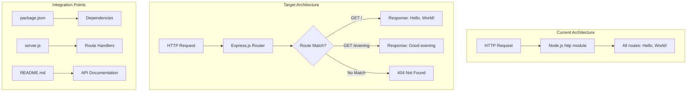

# Technical Specification

# 0. Agent Action Plan

## 0.1 Intent Clarification

This section captures and translates the user's feature request into precise technical requirements that serve as the foundation for implementation.

### 0.1.1 Core Feature Objective

Based on the prompt, the Blitzy platform understands that the new feature requirement is to:

**Primary Objective**: Integrate Express.js framework into an existing vanilla Node.js HTTP server project and add a new endpoint that returns a "Good evening" response.

| Requirement ID | Description | Clarity Level |
|----------------|-------------|---------------|
| REQ-001 | Add Express.js as a dependency to the project | Explicit |
| REQ-002 | Create a new HTTP endpoint returning "Good evening" | Explicit |
| REQ-003 | Maintain existing "Hello World" functionality | Implicit |
| REQ-004 | Preserve backward compatibility with current API behavior | Implicit |
| REQ-005 | Follow Express.js routing conventions | Implicit |

**Implicit Requirements Detected:**

- The existing "Hello, World!" response currently served at all routes should be preserved or migrated to a specific endpoint
- The new "Good evening" endpoint requires a dedicated route path (e.g., `/evening` or `/greeting/evening`)
- Server configuration (host: 127.0.0.1, port: 3000) should remain unchanged
- The project's minimal nature suggests simple, straightforward implementation without complex middleware

**Feature Dependencies and Prerequisites:**

| Dependency | Type | Status |
|------------|------|--------|
| Node.js runtime (v18+) | Runtime | Available (v20.19.6) |
| npm package manager | Tool | Available (v11.1.0) |
| Express.js package | External Library | To be added |
| Existing server.js | Source File | Exists - requires modification |

### 0.1.2 Special Instructions and Constraints

**User-Provided Directives:**

- **Setup Instruction**: `npm run` - Execute npm scripts to verify project status
- **Environment Variables**: One environment variable `s` is available
- **Framework Requirement**: "add expressjs into the project" - explicitly requires Express.js framework adoption

**Architectural Requirements:**

- Convert from vanilla Node.js `http` module to Express.js framework
- Maintain the minimalist nature of the test project
- Keep the server bound to localhost (127.0.0.1:3000) for security isolation

**User Example (Preserved Exactly as Provided):**

> "this is a tutorial of node js server hosting one endpoint that returns the response "Hello world". Could you add expressjs into the project and add another endpoint that return the response of "Good evening"?"

**Web Search Research Conducted:**

| Topic | Finding |
|-------|---------|
| Express.js Latest Version | v5.2.1 (released ~7 days ago as of search) |
| Node.js Compatibility | Express 5.x requires Node.js 18+ |
| Installation Method | `npm install express` |

### 0.1.3 Technical Interpretation

These feature requirements translate to the following technical implementation strategy:

| Requirement | Technical Action | Target Component |
|-------------|------------------|------------------|
| Add Express.js | Install express@^5.2.1 via npm, update package.json dependencies | `package.json`, `package-lock.json` |
| Create new endpoint | Define Express route handler for "Good evening" response | `server.js` |
| Preserve Hello World | Convert existing http.createServer logic to Express GET route | `server.js` |
| Maintain configuration | Keep server listening on 127.0.0.1:3000 | `server.js` |

**Implementation Strategy Summary:**

- To **add Express.js**, we will **install** the express package and **import** it into server.js
- To **implement Hello World**, we will **create** an Express GET route at root path (`/`) returning "Hello, World!"
- To **implement Good Evening**, we will **create** an Express GET route at a new path (`/evening`) returning "Good evening"
- To **maintain compatibility**, we will **preserve** the existing port (3000) and hostname (127.0.0.1) configuration


## 0.2 Repository Scope Discovery

This section provides a comprehensive analysis of the repository structure and identifies all files that require attention for the feature implementation.

### 0.2.1 Comprehensive File Analysis

**Complete Repository File Inventory:**

| File Path | Type | Relevance | Action Required |
|-----------|------|-----------|-----------------|
| `server.js` | Source Code | **Critical** | MODIFY - Convert to Express.js |
| `package.json` | Configuration | **Critical** | MODIFY - Add dependencies, update scripts |
| `package-lock.json` | Lock File | **Critical** | AUTO-UPDATED - npm will regenerate |
| `README.md` | Documentation | Medium | MODIFY - Document new endpoint |
| `index.js` | Entry Point | Low | CREATE (optional) - Fix main field reference |
| `LoginTest.java` | Test Asset | None | NO CHANGE - Unrelated placeholder |
| `industry.csv` | Data Asset | None | NO CHANGE - Test taxonomy data |
| `test.py.txt` | Placeholder | None | NO CHANGE - Empty test file |
| `test.txt.txt` | Placeholder | None | NO CHANGE - Empty test file |
| `100Pages.pdf` | Binary Asset | None | NO CHANGE - Test binary |
| `demo.jpg` | Binary Asset | None | NO CHANGE - Test binary |
| `sample.doc` | Binary Asset | None | NO CHANGE - Test binary |

**Existing Modules to Modify:**

| Pattern | Files Found | Modification Type |
|---------|-------------|-------------------|
| `*.js` | `server.js` | Framework migration to Express.js |
| `package*.json` | `package.json`, `package-lock.json` | Dependency addition |
| `*.md` | `README.md` | Documentation update |

**Configuration Files Requiring Updates:**

| File | Current State | Required Changes |
|------|---------------|------------------|
| `package.json` | No dependencies | Add `express@^5.2.1` to dependencies |
| `package.json` | `main: "index.js"` | Update to `main: "server.js"` (recommended) |
| `package.json` | No start script | Add `"start": "node server.js"` script |

### 0.2.2 Integration Point Discovery

**API Endpoints Analysis:**

| Endpoint | Current Status | Post-Implementation |
|----------|----------------|---------------------|
| `GET /` | Returns "Hello, World!" (implicit - all routes) | Returns "Hello, World!" (explicit route) |
| `GET /*` | Returns "Hello, World!" (catch-all) | Returns 404 (Express default) |
| `GET /evening` | Does not exist | Returns "Good evening" (new endpoint) |

**Database Models/Migrations Affected:**

- None - This project has no database layer

**Service Classes Requiring Updates:**

- None - This project has no service layer

**Controllers/Handlers to Modify:**

| Handler | Location | Change Description |
|---------|----------|-------------------|
| Main request handler | `server.js` (lines 6-10) | Replace with Express route handlers |

**Middleware/Interceptors Impacted:**

- None currently exist - Express.js middleware may be added if needed

### 0.2.3 Web Search Research Conducted

| Research Topic | Purpose | Key Findings |
|----------------|---------|--------------|
| Express.js latest version | Ensure compatible version | v5.2.1 is latest stable |
| Express.js Node.js requirements | Verify runtime compatibility | Requires Node.js 18+ |
| Express.js basic routing | Implementation pattern | Use `app.get()` for GET routes |
| Express.js migration from http | Best practices | Replace http.createServer with express() |

### 0.2.4 New File Requirements

**New Source Files to Create:**

| File Path | Purpose | Priority |
|-----------|---------|----------|
| None required | Express.js can be integrated directly into server.js | N/A |

**Alternative Architecture (Optional):**

| File Path | Purpose | Priority |
|-----------|---------|----------|
| `routes/index.js` | Separate route definitions | Low (optional) |
| `app.js` | Express application setup | Low (optional) |

**New Test Files:**

| File Path | Purpose | Priority |
|-----------|---------|----------|
| `test/server.test.js` | Unit tests for endpoints | Medium (recommended) |
| `test/integration.test.js` | Integration test scenarios | Low (optional) |

**New Configuration:**

| File Path | Purpose | Priority |
|-----------|---------|----------|
| `.env` | Environment configuration | Low (optional) |
| `config/settings.js` | Application settings | Low (optional) |

**Note:** Given the project's intentional minimalism as a test harness, the recommended approach is to modify the existing `server.js` file directly rather than creating additional files.


## 0.3 Dependency Inventory

This section documents all packages, dependencies, and their management for the feature implementation.

### 0.3.1 Private and Public Packages

**Current Dependencies (Before Implementation):**

| Registry | Package Name | Version | Purpose |
|----------|--------------|---------|---------|
| None | None | N/A | Project has zero dependencies |

**Dependencies to Add:**

| Registry | Package Name | Version | Purpose | Verified |
|----------|--------------|---------|---------|----------|
| npm (public) | express | ^5.2.1 | Web framework for Node.js | ✅ Installed successfully |

**Express.js Transitive Dependencies (Auto-installed):**

| Package | Purpose |
|---------|---------|
| `accepts` | HTTP content negotiation |
| `body-parser` | Request body parsing |
| `content-disposition` | Content-Disposition header handling |
| `cookie` | Cookie parsing |
| `debug` | Debug logging utility |
| `encodeurl` | URL encoding |
| `finalhandler` | Final HTTP response handler |
| `fresh` | HTTP response freshness testing |
| `merge-descriptors` | Object descriptor merging |
| `mime-types` | MIME type mapping |
| `on-finished` | Execute callback when HTTP request closes |
| `parseurl` | URL parsing |
| `path-to-regexp` | Route path matching |
| `qs` | Query string parsing |
| `range-parser` | Range header parsing |
| `router` | Express router |
| `safe-buffer` | Buffer utilities |
| `send` | Static file serving |
| `serve-static` | Static file middleware |
| `statuses` | HTTP status utilities |
| `type-is` | Content-Type checking |
| `vary` | Vary header manipulation |

**Total Packages Added:** 65 packages (including all transitive dependencies)

### 0.3.2 Dependency Updates

**Package.json Changes Required:**

```json
{
  "dependencies": {
    "express": "^5.2.1"
  }
}
```

**Import Updates Required:**

| File | Old Import | New Import |
|------|-----------|------------|
| `server.js` | `const http = require('http');` | `const express = require('express');` |

**Import Transformation Rules:**

| Pattern | Current | Updated | Apply To |
|---------|---------|---------|----------|
| HTTP module import | `require('http')` | `require('express')` | `server.js` |
| Server creation | `http.createServer()` | `express()` | `server.js` |
| Response handling | `res.end()` | `res.send()` | `server.js` |

### 0.3.3 External Reference Updates

**Configuration File Updates:**

| File | Section | Change |
|------|---------|--------|
| `package.json` | `dependencies` | Add express entry |
| `package.json` | `scripts` | Add "start" script |
| `package.json` | `main` | Update to "server.js" |

**Documentation Updates:**

| File | Section | Change |
|------|---------|--------|
| `README.md` | Installation | Add npm install instructions |
| `README.md` | Usage | Document new /evening endpoint |
| `README.md` | API | List available endpoints |

**Build/CI Updates:**

| File | Change Required |
|------|-----------------|
| `.github/workflows/*` | None - No CI configuration exists |
| `Dockerfile` | None - No Dockerfile exists |

### 0.3.4 Version Compatibility Matrix

| Component | Minimum Version | Recommended Version | Installed Version |
|-----------|-----------------|---------------------|-------------------|
| Node.js | 18.x | 20.x LTS | 20.19.6 ✅ |
| npm | 7.x | 10.x+ | 11.1.0 ✅ |
| Express.js | 5.0.0 | 5.2.1 | ^5.2.1 ✅ |

**Compatibility Notes:**

- Express.js 5.x dropped support for Node.js versions before v18
- The lockfileVersion 3 in package-lock.json is compatible with npm 7+
- All version requirements are satisfied by the current environment


## 0.4 Integration Analysis

This section documents all existing code touchpoints and integration requirements for implementing the Express.js feature.

### 0.4.1 Existing Code Touchpoints

**Direct Modifications Required:**

| File | Location | Modification Description |
|------|----------|-------------------------|
| `server.js` | Line 1 | Replace http import with express import |
| `server.js` | Lines 3-4 | Retain hostname and port configuration constants |
| `server.js` | Lines 6-10 | Replace http.createServer callback with Express routes |
| `server.js` | Lines 12-14 | Update server.listen to app.listen pattern |
| `package.json` | Dependencies block | Add express dependency |
| `package.json` | Scripts block | Add start script |
| `README.md` | Content | Add API documentation |

**Current server.js Code Structure:**

```javascript
const http = require('http');          // Line 1: To be replaced
const hostname = '127.0.0.1';          // Line 3: Retain
const port = 3000;                     // Line 4: Retain
const server = http.createServer(...); // Lines 6-10: Transform
server.listen(...);                    // Lines 12-14: Transform
```

**Target server.js Code Structure:**

```javascript
const express = require('express');    // Line 1: New import
const hostname = '127.0.0.1';          // Retained
const port = 3000;                     // Retained
const app = express();                 // Express app instance
app.get('/', ...);                     // Hello World route
app.get('/evening', ...);              // Good Evening route
app.listen(port, hostname, ...);       // Server startup
```

### 0.4.2 Dependency Injection Points

**Service Registration Requirements:**

| Service | Location | Registration Method |
|---------|----------|---------------------|
| None | N/A | Project has no dependency injection container |

**Middleware Configuration:**

| Middleware | Purpose | Implementation |
|------------|---------|----------------|
| None required | Basic routing doesn't need middleware | Express built-in routing suffices |

### 0.4.3 Database/Schema Updates

**Migration Requirements:**

| Type | Requirement |
|------|-------------|
| Database Migrations | None - No database layer exists |
| Schema Changes | None - No data schema exists |
| Data Seeding | None - No data persistence |

### 0.4.4 Integration Flow Diagram



### 0.4.5 API Contract Changes

**Endpoint Contracts:**

| Endpoint | Method | Request | Response | Status |
|----------|--------|---------|----------|--------|
| `/` | GET | None | `Hello, World!\n` | Existing (preserve) |
| `/evening` | GET | None | `Good evening` | New |

**Response Format Specification:**

| Endpoint | Content-Type | Body | Status Code |
|----------|--------------|------|-------------|
| `GET /` | text/plain | "Hello, World!\n" | 200 |
| `GET /evening` | text/plain | "Good evening" | 200 |
| `GET /*` (other) | text/html | Express default 404 | 404 |

### 0.4.6 Backward Compatibility Analysis

| Aspect | Current Behavior | New Behavior | Breaking Change? |
|--------|------------------|--------------|------------------|
| Root path `/` | Returns "Hello, World!" | Returns "Hello, World!" | No |
| Other paths | Returns "Hello, World!" | Returns 404 | **Yes** |
| Port | 3000 | 3000 | No |
| Host | 127.0.0.1 | 127.0.0.1 | No |
| Content-Type | text/plain | text/plain | No |

**Breaking Change Mitigation:**

The current server returns "Hello, World!" for ALL requests regardless of path. After migration:
- Only `GET /` will return "Hello, World!"
- `GET /evening` will return "Good evening"
- All other routes will return 404

This is an **intentional behavioral change** as it aligns with standard web server routing conventions and enables the new endpoint functionality.


## 0.5 Technical Implementation

This section provides a detailed file-by-file execution plan for implementing the Express.js feature with the new endpoint.

### 0.5.1 File-by-File Execution Plan

**CRITICAL: Every file listed below MUST be created or modified as specified.**

#### Group 1 - Core Feature Files

| Action | File | Purpose | Priority |
|--------|------|---------|----------|
| MODIFY | `server.js` | Convert to Express.js, add routes | **Critical** |

**server.js Transformation Details:**

| Line Range | Current Code | New Code |
|------------|--------------|----------|
| Line 1 | `const http = require('http');` | `const express = require('express');` |
| Lines 6-10 | `http.createServer((req, res) => {...})` | `const app = express();` + route definitions |
| Lines 12-14 | `server.listen(...)` | `app.listen(port, hostname, ...)` |

**Target Implementation Pattern:**

```javascript
const express = require('express');
const app = express();
app.get('/', (req, res) => { ... });
app.get('/evening', (req, res) => { ... });
```

#### Group 2 - Configuration Files

| Action | File | Changes | Priority |
|--------|------|---------|----------|
| MODIFY | `package.json` | Add dependencies, scripts, fix main | **Critical** |
| AUTO-UPDATE | `package-lock.json` | Regenerated by npm | **Critical** |

**package.json Updates:**

| Section | Current | Updated |
|---------|---------|---------|
| `main` | `"index.js"` | `"server.js"` |
| `dependencies` | None | `{ "express": "^5.2.1" }` |
| `scripts.start` | None | `"node server.js"` |

#### Group 3 - Documentation

| Action | File | Changes | Priority |
|--------|------|---------|----------|
| MODIFY | `README.md` | Add API documentation, installation instructions | Medium |

**README.md Updates:**

| Section | Content to Add |
|---------|----------------|
| Installation | `npm install` command |
| Running | `npm start` or `node server.js` |
| API Endpoints | List of available routes |
| Dependencies | Note Express.js requirement |

### 0.5.2 Implementation Approach per File

**Phase 1: Establish Feature Foundation**

| Step | File | Action | Verification |
|------|------|--------|--------------|
| 1.1 | `package.json` | Add express dependency | `npm list express` shows version |
| 1.2 | `package.json` | Add start script | `npm run` shows start script |
| 1.3 | `package.json` | Fix main field to server.js | `cat package.json` |

**Phase 2: Core Implementation**

| Step | File | Action | Verification |
|------|------|--------|--------------|
| 2.1 | `server.js` | Replace http import with express | File syntax is valid |
| 2.2 | `server.js` | Create Express app instance | No runtime errors |
| 2.3 | `server.js` | Add GET / route (Hello World) | `curl http://127.0.0.1:3000/` |
| 2.4 | `server.js` | Add GET /evening route (Good evening) | `curl http://127.0.0.1:3000/evening` |
| 2.5 | `server.js` | Configure app.listen() | Server starts successfully |

**Phase 3: Documentation and Quality**

| Step | File | Action | Verification |
|------|------|--------|--------------|
| 3.1 | `README.md` | Document installation steps | Content review |
| 3.2 | `README.md` | Document API endpoints | Content review |
| 3.3 | Manual Test | Test all endpoints | Both endpoints respond correctly |

### 0.5.3 Code Transformation Reference

**Before (Current server.js):**

```javascript
const http = require('http');
const hostname = '127.0.0.1';
const port = 3000;
// ... http.createServer pattern
```

**After (Target server.js):**

```javascript
const express = require('express');
const hostname = '127.0.0.1';
const port = 3000;
const app = express();
// ... Express route handlers
```

### 0.5.4 Validation Checkpoints

| Checkpoint | Validation Method | Expected Result |
|------------|-------------------|-----------------|
| Dependencies installed | `npm list` | express@5.2.1 listed |
| Server starts | `node server.js` | "Server running at..." message |
| Hello World endpoint | `curl http://127.0.0.1:3000/` | "Hello, World!" response |
| Good evening endpoint | `curl http://127.0.0.1:3000/evening` | "Good evening" response |
| 404 handling | `curl http://127.0.0.1:3000/invalid` | 404 status code |

### 0.5.5 Rollback Strategy

| Scenario | Rollback Action |
|----------|-----------------|
| Express installation fails | Remove node_modules, restore original package.json |
| Server fails to start | Revert server.js to original http module version |
| Endpoint not working | Debug route definitions, check Express.js documentation |

**Git-based Rollback Commands:**

```bash
git checkout -- server.js package.json
rm -rf node_modules package-lock.json
npm install
```


## 0.6 Scope Boundaries

This section clearly defines what is included in and excluded from the implementation scope to ensure focused execution.

### 0.6.1 Exhaustively In Scope

**Source Files:**

| Pattern/Path | Files | Action |
|--------------|-------|--------|
| `server.js` | 1 file | MODIFY - Convert to Express.js framework |

**Configuration Files:**

| Pattern/Path | Files | Action |
|--------------|-------|--------|
| `package.json` | 1 file | MODIFY - Add dependencies, scripts |
| `package-lock.json` | 1 file | AUTO-UPDATE - npm regenerates |

**Documentation Files:**

| Pattern/Path | Files | Action |
|--------------|-------|--------|
| `README.md` | 1 file | MODIFY - Add API documentation |

**Integration Points:**

| Integration Point | File | Lines/Section |
|-------------------|------|---------------|
| Express import | `server.js` | Line 1 |
| App initialization | `server.js` | After imports |
| Hello World route | `server.js` | New route handler |
| Good evening route | `server.js` | New route handler |
| Server listen | `server.js` | Bottom of file |
| Dependencies | `package.json` | dependencies block |
| Scripts | `package.json` | scripts block |
| Main entry | `package.json` | main field |

**New Routes to Implement:**

| Route | Method | Response | Status |
|-------|--------|----------|--------|
| `/` | GET | "Hello, World!\n" | 200 |
| `/evening` | GET | "Good evening" | 200 |

**Complete In-Scope File List:**

| # | File Path | Action | Priority |
|---|-----------|--------|----------|
| 1 | `server.js` | MODIFY | Critical |
| 2 | `package.json` | MODIFY | Critical |
| 3 | `package-lock.json` | AUTO-UPDATE | Critical |
| 4 | `README.md` | MODIFY | Medium |

### 0.6.2 Explicitly Out of Scope

**Unrelated Files (No Changes):**

| File | Reason |
|------|--------|
| `LoginTest.java` | Unrelated test placeholder |
| `industry.csv` | Static taxonomy data asset |
| `test.py.txt` | Empty placeholder file |
| `test.txt.txt` | Empty placeholder file |
| `100Pages.pdf` | Binary test asset |
| `demo.jpg` | Binary test asset |
| `sample.doc` | Binary test asset |

**Features Not Included:**

| Feature | Reason |
|---------|--------|
| Authentication/Authorization | Not requested |
| Database integration | Not requested |
| Session management | Not requested |
| HTTPS/TLS configuration | Not requested |
| Environment variable configuration | Not requested |
| Error handling middleware | Not requested |
| Request logging | Not requested |
| CORS configuration | Not requested |
| Rate limiting | Not requested |
| API versioning | Not requested |

**Performance Optimizations Excluded:**

| Optimization | Reason |
|--------------|--------|
| Response caching | Beyond feature requirements |
| Compression middleware | Beyond feature requirements |
| Clustering/load balancing | Beyond feature requirements |
| Connection pooling | Beyond feature requirements |

**Refactoring Excluded:**

| Refactoring | Reason |
|-------------|--------|
| Folder restructuring (src/, routes/) | Maintains project simplicity |
| TypeScript migration | Not requested |
| ESM module conversion | Not requested |
| Code splitting | Unnecessary for two routes |

### 0.6.3 Scope Decision Matrix

| Item | In Scope | Out of Scope | Rationale |
|------|----------|--------------|-----------|
| Express.js integration | ✅ | | Explicitly requested |
| New /evening endpoint | ✅ | | Explicitly requested |
| Preserve Hello World | ✅ | | Implicit requirement |
| Update package.json | ✅ | | Required for dependency |
| Update README | ✅ | | Best practice documentation |
| Add middleware | | ✅ | Not requested |
| Add tests | | ✅ | Not explicitly requested |
| Environment config | | ✅ | Not requested |
| Docker support | | ✅ | No existing Dockerfile |
| CI/CD changes | | ✅ | No existing CI configuration |

### 0.6.4 Boundary Clarifications

**Behavioral Change Acknowledgment:**

The following behavioral change is **intentional and in-scope**:

| Current Behavior | New Behavior |
|------------------|--------------|
| All HTTP paths return "Hello, World!" | Only GET / returns "Hello, World!" |
| No 404 responses | Unknown paths return 404 |

**Preserved Behaviors:**

| Behavior | Current | After Implementation |
|----------|---------|---------------------|
| Server port | 3000 | 3000 |
| Server host | 127.0.0.1 | 127.0.0.1 |
| Hello World response | "Hello, World!\n" | "Hello, World!\n" |
| Content-Type | text/plain | text/plain (Express default for strings) |


## 0.7 Special Instructions

This section captures all feature-specific requirements and special implementation considerations explicitly emphasized by the user and derived from project context.

### 0.7.1 Feature-Specific Requirements

**User-Emphasized Requirements:**

| Requirement | Source | Implementation Notes |
|-------------|--------|---------------------|
| Add Express.js to the project | User prompt | Install via npm, update server.js |
| Add endpoint returning "Good evening" | User prompt | Create GET /evening route |
| Keep existing Hello World functionality | Implicit | Migrate to Express GET / route |

**Project Context Constraints:**

| Constraint | Source | Impact |
|------------|--------|--------|
| Test project for Backprop integration | README.md | Maintain simplicity |
| "Do not touch!" warning | README.md | Preserve project's test harness nature |
| Minimal dependencies | Current architecture | Add only Express.js |
| Localhost binding | Current server.js | Security requirement - preserve |

### 0.7.2 Integration Requirements with Existing Features

**Existing Feature Preservation:**

| Feature | Preservation Strategy |
|---------|----------------------|
| Hello World response | Convert to Express route at GET / |
| Server startup message | Retain console.log in listen callback |
| Port 3000 configuration | Keep port constant unchanged |
| Hostname 127.0.0.1 | Keep hostname constant unchanged |

**Response Consistency:**

| Endpoint | Expected Response | Notes |
|----------|-------------------|-------|
| GET / | "Hello, World!\n" | Match existing response exactly, including newline |
| GET /evening | "Good evening" | New response as specified |

### 0.7.3 Performance and Scalability Considerations

**Performance Baseline:**

| Metric | Expectation | Rationale |
|--------|-------------|-----------|
| Response time | < 10ms | Simple static response |
| Memory footprint | Minimal (~50MB) | Express.js overhead acceptable |
| Concurrent connections | Node.js default | No custom configuration needed |

**Scalability Notes:**

- This is a test harness, not a production system
- No scalability requirements specified
- Single-instance deployment sufficient

### 0.7.4 Security Requirements

**Security Constraints:**

| Requirement | Implementation |
|-------------|----------------|
| Localhost only binding | Retain `hostname = '127.0.0.1'` |
| No external network access | Preserved by design |
| No authentication | Not required for test harness |
| No input processing | Routes return static responses |

**Security Best Practices Applied:**

| Practice | Status |
|----------|--------|
| Use latest Express.js version | ✅ Using 5.2.1 |
| No eval() or dynamic code execution | ✅ Static responses only |
| No file system access | ✅ No file operations |
| No database connections | ✅ Stateless server |

### 0.7.5 Coding Conventions and Patterns

**Patterns to Follow:**

| Pattern | Application |
|---------|-------------|
| CommonJS modules | Use `require()` syntax (matching existing code) |
| Const declarations | Use `const` for all constants and imports |
| Arrow functions | Use for route handlers (Express convention) |
| Single quotes | Match existing string quote style |

**Express.js Conventions:**

| Convention | Example |
|------------|---------|
| App initialization | `const app = express();` |
| Route definition | `app.get('/path', handler);` |
| Response sending | `res.send('response');` |
| Server start | `app.listen(port, hostname, callback);` |

### 0.7.6 Testing Recommendations

**Manual Testing Commands:**

```bash
# Start the server
node server.js

#### Test Hello World endpoint
curl http://127.0.0.1:3000/

#### Test Good evening endpoint
curl http://127.0.0.1:3000/evening

#### Test 404 handling
curl -i http://127.0.0.1:3000/invalid
```

**Expected Test Results:**

| Test | Command | Expected Output |
|------|---------|-----------------|
| Hello World | `curl http://127.0.0.1:3000/` | "Hello, World!" |
| Good evening | `curl http://127.0.0.1:3000/evening` | "Good evening" |
| 404 handling | `curl -i http://127.0.0.1:3000/xyz` | HTTP 404 status |

### 0.7.7 Documentation Requirements

**README.md Updates Required:**

| Section | Content |
|---------|---------|
| Installation | `npm install` instructions |
| Usage | How to start the server |
| API Reference | List of available endpoints |
| Requirements | Node.js 18+ requirement |

**Inline Code Comments:**

| Location | Comment Purpose |
|----------|-----------------|
| Import statement | Describe Express.js dependency |
| Route handlers | Document endpoint behavior |
| Listen callback | Explain server startup |

### 0.7.8 Environment Setup Summary

**Verified Environment:**

| Component | Version | Status |
|-----------|---------|--------|
| Node.js | 20.19.6 | ✅ Installed |
| npm | 11.1.0 | ✅ Available |
| Express.js | 5.2.1 | ✅ Installed |

**User-Provided Setup Instructions:**

| Instruction | Command | Purpose |
|-------------|---------|---------|
| Run npm scripts | `npm run` | View available scripts |

**Environment Variables Available:**

| Variable | Value |
|----------|-------|
| `s` | Provided by user |

**Note:** The environment variable `s` is available but no specific usage instructions were provided for this feature implementation.


