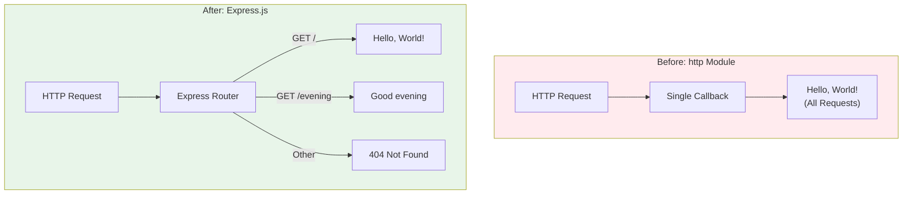

# Technical Specification

# 0. Agent Action Plan

## 0.1 Intent Clarification

### 0.1.1 Core Feature Objective

Based on the prompt, the Blitzy platform understands that the new feature requirement is to:

**Primary Requirements:**

| Requirement ID | Requirement Description | Technical Interpretation |
|----------------|------------------------|-------------------------|
| REQ-001 | Add Express.js framework to the existing Node.js project | Install `express` as a production dependency and refactor the server architecture |
| REQ-002 | Create a new endpoint that returns "Good evening" | Implement an additional HTTP route with a specific string response |
| REQ-003 | Maintain the existing "Hello world" functionality | Preserve backward compatibility by keeping the existing response behavior |

**Implicit Requirements Detected:**

- The existing raw `http` module implementation must be replaced with Express.js routing
- The current single-response behavior needs to be converted to a route-based pattern
- Server configuration (hostname, port) should remain unchanged for compatibility
- Console logging for server startup confirmation should be preserved

**Feature Dependencies and Prerequisites:**

| Dependency | Status | Notes |
|------------|--------|-------|
| Node.js Runtime v18+ | ✅ Available (v20.20.0) | Required for Express.js 5.x compatibility |
| npm Package Manager | ✅ Available (v11.1.0) | Required for Express.js installation |
| Existing `server.js` | ✅ Present | Contains current HTTP server implementation |
| `package.json` | ✅ Present | Manifest file for dependency management |

### 0.1.2 Special Instructions and Constraints

**Architectural Requirements:**

- Integrate Express.js while maintaining the existing project structure
- Follow the established CommonJS module pattern (`require()`) used in the codebase
- Preserve the localhost binding (`127.0.0.1`) and port (`3000`) configuration
- Maintain the MIT license and project metadata

**User Example - Original Request:**

> "this is a tutorial of node js server hosting one endpoint that returns the response "Hello world". Could you add expressjs into the project and add another endpoint that return the response of "Good evening"?"

**Web Search Requirements Documented:**

- Express.js latest stable version verification: v5.2.1 confirmed
- Express.js 5.x requires Node.js 18 or higher (current system: v20.20.0 - compatible)
- Express.js 5.x includes native async/await middleware support

### 0.1.3 Technical Interpretation

These feature requirements translate to the following technical implementation strategy:

| Requirement | Technical Action | Component Impact |
|-------------|-----------------|------------------|
| Add Express.js | `npm install express@5.2.1` and refactor `server.js` | `package.json`, `package-lock.json`, `server.js` |
| Create "Good evening" endpoint | Add new Express route handler for a specific path | `server.js` |
| Maintain "Hello world" | Convert existing response to root route (`/`) | `server.js` |

**Implementation Approach:**

- To **add Express.js to the project**, we will **install** the `express` package as a production dependency and **modify** `server.js` to use Express.js instead of the raw `http` module
- To **implement the "Hello world" endpoint**, we will **convert** the existing static response into an Express route handler at the root path (`/`)
- To **implement the "Good evening" endpoint**, we will **create** a new Express route handler at a designated path (e.g., `/evening` or `/good-evening`)
- To **maintain backward compatibility**, we will **preserve** the existing server configuration (host: `127.0.0.1`, port: `3000`) and startup logging

```javascript
// Example route structure (Express.js 5.x pattern)
app.get('/', (req, res) => res.send('Hello, World!\n'));
app.get('/evening', (req, res) => res.send('Good evening\n'));
```


## 0.2 Repository Scope Discovery

### 0.2.1 Comprehensive File Analysis

**Repository Structure Analysis:**

The repository contains a minimal Node.js project with the following file structure:

| File/Path | Type | Purpose | Modification Status |
|-----------|------|---------|---------------------|
| `server.js` | Source | HTTP server implementation | **MODIFY** - Convert to Express.js |
| `package.json` | Config | npm manifest | **MODIFY** - Add Express dependency |
| `package-lock.json` | Config | Dependency lockfile | **AUTO-UPDATE** - npm will regenerate |
| `README.md` | Docs | Project documentation | **MODIFY** - Update with new endpoints |
| `industry.csv` | Data | Test taxonomy data | UNCHANGED |
| `LoginTest.java` | Test | Java test scaffold | UNCHANGED |
| `100Pages.pdf` | Asset | Binary test file | UNCHANGED |
| `demo.jpg` | Asset | Image test file | UNCHANGED |
| `sample.doc` | Asset | Document test file | UNCHANGED |
| `test.py.txt` | Placeholder | Empty file | UNCHANGED |
| `test.txt.txt` | Placeholder | Empty file | UNCHANGED |

**Files Requiring Modification:**

| File | Lines Affected | Change Description |
|------|---------------|-------------------|
| `server.js` | Lines 1-14 (entire file) | Replace `http` module with Express.js, add multiple routes |
| `package.json` | New `dependencies` section | Add `"express": "^5.2.1"` dependency |
| `README.md` | Documentation section | Add endpoint documentation for both routes |

**Integration Point Discovery:**

| Integration Type | Current Implementation | Required Changes |
|-----------------|----------------------|-----------------|
| HTTP Server Initialization | `http.createServer()` | Replace with `express()` |
| Request Handling | Single callback for all requests | Route-specific handlers |
| Response Generation | `res.end('Hello, World!\n')` | `res.send()` for each route |
| Server Listening | `server.listen(port, hostname)` | `app.listen(port, hostname)` |

### 0.2.2 Web Search Research Conducted

| Research Topic | Finding | Source |
|---------------|---------|--------|
| Express.js Latest Version | v5.2.1 is the current stable release | npm registry |
| Node.js Compatibility | Express 5.x requires Node.js 18+ | Express.js GitHub releases |
| Express 5.x Changes | Dropped support for legacy Node.js, improved async/await | Express official documentation |
| Route Handler Best Practices | Use `app.get()`, `app.post()` for explicit routing | Express.js community guides |

### 0.2.3 New File Requirements

**New Source Files to Create:**

No new source files are required for this feature. All changes can be implemented within the existing `server.js` file, which aligns with the project's minimal architecture design.

**Test File Considerations:**

| Test Category | File | Status | Notes |
|--------------|------|--------|-------|
| Unit Tests | `tests/server.test.js` | Optional | Could verify route responses |
| Integration Tests | `tests/integration.test.js` | Optional | Could verify server startup |

> **Note:** The original project does not include a test framework. The `package.json` script for "test" is a placeholder that exits with error. Adding tests would require additional devDependencies (e.g., Jest, Mocha).

**Configuration File Updates:**

| File | New Content Required |
|------|---------------------|
| `package.json` | Add `dependencies: { "express": "^5.2.1" }` |
| `.env` | Not required - hardcoded configuration retained |
| `.nvmrc` | Optional - could specify `20` for Node.js version |


## 0.3 Dependency Inventory

### 0.3.1 Private and Public Packages

**Current Dependency State:**

The existing `package.json` contains zero dependencies:

```json
{
  "name": "hello_world",
  "version": "1.0.0",
  "description": "Hello world in Node.js",
  "main": "index.js",
  "scripts": { "test": "echo \"Error: no test specified\" && exit 1" },
  "author": "hxu",
  "license": "MIT"
}
```

**New Dependencies Required:**

| Registry | Package Name | Version | Purpose | License |
|----------|-------------|---------|---------|---------|
| npm (public) | express | ^5.2.1 | Web application framework for HTTP routing | MIT |

**Express.js Transitive Dependencies (Auto-installed):**

Express.js 5.2.1 will automatically install the following transitive dependencies:

| Package | Purpose |
|---------|---------|
| `accepts` | HTTP content negotiation |
| `body-parser` | Request body parsing middleware |
| `content-disposition` | Content-Disposition header handling |
| `content-type` | Content-Type header parsing |
| `cookie` | HTTP cookie handling |
| `cookie-signature` | Cookie signing |
| `debug` | Debug logging utility |
| `encodeurl` | URL encoding |
| `escape-html` | HTML escaping |
| `etag` | ETag generation |
| `finalhandler` | Final HTTP response handler |
| `fresh` | HTTP response freshness testing |
| `merge-descriptors` | Object descriptor merging |
| `methods` | HTTP methods |
| `mime-types` | MIME type mapping |
| `on-finished` | Request/Response finished listener |
| `parseurl` | URL parsing |
| `path-to-regexp` | Route path matching |
| `proxy-addr` | Proxy address detection |
| `qs` | Query string parsing |
| `range-parser` | Range header parsing |
| `raw-body` | Raw request body reading |
| `router` | Express router |
| `safe-buffer` | Buffer safety utilities |
| `safer-buffer` | Buffer safety utilities |
| `send` | Static file serving |
| `serve-static` | Static file middleware |
| `setprototypeof` | Object prototype setting |
| `statuses` | HTTP status codes |
| `type-is` | Content-Type checking |
| `utils-merge` | Object merging |
| `vary` | Vary header management |

### 0.3.2 Dependency Updates

**Import Updates Required:**

| File Pattern | Current Import | New Import |
|--------------|---------------|------------|
| `server.js` | `const http = require('http');` | `const express = require('express');` |

**Import Transformation Rules:**

```javascript
// Old: Native http module
const http = require('http');
const server = http.createServer((req, res) => { ... });

// New: Express.js application
const express = require('express');
const app = express();
```

**External Reference Updates:**

| File | Section | Update Required |
|------|---------|-----------------|
| `package.json` | `dependencies` | Add `"express": "^5.2.1"` |
| `package.json` | `main` | Update from `index.js` to `server.js` (optional fix) |
| `package.json` | `scripts.start` | Add `"start": "node server.js"` (optional enhancement) |
| `README.md` | Endpoints section | Document new `/evening` endpoint |

### 0.3.3 Installation Commands

**Production Dependency Installation:**

```bash
npm install express@^5.2.1 --save
```

**Expected `package.json` After Installation:**

```json
{
  "name": "hello_world",
  "version": "1.0.0",
  "description": "Hello world in Node.js",
  "main": "server.js",
  "scripts": {
    "start": "node server.js",
    "test": "echo \"Error: no test specified\" && exit 1"
  },
  "author": "hxu",
  "license": "MIT",
  "dependencies": {
    "express": "^5.2.1"
  }
}
```

### 0.3.4 Version Compatibility Matrix

| Component | Minimum Version | Current Version | Status |
|-----------|----------------|-----------------|--------|
| Node.js | 18.0.0 | 20.20.0 | ✅ Compatible |
| npm | 8.0.0 | 11.1.0 | ✅ Compatible |
| Express.js | 5.0.0 | 5.2.1 | ✅ Latest Stable |


## 0.4 Integration Analysis

### 0.4.1 Existing Code Touchpoints

**Direct Modifications Required:**

| File | Location | Modification Description |
|------|----------|-------------------------|
| `server.js` | Line 1 | Replace `const http = require('http');` with `const express = require('express');` |
| `server.js` | Lines 3-4 | Retain hostname and port constants |
| `server.js` | Lines 6-10 | Replace `http.createServer()` with Express app and route definitions |
| `server.js` | Lines 12-14 | Modify `server.listen()` to `app.listen()` |

**Current `server.js` Implementation (Lines 1-14):**

```javascript
const http = require('http');

const hostname = '127.0.0.1';
const port = 3000;

const server = http.createServer((req, res) => {
  res.statusCode = 200;
  res.setHeader('Content-Type', 'text/plain');
  res.end('Hello, World!\n');
});

server.listen(port, hostname, () => {
  console.log(`Server running at http://${hostname}:${port}/`);
});
```

**Proposed Express.js Implementation:**

```javascript
const express = require('express');

const hostname = '127.0.0.1';
const port = 3000;
const app = express();

app.get('/', (req, res) => {
  res.type('text/plain').send('Hello, World!\n');
});

app.get('/evening', (req, res) => {
  res.type('text/plain').send('Good evening\n');
});

app.listen(port, hostname, () => {
  console.log(`Server running at http://${hostname}:${port}/`);
});
```

### 0.4.2 Code Change Impact Analysis

**Before/After Comparison:**

| Aspect | Before (http module) | After (Express.js) |
|--------|---------------------|-------------------|
| Module Import | `const http = require('http')` | `const express = require('express')` |
| App Creation | `http.createServer(callback)` | `express()` |
| Route Handling | Single callback for ALL requests | Explicit route handlers per path |
| Response Headers | Manual `res.setHeader()` | Automatic via `res.type()` |
| Response Body | `res.end(string)` | `res.send(string)` |
| Listening | `server.listen(port, hostname, cb)` | `app.listen(port, hostname, cb)` |

### 0.4.3 Behavioral Changes

**Request Handling Behavior:**

| Scenario | Before | After |
|----------|--------|-------|
| `GET /` | Returns "Hello, World!" | Returns "Hello, World!" |
| `GET /evening` | Returns "Hello, World!" | Returns "Good evening" |
| `GET /unknown` | Returns "Hello, World!" | Returns 404 Not Found (Express default) |
| `POST /` | Returns "Hello, World!" | Returns 404 Not Found (only GET defined) |

**Key Behavioral Differences:**

- **Route Specificity**: Express only responds to defined routes; undefined routes return 404
- **HTTP Method Specificity**: Express routes are method-specific (`app.get()`, `app.post()`, etc.)
- **Content-Type Handling**: Express automatically sets appropriate headers based on response type

### 0.4.4 Integration Flow Diagram



### 0.4.5 Database/Schema Updates

| Category | Status | Notes |
|----------|--------|-------|
| Database Migrations | Not Required | Project has no database |
| Schema Changes | Not Required | Project has no data models |
| Data Persistence | Not Required | Stateless implementation |


## 0.5 Technical Implementation

### 0.5.1 File-by-File Execution Plan

**CRITICAL: Every file listed below MUST be created or modified.**

**Group 1 - Core Dependency Installation:**

| Action | File | Purpose |
|--------|------|---------|
| MODIFY | `package.json` | Add Express.js dependency to `dependencies` section |
| AUTO-UPDATE | `package-lock.json` | npm will regenerate lockfile with Express.js dependency tree |

**Group 2 - Server Implementation:**

| Action | File | Purpose |
|--------|------|---------|
| MODIFY | `server.js` | Replace http module with Express.js, implement route handlers |

**Group 3 - Documentation:**

| Action | File | Purpose |
|--------|------|---------|
| MODIFY | `README.md` | Document new endpoints and updated usage instructions |

### 0.5.2 Implementation Approach per File

**Step 1: Modify `package.json`**

Add the Express.js dependency to enable installation:

```json
{
  "dependencies": {
    "express": "^5.2.1"
  }
}
```

**Step 2: Install Dependencies**

Execute npm install to fetch Express.js and transitive dependencies:

```bash
npm install
```

**Step 3: Modify `server.js`**

Transform the server from raw http module to Express.js application:

| Line Range | Original Code | Replacement Code |
|------------|--------------|-----------------|
| Line 1 | `const http = require('http');` | `const express = require('express');` |
| Lines 6-10 | `http.createServer()` callback | Express app with route handlers |
| Lines 12-14 | `server.listen()` | `app.listen()` |

**Complete Implementation for `server.js`:**

```javascript
const express = require('express');

const hostname = '127.0.0.1';
const port = 3000;
const app = express();

// Route: Root - Returns "Hello, World!"
app.get('/', (req, res) => {
  res.type('text/plain').send('Hello, World!\n');
});

// Route: Evening - Returns "Good evening"
app.get('/evening', (req, res) => {
  res.type('text/plain').send('Good evening\n');
});

app.listen(port, hostname, () => {
  console.log(`Server running at http://${hostname}:${port}/`);
});
```

**Step 4: Update `README.md`**

Add documentation for the new endpoint:

```
## Endpoints

| Method | Path | Response |
|--------|------|----------|
| GET | `/` | Hello, World! |
| GET | `/evening` | Good evening |
```

### 0.5.3 Execution Sequence


### 0.5.4 Verification Commands

**Post-Implementation Testing:**

```bash
# Start the server

node server.js &

#### Test root endpoint (should return "Hello, World!")

curl http://127.0.0.1:3000/

#### Test evening endpoint (should return "Good evening")

curl http://127.0.0.1:3000/evening

#### Test 404 handling (should return 404 Not Found)

curl http://127.0.0.1:3000/unknown

#### Stop the server

kill %1
```

**Expected Test Results:**

| Test | Command | Expected Response | Status Code |
|------|---------|------------------|-------------|
| Root Endpoint | `curl http://127.0.0.1:3000/` | `Hello, World!` | 200 |
| Evening Endpoint | `curl http://127.0.0.1:3000/evening` | `Good evening` | 200 |
| Unknown Route | `curl http://127.0.0.1:3000/unknown` | `Cannot GET /unknown` | 404 |

### 0.5.5 User Interface Design

**Applicability:** Not applicable. This project is a backend HTTP server with no user interface components. No Figma URLs were provided.


## 0.6 Scope Boundaries

### 0.6.1 Exhaustively In Scope

**Source Files:**

| File Pattern | Action | Purpose |
|--------------|--------|---------|
| `server.js` | MODIFY | Convert to Express.js with dual route handlers |

**Configuration Files:**

| File Pattern | Action | Purpose |
|--------------|--------|---------|
| `package.json` | MODIFY | Add Express.js dependency and optional scripts |
| `package-lock.json` | AUTO-UPDATE | Lockfile regeneration by npm |

**Documentation Files:**

| File Pattern | Action | Purpose |
|--------------|--------|---------|
| `README.md` | MODIFY | Document new endpoints |

**Complete In-Scope File List:**

| # | File Path | Modification Type | Lines Affected |
|---|-----------|-------------------|----------------|
| 1 | `server.js` | Full Refactor | All 14 lines |
| 2 | `package.json` | Add Section | New `dependencies` block |
| 3 | `package-lock.json` | Regenerate | Entire file (npm managed) |
| 4 | `README.md` | Append Content | New endpoints section |

**Integration Points In Scope:**

| Integration Point | File | Change |
|------------------|------|--------|
| HTTP Server Initialization | `server.js` | Replace `http.createServer()` with `express()` |
| Root Route Handler | `server.js` | Add `app.get('/', ...)` |
| Evening Route Handler | `server.js` | Add `app.get('/evening', ...)` |
| Server Listen | `server.js` | Convert to `app.listen()` |
| Dependency Declaration | `package.json` | Add Express.js to dependencies |

### 0.6.2 Explicitly Out of Scope

**Unrelated Files (No Modifications):**

| File | Reason for Exclusion |
|------|---------------------|
| `industry.csv` | Test data asset - not related to server implementation |
| `LoginTest.java` | Java test scaffold - not related to Node.js server |
| `100Pages.pdf` | Binary test asset - not related to server implementation |
| `demo.jpg` | Image test asset - not related to server implementation |
| `sample.doc` | Document test asset - not related to server implementation |
| `test.py.txt` | Empty placeholder - not related to server implementation |
| `test.txt.txt` | Empty placeholder - not related to server implementation |

**Features Explicitly Out of Scope:**

| Feature | Reason for Exclusion |
|---------|---------------------|
| Unit Testing Framework | Not requested - would require additional devDependencies |
| TypeScript Conversion | Not requested - project uses CommonJS JavaScript |
| Environment Variables | Not requested - project uses hardcoded configuration |
| Docker Configuration | Not requested - project runs directly with Node.js |
| CI/CD Pipeline | Not requested - no GitHub Actions/workflows defined |
| Additional Middleware | Not requested - only Express core routing needed |
| Error Handling Middleware | Not requested - default Express 404 handling is sufficient |
| Request Body Parsing | Not requested - no POST/PUT endpoints with body data |
| Static File Serving | Not requested - no static assets to serve |
| Template Engine | Not requested - responses are plain text strings |
| Database Integration | Not requested - stateless implementation maintained |
| Authentication/Authorization | Not requested - open endpoints |
| HTTPS/TLS Configuration | Not requested - localhost development only |
| Logging Framework | Not requested - console.log maintained |
| Rate Limiting | Not requested - test project scope |
| CORS Configuration | Not requested - localhost only |
| API Versioning | Not requested - simple endpoint structure |
| OpenAPI/Swagger Documentation | Not requested - manual README documentation |

**Performance Optimizations Not Included:**

| Optimization | Reason |
|--------------|--------|
| Clustering | Not necessary for test project |
| Caching | Not necessary for static responses |
| Compression | Not necessary for small text responses |
| Load Balancing | Not necessary for single-server test |

**Refactoring Not Included:**

| Potential Refactor | Reason |
|-------------------|--------|
| Modularization | Project intentionally minimal/single-file |
| Route Separation | Not necessary for two endpoints |
| Controller Pattern | Overkill for simple response handlers |
| Service Layer | No business logic requiring separation |

### 0.6.3 Scope Summary Diagram


## 0.7 Rules for Feature Addition

### 0.7.1 Feature-Specific Rules

**Patterns and Conventions to Follow:**

| Rule ID | Rule Description | Application |
|---------|-----------------|-------------|
| R-001 | Use CommonJS module syntax (`require()`) | Maintain consistency with existing codebase pattern |
| R-002 | Preserve existing configuration values | Keep `hostname = '127.0.0.1'` and `port = 3000` |
| R-003 | Match existing response format | Include trailing newline (`\n`) in response strings |
| R-004 | Maintain existing startup logging format | Keep `console.log(\`Server running at http://${hostname}:${port}/\`)` |
| R-005 | Use `text/plain` content type | Match existing response header behavior |

### 0.7.2 Integration Requirements with Existing Features

| Requirement | Implementation |
|-------------|----------------|
| Backward Compatibility | Root endpoint (`/`) must continue to return "Hello, World!\n" |
| Response Format Consistency | Both endpoints must return plain text with trailing newline |
| Server Lifecycle | Server startup behavior and logging must remain identical |
| Network Binding | Server must continue to bind to localhost (`127.0.0.1`) only |

### 0.7.3 Code Style Conventions

**Consistent Styling Rules:**

| Element | Convention | Example |
|---------|-----------|---------|
| Variable Declaration | `const` for constants | `const express = require('express');` |
| String Quotes | Single quotes | `'Hello, World!\n'` |
| Semicolons | Required | Statement terminators |
| Callback Style | Arrow functions | `(req, res) => { ... }` |
| Route Paths | Lowercase, leading slash | `'/'`, `'/evening'` |

### 0.7.4 Security Requirements

| Requirement | Implementation Status |
|-------------|---------------------|
| Input Validation | Not required - no user input processed |
| Output Encoding | Not required - static string responses |
| HTTPS | Not required - localhost development only |
| Authentication | Not required - open test endpoints |
| Rate Limiting | Not required - test project scope |

### 0.7.5 Performance Considerations

| Consideration | Implementation |
|---------------|----------------|
| Response Time | Immediate - static strings, no processing |
| Memory Footprint | Minimal - Express.js default |
| Concurrent Connections | Node.js event loop default handling |
| Startup Time | Sub-second - minimal dependency tree |

### 0.7.6 Testing Requirements

**Manual Verification Steps:**

| Test Case | Command | Expected Result |
|-----------|---------|-----------------|
| TC-001: Root Endpoint | `curl http://127.0.0.1:3000/` | `Hello, World!` (200 OK) |
| TC-002: Evening Endpoint | `curl http://127.0.0.1:3000/evening` | `Good evening` (200 OK) |
| TC-003: Invalid Route | `curl http://127.0.0.1:3000/invalid` | `Cannot GET /invalid` (404) |
| TC-004: Server Startup | `node server.js` | Logs "Server running at http://127.0.0.1:3000/" |

**Automated Testing (Optional Enhancement):**

If automated testing is desired in the future, the following devDependencies would be required:

| Package | Version | Purpose |
|---------|---------|---------|
| jest | ^29.x | Test runner framework |
| supertest | ^6.x | HTTP assertion library |

### 0.7.7 Error Handling Strategy

| Error Type | Handling Approach |
|------------|------------------|
| Unknown Routes | Express default 404 response |
| Server Errors | Node.js default uncaught exception handling |
| Port In Use | Node.js default `EADDRINUSE` error |

**Note:** No custom error handling middleware is required per the project's minimal scope.


## 0.8 References

### 0.8.1 Repository Files Searched and Analyzed

**Files Retrieved and Examined:**

| File Path | Lines Analyzed | Key Information Extracted |
|-----------|---------------|---------------------------|
| `server.js` | Lines 1-14 (complete) | Current http module implementation, server configuration |
| `package.json` | Lines 1-11 (complete) | Project metadata, no dependencies defined |
| `package-lock.json` | Lines 1-13 (complete) | Lockfile version 3, no external dependencies locked |
| `README.md` | Lines 1-2 (complete) | Project name and description |

**Folders Explored:**

| Folder Path | Contents Discovered |
|-------------|-------------------|
| `/` (root) | 8 files total: README.md, industry.csv, LoginTest.java, package-lock.json, package.json, server.js, test.py.txt, test.txt.txt, and binary assets |

### 0.8.2 External Research Sources

**Web Searches Conducted:**

| Search Query | Key Finding | Source |
|--------------|------------|--------|
| "express.js latest version npm 2025" | Express.js v5.2.1 is the current stable version | npm registry |

**External Documentation Referenced:**

| Resource | Information Used |
|----------|-----------------|
| npm Registry (express) | Verified latest version: 5.2.1 |
| Express.js GitHub Releases | Express 5.x requires Node.js 18+ |
| Express.js Official Documentation | Express 5.1.0 is now the default on npm |
| Node.js Releases | Node.js v20.20.0 is compatible with Express 5.x |

### 0.8.3 User-Provided Attachments

| Attachment | Status |
|------------|--------|
| No attachments provided | N/A |

### 0.8.4 Figma URLs

| Figma URL | Status |
|-----------|--------|
| No Figma URLs provided | N/A |

### 0.8.5 Technical Specification Sections Referenced

| Section | Information Retrieved |
|---------|---------------------|
| 1.3 Scope | Current in-scope and out-of-scope elements |
| 3.2 Programming Languages | Node.js/JavaScript runtime specifications |
| 3.4 Open Source Dependencies | Confirmed zero current dependencies |
| 5.1 High-Level Architecture | Minimal Monolithic Single-File Architecture pattern |

### 0.8.6 Environment Verification

| Component | Verification Method | Result |
|-----------|-------------------|--------|
| Node.js Version | `node --version` | v20.20.0 |
| npm Version | `npm --version` | v11.1.0 |
| Express.js Latest | `npm view express version` | 5.2.1 |
| Server Functionality | `curl http://127.0.0.1:3000/` | "Hello, World!" confirmed |

### 0.8.7 Original User Request

**Verbatim User Input:**

> "this is a tutorial of node js server hosting one endpoint that returns the response "Hello world". Could you add expressjs into the project and add another endpoint that return the response of "Good evening"?"

**Request Analysis Summary:**

| Element | Interpretation |
|---------|----------------|
| Existing Feature | Node.js server with "Hello world" endpoint |
| Requested Framework | Express.js |
| Requested Feature | New endpoint returning "Good evening" |
| Implicit Requirement | Maintain existing "Hello world" functionality |


